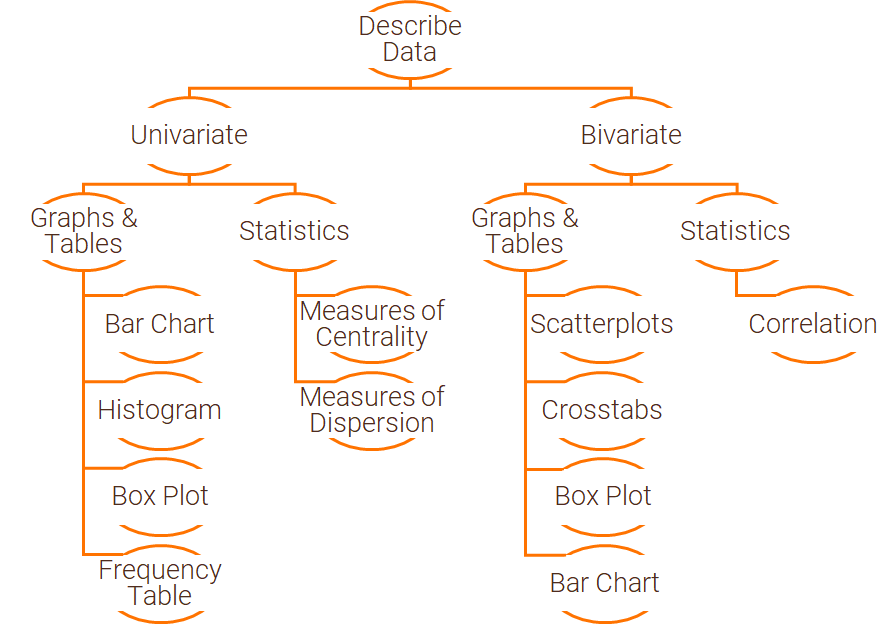

# Examining and Summarizing Data

## Motivation

After data preparation, examining and summarizing the data provides the analyst with a “feel” for the data

* Distributions of variables
* Relationships between variables
* Missing observations
* Coding of variables

## R Packages and Datasets for Topic 1

``` {r t1packagesdata, message=FALSE}
library(ggplot2)     # Advanced graphing capabilities
library(dplyr)       # Easier programming
library(tidyr)       # Easier programming   
library(scales)      # Control appearance of axes and legend labels
library(questionr)   # Easier frequency tables
library(htmlTable)   # Better HTML Tables
library(mosaic)      # Statistical functions
library(sjPlot)      # Easily create cross-tabs
library(MKT4320BGSU)
data(airlinesat)
```

## Describing Data

How we examine and summarize data depends on:

* Type of data
    * Nominal
    * Ordinal
    * Continuous
    
* Number of variables
    * Univariate
    * Bivariate

```{r echo=FALSE, out.width='100%'}
knitr:: 
```


### Univariate - Graphs and Tables

#### Bar Chart

* Primarily for nominal/ordinal data
* Displays each category's...
    * Frequency (usually)
    * Centrality
    * Dispersion

<div class="hr" id="f11">
***Figure 1.1: Bar Chart***
``` {r t1barchart, echo=FALSE}
airlinesat %>%     # Dataset
   # Groups dataset by variable 'status'
   group_by(status) %>%
   # Creates new variable 'n' equal to number of obs for each status
   summarise(n=n()) %>%
   # Creates new variable 'prop' equal to proportion of same for each status
   mutate(prop=n/sum(n)) %>%
   # Begins plot with 'status' on x axis and 'prop' on y axis
   ggplot(aes(x=status, y=prop)) +
      # Requests bar chart as the geom function, using actual value
      # of variable 'prop' as the statistic to plot
      geom_bar(stat="identity") +
      # Adds data labels to the end of the bars
      geom_text(aes(label=sprintf("%1.1f%%", prop*100)), 
                vjust=1.5, color="white") +
      # Changes text size to be larger
      theme(text=element_text(size=15)) +
      # Adds axis labels
      labs(x="Status",y="Proportion")
```
<br>[R Code](#figure11)</div><p>

#### Histogram

* Non-overlapping categories of equal width from continuous data
* Shows frequency in each category
* Used to examine distribution of variable

<div class="hr" id="f12">
***Figure 1.2: Historgram 1***
``` {r t1histogram1, echo=FALSE}
airlinesat %>%     # Dataset
   # Begins plot with 'age' as variable to plot on x axis
   ggplot(aes(x=age)) +
      # Requests histogram as the geom function, with binwidth of 2,
      # y axis to represent density, and outline/color of bars
      geom_histogram(binwidth=2, aes(y=..density..), 
                     color="black", fill="tan") +
      # Creates normal curve overlay
      stat_function(fun=function(x)
         dnorm(x, mean=mean(airlinesat$age),sd=sd(airlinesat$age))) +
      # Changes text size to be larger
      theme(text=element_text(size=15)) +
      # Adds axis labels
      labs(x="Age", y="Density")
```
<br>[R Code](#figure12)</div><p>

<div class="hr" id="f13">
***Figure 1.3: Histogram 2***
``` {r t1histogram2, echo=FALSE}
airlinesat %>%     # Dataset
   # Drops ros with missing values for variable 's1'
   drop_na(s1) %>%
   # Begins plot with 's1' as variable to plot on x axis
   ggplot(aes(x=s1)) +
      # Requests histogram as the geom function, with binwidth of 2,
      # y axis to represent density, and outline/color of bars
      geom_histogram(binwidth=2, aes(y=..density..), 
                     color="black", fill="tan") +
      # Creates normal curve overlay
      stat_function(fun=function(x)
         dnorm(x, mean=mean(airlinesat$s1, na.rm=TRUE), 
               sd=sd(airlinesat$s1, na.rm=TRUE))) +
      # Changes text size to be larger
      theme(text=element_text(size=15)) +
      # Adds axis labels
      labs(x="Airline gets me there on time (Satisfaction)", y="Density")
```
<br>[R Code](#figur13)</div><p>

#### Box Plot

* Displays distribution of continuous data
    * Conveys dispersion information
    * Wider box = More dispersion
    * Can help identify potential outliers
* How to interpret:
    * Box in middle is the Interquartile Range
        * Q3 (75th percentile) - Q1 (25th percentile)
    * Line in middle is the median
    * Upper/lower lines are upper/lower adjacent values
        * Upper adjacent value is the largest observation that is smaller than
        Q3 + 1.5*IQR
        * Lower adject value is the smallest observatoin that is larger than
        Q1 - 1.5*IQR
    * Any observations above (below) the upper (lower) adjacent value are
    plotted separately, and *could* be outliers

<div class="hr" id="f14">
***Figure 1.4: Box Plot***
``` {r t1boxplot, echo=FALSE}
airlinesat %>%     # Dataset
   # Begins plot with no grouping variable and age as continuous variable 
   ggplot(aes(x="", y=age)) +
   # Request boxplot as the geom function
   geom_boxplot() +
   # Adds the whiskers to the boxplot
   stat_boxplot(geom='errorbar') +
   # Changes text size to be larger
   theme(text=element_text(size=15)) +
   # Adds axis labels
   labs(x="", y="Age")
```
<br>[R Code](#figure14)</div><p>

#### Frequency Table

* Displays counts and percentages for categorical variables
* Similar to bar chart, but in table form

<div class="hr" id="t11">
***Table 1.1: Frequency Table***
``` {r t1freqtable, echo=FALSE, results="asis"}
freq(airlinesat$status, cum=TRUE, total=TRUE) %>%
   htmlTable()
```
[R Code](#table11)</div><p>

### Univariate - Statistics

#### Measures of Centrality

* Values of a “typical” or “average” score
* Mean is the sum of all observations divided by the number of observations
    * Only appropriate for continuous data
* Median separates highest and lowers 50% of observations
    * Cannot be used on categorical data

<div class="hr" id="t12">
***Table 1.2: Measures of Centrality and Dispersion***
``` {r t1statistics1, echo=FALSE}
airlinesat %>%     # Dataset
   # Select variables; Use 'dplyr::' before 'select' to avoid conflicts
   dplyr::select(age, s1) %>%
   # Request summary statistics
   summary() %>%
   # Create htmlTable
   htmlTable()
```
[R Code](#table12)</div><p>

#### Measures of Dispersion

* Provide info about variability in the data
* Range is the highest minus the lowest observation
    * Simple, but includes extreme values
    * Not appropriate for categorical data
* Interquartile Range (IQR) is Q3 (75th percentile) - Q1 (25th percentile)
    * Used in the Box Plot
    * Not appropriate for categorical data
* Standard Deviation
    * Given by Equation 1.1 below

    \begin{equation} 
    s = \sqrt{\frac{\sum_{i=1}^{n}{(x_i - \bar{x})^2}}{n-1}}
    (\#eq:stdev)
    \end{equation} 

    * Only appropriate with continuous data

<div class="hr" id="t13">
***Table 1.3 Measures of Centrality and Dispersion For (A) 'Age' and (B) 'Airline gets me there on time (Satisfaction)'*** 
``` {r t1statistics2, echo=FALSE}
# Request htmlTable for summary statistics with rounding two 2 digits
# for 'age'
htmlTable(txtRound(favstats(airlinesat$age),2), caption="(A)")
# Request htmlTable for summary statistics with rounding two 2 digits
# for 's1'
htmlTable(txtRound(favstats(airlinesat$s1),2), caption="(B)")
```
[R Code](#table13)</div><p>

### Bivariate - Graphs and Tables

#### Scatterplots

* Graphically shows how two continuous variables are related
    * If dots appear in to follow a line, variables are likely related (see Figure <a href="#f15">1.5</a>)
    * If dots appear random, variables are likely not related (see Figure <a href="#f16">1.6</a>)
    * Not appropriate for categorical data (see Figure <a href="#f17">1.7</a>)

<div class="hr" id="f15">
***Figure 1.5: Scatterplot 1 with Fitted Line***
``` {r t1scatterplot1, echo=FALSE, message=FALSE, warning=FALSE}
airlinesat %>%     # Passes dataset to ggplot
   # Begins plot with x (s18) and y (s17) variables
   ggplot(aes(x=s18, y=s17)) +
      # Requests scatter plot
      geom_point() +
      # Requests linear regression fitted line without confidence interval
      geom_smooth(method="lm", se=FALSE) +
      # Changes text size to be larger
      theme(text=element_text(size=15)) +
      # Adds axis labels
      labs(x="Employees are service-oriented (s18)",
           y="Employees are friendly (s17)")
```
<br>[R Code](#figure15)</div><p>

<div class="hr" id="f16">
***Figure 1.6: Scatterplot 2 without Fitted Line***
``` {r t1scatterplot2, echo=FALSE, message=FALSE, warning=FALSE}
airlinesat %>%     # Passes dataset to ggplot
   # Begins plot with x (age) and y (s11) variables
   ggplot(aes(x=age, y=s11)) +
      # Requests scatter plot
      geom_point() +
      # Changes text size to be larger
      theme(text=element_text(size=15)) +
      # Adds axis labels
      labs(x="Age",
           y="Aircraft interior is well maintained (s11)")
```
<br>[R Code](#figure16)</div><p>

<div class="hr" id="f17">
***Figure 1.7: Scatterplot of Categorical Data***
``` {r t1scatterplot3, echo=FALSE, message=FALSE, warning=FALSE}
airlinesat %>%     # Passes dataset to ggplot
   # Begins plot with x (age) and y (s11) variables
   ggplot(aes(x=flight_type, y=flight_purpose)) +
   # Requests scatter plot
   geom_point() +
   # Changes text size to be larger
   theme(text=element_text(size=15)) +
   # Adds axis labels
   labs(x="Flight Type",
        y="Flight Purpose")
```
<br>[R Code](#figure17)
</div><p>

#### Crosstabs

* Show if and how two categorical variables are related
    * Common to put “DV” in rows and “IV” in columns
    * Can ask for $\chi^2$ to test if for significant association
    * Can also view it visually with a stacked bar chart (see Figure <a href="#f18">1.8</a>)
        * Percentages represent column percentages
    * Can also view it visually with separate bars for each category (see Figure <a href="#f19">1.9</a>)
        * Bar height is percent of total

<div class="hr" id="t14">
***Table 1.4: Crosstab***
``` {r t1crosstab1, echo=FALSE}
# Use package sjPlot to easily create cross-tab
# Note: sjPlot::tab_xtab not available in virtual environment
tab_xtab(var.row=airlinesat$flight_purpose, # Set row variable
         var.col=airlinesat$flight_type, # Set column variable
         show.col.prc=TRUE) # Request column percentages
```
[R Code](#table14)</div><p><br>

<div class="hr" id="f18">
***Figure 1.8: Stacked Bar Chart***
``` {r t1stackedbarchart, echo=FALSE, message=FALSE}
airlinesat %>%     # Dataset
   # Groups dataset by crosstab variables
   group_by(flight_type, flight_purpose) %>%
   # Creates new variable 'n' for count of observations in each cell
   summarise(n=n()) %>%
   # Creates column percentages
   mutate(prop=n/sum(n)) %>%
   # Begins plot with 'flight_type' on x, 'prop' on y, and color of the
   # fill in the bars based on'flight_purpose'
   ggplot(aes(x=flight_type, y=prop, fill=flight_purpose)) +
      # Requests bar chart as the geom function, positioning the the
      # location of the bars based ont the fill variable
      geom_bar(position="fill", stat="identity") +
      # Labels y-axis using percentages
      scale_y_continuous(labels=scales::label_percent()) +
      # Adds data labels to middle of bars
      geom_text(aes(label=sprintf("%1.1f%%", prop*100)), 
             position=position_stack(vjust=0.5), color="white") +
      # Changes test size to be larger
      theme(text=element_text(size=15)) +
      # Adds axis and legend labels
      labs(x="Flight Type", y="Percent", fill="Flight Purpose")
```
<br>[R Code](#figure18)
</div><p>

<div class="hr" id="f19">
***Figure 1.9: Side-by-Side Bar Chart***
``` {r t1sidebysidebarchart, echo=FALSE}
airlinesat %>%     # Dataset
   # Groups dataset by crosstab variables
   group_by(flight_type, flight_purpose) %>%
   # Creates new variable 'n' for count of observations in each cell, but
   # drops grouping structure to get total percentages
   summarise(n=n(), .groups="drop") %>%
   # Creates total percentages
   mutate(prop=n/sum(n)) %>%
   # Begins plot with 'flight_type' on x, 'prop' on y, and color of the
   # fill in the bars based on'flight_purpose'
   ggplot(aes(x=flight_type, y=prop, fill=flight_purpose)) +
      # Requests bar chart as the geom function, positioning the 
      # location of the bars to be side-by-side (dodge)
      geom_bar(position="dodge", stat="identity") +
      # Labels y-axis using percentages
      scale_y_continuous(labels=scales::label_percent()) +
      # Adds data labels to end of bars
      geom_text(aes(label=sprintf("%1.1f%%", prop*100)), vjust=1.5, 
                position=position_dodge(width=.9), color="white") +
      # Changes test size to be larger
      theme(text=element_text(size=15)) +
      # Adds axis and legend labels
      labs(x="Flight Type", y="Percent", fill="Flight Purpose")
```
<br>[R Code](#figure19)</div><p>

#### Box Plot

* Displays distribution of continuous data across classes of a categorical variable

<div class="hr" id="f110">
***Figure 1.10: Box Plot by Category***
``` {r t1boxplot2chart, echo=FALSE}
airlinesat %>%     # Dataset
   # Begins plot with 'status' as grouping variable and
   # 'age' as continuous variable 
   ggplot(aes(x=status, y=age)) +
   # Request boxplot as the geom function
      geom_boxplot() +
      # Adds the whiskers to the boxplot
      stat_boxplot(geom='errorbar') +
      # Changes text size to be larger
      theme(text=element_text(size=15)) +
      # Adds axis labels
      labs(x="Status", y="Age")
```
<br>[R Code](#figure110)</div><p>

#### Bar Chart

* Displays mean (or some other value) of continuous data across classes of a categorical variable

<div class="hr" id="f111">
***Figure 1.11: Bar Chart by Category***
``` {r t1barchart2chart, echo=FALSE}
airlinesat %>%     # Dataset
   # Groups dataset by 'crosstab variables'status'
   group_by(status) %>%
   # Creates new variable 'mean' for mean of 'age' by 'status'
   summarise(mean=mean(age)) %>%
   # Begins plot with 'status' on x, 'mean' on y
   ggplot(aes(x=status, y=mean)) +
   # Requests bar chart as the geom function, plotting the actual
   # value ('identity'), and setting fill color to match status
   geom_bar(stat="identity", fill=c("midnightblue","gold","gray")) +
   # Sets number of breaks on y-axis
   scale_y_continuous(n.breaks=6) +
   # Adds data labels to outside end of bars
   geom_text(aes(label=sprintf("%.2f", mean)), vjust=-.5, 
             position=position_dodge(width=.9), color="black") +
   # Changes test size to be larger
   theme(text=element_text(size=15)) +
   # Adds axis and legend labels
   labs(x="Status", y="Mean of Age")
```
<br>[R Code](#figure111)</div><p>

### Statistics

#### Correlation

* Provides a measure of linear association between two continuous variables
    * Given by Equation 1.2 below

    \begin{equation} 
    r = \frac{\sum_{i=1}^{n}{(x_i - \bar{x})(y_i-\bar{y})}}{(n-1)s_xs_y}
    (\#eq:pearcorr)
    \end{equation}
    
    * $-1 \le r \le 1$

<div class="hr" id="t15">
***Table 1.5: Correlation Matrix***
``` {r t1correlation1, echo=FALSE}
# Create dataframe of variables to include
corrvars <-  airlinesat %>% select(age, nflights, e7, s11)
# Use package sjPlot to easily create correlation matrix
# Note: sjPlot not available in virtual environment
tab_corr(corrvars,
         na.deletion = "pairwise",  # Delete obs if either variable is missing
         corr.method = "pearson",  # Choose Pearson correlation coefficient
         show.p = TRUE,  # Show asterisks for significant correlations
         digits = 3,  # Show three decimal points
         triangle = "lower",  # Show only lower triangle
         fade.ns=FALSE)  # Do not fade insignficant correlations
```
[R Code](#table15)</div><p>

## Suggested Readings

* *R for Marketing Research and Analytics. 2nd Edition* (2019). Chapman, Chris; McDonnel Feit, Elea
    * BGSU Library Link:<br><a href="http://maurice.bgsu.edu/record=b4966554~S9" target="_blank" rel="noopener noreferrer">http://maurice.bgsu.edu/record=b4966554~S9</a>
    * eBook through BGSU Library:<br><a href="https://link-springer-com.ezproxy.bgsu.edu/book/10.1007%2F978-3-030-14316-9" target="_blank" rel="noopener noreferrer">https://link-springer-com.ezproxy.bgsu.edu/book/10.1007%2F978-3-030-14316-9</a>
    * Chapter 3: Describing Data
    * Chapter 4: Relationships Between Continuous Variables
    * Chapter 5: Tables and Visualization
* *OpenIntro Statistics. 4th Edition* (2019). Diez, David; Cetinkaya-Rundel, Mine; Barr, Christopher D.
    * Available at OpenIntro.org:<br><a href="https://www.openintro.org/book/os/" target="_blank" rel="noopener noreferrer">https://www.openintro.org/book/os/</a>
    * Summarizing Data
    
* *Multivariate Data Analysis*. Hair, Joseph F.; Black, William C.; Babin, Barry J.; Anderson, Rolph E.
    * 7th Edition: Search for “multivariate data analysis 7th edition hair”
        * Graphical Examination of the Data (pp. 34-40)
    * 5th Edition: Course reserves
        * Graphical Examination of the Data (pp. 40-46)

## R Code

### Table1.1 {#table11}
See Table <a href="#t11">1.1</a>
``` {r t1freqtablecode, eval=FALSE}
# Create frequency table using questionr::freq and pass result
# htmlTable
freq(airlinesat$status, cum=TRUE, total=TRUE) %>%
   htmlTable()
```

### Table1.2 {#table12}
See Table <a href="#t12">1.2</a>
``` {r t1statistics1code, eval=FALSE}
airlinesat %>%     # Dataset
   # Select variables; Use 'dplyr::' before 'select' to avoid conflicts
   dplyr::select(age, s1) %>%
   # Request summary statistics
   summary() %>%
   # Create htmlTable
   htmlTable()
```

### Table1.3 {#table13}
See Table <a href="#t13">1.3</a>
``` {r t1statistics2code, eval=FALSE}
# Request htmlTable for summary statistics with rounding two 2 digits
# for 'age'
htmlTable(txtRound(favstats(airlinesat$age),2), 
          caption="Age")
# Request htmlTable for summary statistics with rounding two 2 digits
# for 's1'
htmlTable(txtRound(favstats(airlinesat$s1),2), 
          caption="Airline Gets me there on time (Satisfaction)")
```

### Table1.4 {#table14}
See Table <a href="#t14">1.4</a>
``` {r t1crosstab1code, eval=FALSE}
# Use package sjPlot to easily create cross-tab
# Note: sjPlot::tab_xtab not available in virtual environment
tab_xtab(var.row=airlinesat$flight_purpose, # Set row variable
         var.col=airlinesat$flight_type, # Set column variable
         show.col.prc=TRUE) # Request column percentages
```

### Table1.5 {#table15}
See Table <a href="#t15">1.5</a>
``` {r t1correlation1code, eval=FALSE}
# Create dataframe of variables to include
corrvars <-  airlinesat %>% select(age, nflights, e7, s11)
# Use package sjPlot to easily create correlation matrix
# Note: sjPlot not available in virtual environment
tab_corr(corrvars,
         na.deletion = "pairwise",  # Delete obs if either variable is missing
         corr.method = "pearson",  # Choose Pearson correlation coefficient
         show.p = TRUE,  # Show asterisks for significant correlations
         digits = 3,  # Show three decimal points
         triangle = "lower",  # Show only lower triangle
         fade.ns=FALSE)  # Do not fade insignficant correlations

# Note: For vitual environment, use package Hmisc to produce separate
# tables for correlation coefficients and p-values
htmlTable(txtRound(rcorr(as.matrix(corrvars))[["r"]],3))
htmlTable(txtRound(rcorr(as.matrix(corrvars))[["P"]],3))
```

### Figure 1.1 {#figure11}
See Figure <a href="#f11">1.1</a>
``` {r t1barchartcode, eval=FALSE}
airlinesat %>%     # Dataset
   # Groups dataset by variable 'status'
   group_by(status) %>%
   # Creates new variable 'n' equal to number of obs for each status
   summarize(n=n()) %>%
   # Creates new variable 'prop' equal to proportion of same for each status
   mutate(prop=n/sum(n)) %>%
   # Begins plot with 'status' on x axis and 'prop' on y axis
   ggplot(aes(x=status, y=prop)) +
      # Requests bar chart as the geom function, using actual value
      # of variable 'prop' as the statistic to plot
      geom_bar(stat="identity") +
      # Adds data labels to the end of the bars
      geom_text(aes(label=sprintf("%1.1f%%", prop*100)), 
                vjust=1.5, color="white") +
      # Changes text size to be larger
      theme(text=element_text(size=15)) +
      # Adds axis labels
      labs(x="Status",y="Proportion")
```

### Figure 1.2 {#figure12}
See Figure <a href="#f12">1.2</a>
``` {r t1histogram1code, eval=FALSE}
airlinesat %>%     # Dataset
   # Begins plot with 'age' as variable to plot on x axis
   ggplot(aes(x=age)) +
      # Requests histogram as the geom function, with binwidth of 2,
      # y axis to represent density, and outline/color of bars
      geom_histogram(binwidth=2, aes(y=..density..), 
                     color="black", fill="tan") +
      # Creates normal curve overlay
      stat_function(fun=function(x)
         dnorm(x, mean=mean(airlinesat$age),sd=sd(airlinesat$age))) +
      # Changes text size to be larger
      theme(text=element_text(size=15)) +
      # Adds axis labels
      labs(x="Age", y="Density")
```

### Figure 1.3 {#figure13}
See Figure <a href="#f13">1.3</a>
``` {r t1histogram2code, eval=FALSE}
airlinesat %>%     # Dataset
   # Drops ros with missing values for variable 's1'
   drop_na(s1) %>%
   # Begins plot with 's1' as variable to plot on x axis
   ggplot(aes(x=s1)) +
      # Requests histogram as the geom function, with binwidth of 2,
      # y axis to represent density, and outline/color of bars
      geom_histogram(binwidth=2, aes(y=..density..), 
                     color="black", fill="tan") +
      # Creates normal curve overlay
      stat_function(fun=function(x)
         dnorm(x, mean=mean(airlinesat$s1, na.rm=TRUE), 
               sd=sd(airlinesat$s1, na.rm=TRUE))) +
      # Changes text size to be larger
      theme(text=element_text(size=15)) +
      # Adds axis labels
      labs(x="Airline gets me there on time (Satisfaction)", y="Density")
```

### Figure 1.4 {#figure14}
See Figure <a href="#f14">1.4</a>
``` {r t1boxplot1code, eval=FALSE}
airlinesat %>%     # Dataset
   # Begins plot with no grouping variable and age as continuous variable 
   ggplot(aes(x="", y=age)) +
   # Request boxplot as the geom function
   geom_boxplot() +
   # Adds the whiskers to the boxplot
   stat_boxplot(geom='errorbar') +
   # Changes text size to be larger
   theme(text=element_text(size=15)) +
   # Adds axis labels
   labs(x="", y="Age")
```

### Figure 1.5 {#figure15}
See Figure <a href="#f15">1.5</a>
``` {r t1scatterplot1code, eval=FALSE}
airlinesat %>%     # Passes dataset to ggplot
   # Begins plot with x (s18) and y (s17) variables
   ggplot(aes(x=s18, y=s17)) +
      # Requests scatter plot
      geom_point() +
      # Requests linear regression fitted line without confidence interval
      geom_smooth(method="lm", se=FALSE) +
      # Changes text size to be larger
      theme(text=element_text(size=15)) +
      # Adds axis labels
      labs(x="Employees are service-oriented (s18)",
           y="Employees are friendly (s17)")
```

### Figure 1.6 {#figure16}
See Figure <a href="#f16">1.6</a>
``` {r t1scatterplot2code, eval=FALSE}
airlinesat %>%     # Passes dataset to ggplot
   # Begins plot with x (age) and y (s11) variables
   ggplot(aes(x=age, y=s11)) +
      # Requests scatter plot
      geom_point() +
      # Changes text size to be larger
      theme(text=element_text(size=15)) +
      # Adds axis labels
      labs(x="Age",
           y="Aircraft interior is well maintained (s11)")
```

### Figure 1.7 {#figure17}
See Figure <a href="#f17">1.7</a>
``` {r t1scatterplot3code, eval=FALSE}
airlinesat %>%     # Passes dataset to ggplot
   # Begins plot with x (age) and y (s11) variables
   ggplot(aes(x=flight_type, y=flight_purpose)) +
   # Requests scatter plot
   geom_point() +
   # Changes text size to be larger
   theme(text=element_text(size=15)) +
   # Adds axis labels
   labs(x="Flight Type",
        y="Flight Purpose")
```

### Figure 1.8 {#figure18}
See Figure <a href="#f18">1.8</a>
``` {r t1stackedbarchartcode, eval=FALSE}
airlinesat %>%     # Dataset
   # Groups dataset by crosstab variables
   group_by(flight_type, flight_purpose) %>%
   # Creates new variable 'n' for count of observations in each cell
   summarise(n=n()) %>%
   # Creates column percentages
   mutate(prop=n/sum(n)) %>%
   # Begins plot with 'flight_type' on x, 'prop' on y, and color of the
   # fill in the bars based on'flight_purpose'
   ggplot(aes(x=flight_type, y=prop, fill=flight_purpose)) +
      # Requests bar chart as the geom function, positioning the 
      # location of the bars based on the fill variable
      geom_bar(position="fill", stat="identity") +
      # Labels y-axis using percentages
      scale_y_continuous(labels=scales::label_percent()) +
      # Adds data labels to middle of bars
      geom_text(aes(label=sprintf("%1.1f%%", prop*100)), 
             position=position_stack(vjust=0.5), color="white") +
      # Changes test size to be larger
      theme(text=element_text(size=15)) +
      # Adds axis and legend labels
      labs(x="Flight Type", y="Percent", fill="Flight Purpose")
```

### Figure 1.9 {#figure19}
See Figure <a href="#f19">1.9</a>
``` {r t1sidebysidebarchartcode, eval=FALSE}
airlinesat %>%     # Dataset
   # Groups dataset by crosstab variables
   group_by(flight_type, flight_purpose) %>%
   # Creates new variable 'n' for count of observations in each cell, but
   # drops grouping structure to get total percentages
   summarise(n=n(), .groups="drop") %>%
   # Creates total percentages
   mutate(prop=n/sum(n)) %>%
   # Begins plot with 'flight_type' on x, 'prop' on y, and color of the
   # fill in the bars based on'flight_purpose'
   ggplot(aes(x=flight_type, y=prop, fill=flight_purpose)) +
      # Requests bar chart as the geom function, positioning the 
      # location of the bars to be side-by-side (dodge)
      geom_bar(position="dodge", stat="identity") +
      # Labels y-axis using percentages
      scale_y_continuous(labels=scales::label_percent()) +
      # Adds data labels to end of bars
      geom_text(aes(label=sprintf("%1.1f%%", prop*100)), vjust=1.5, 
                position=position_dodge(width=.9), color="white") +
      # Changes test size to be larger
      theme(text=element_text(size=15)) +
      # Adds axis and legend labels
      labs(x="Flight Type", y="Percent", fill="Flight Purpose")
```

### Figure 1.10 {#figure110}
See Figure <a href="#f110">1.10</a>
``` {r t1boxplot2code, eval=FALSE}
airlinesat %>%     # Dataset
   # Begins plot with 'status' as grouping variable and
   # 'age' as continuous variable 
   ggplot(aes(x=status, y=age)) +
   # Request boxplot as the geom function
      geom_boxplot() +
      # Adds the whiskers to the boxplot
      stat_boxplot(geom='errorbar') +
      # Changes text size to be larger
      theme(text=element_text(size=15)) +
      # Adds axis labels
      labs(x="Status", y="Age")
```

### Figure 1.11 {#figure111}
See Figure <a href="#f111">1.11</a>
``` {r t1barchart2code, eval=FALSE}
airlinesat %>%     # Dataset
   # Groups dataset by 'crosstab variables'status'
   group_by(status) %>%
   # Creates new variable 'mean' for mean of 'age' by 'status'
   summarise(mean=mean(age)) %>%
   # Begins plot with 'status' on x, 'mean' on y
   ggplot(aes(x=status, y=mean)) +
   # Requests bar chart as the geom function, plotting the actual
   # value ('identity'), and setting fill color to match status
   geom_bar(stat="identity", fill=c("midnightblue","gold","gray")) +
   # Sets number of breaks on y-axis
   scale_y_continuous(n.breaks=6) +
   # Adds data labels to outside end of bars
   geom_text(aes(label=sprintf("%.2f", mean)), vjust=-.5, 
             position=position_dodge(width=.9), color="black") +
   # Changes test size to be larger
   theme(text=element_text(size=15)) +
   # Adds axis and legend labels
   labs(x="Status", y="Mean of Age")
```