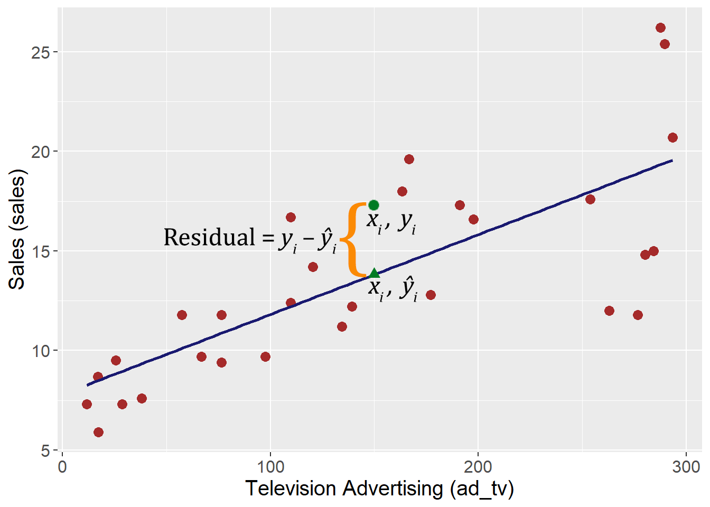

# Linear Regression

## Motivation

Regression allows marketers to:

* Understand relationships between a dependent variable and one or more independent variables
* Determine the relative strength of different independent variables
* Make predictions


## R Packages and Datasets for Topic 2

The following packages are used for this topic and are loaded when needed.

``` {r t2packages, message=FALSE}
library(ggplot2)       # Advanced graphing capabilities
library(tidyr)         # Easier programming   
library(htmlTable)     # Better HTML Tables
library(reshape2)      # Easily convert wide data to long data
library(summarytools)  # Summary statistics
library(effects)       # Help with linear predictions
library(cowplot)       # Arrange separate plots in a grid
library(ggtext)        # Annotate ggplots
library(lubridate)     # Easily work with dates
library(jtools)        # Concise regression results
library(dplyr)         # Easier programming
library(GGally)        # Scatterplot Matrix
```

The following datasets are used for this topic and are loaded now.

``` {r t2data, message=FALSE}
load("Topic02/advtsales.rdata")
load("Topic02/deptstoresales.rdata")
```
[Download advtsales.rdata](Topic02/advtsales.rdata)  
[Download deptstoresales.rdata](Topic02/deptstoresales.rdata)


## Understanding Regression Analysis

| Regression notation: $y = \alpha + \beta_kx_k+\varepsilon$  
|        where
$y$ is the dependent variable (DV)  
$x_k$ is the $k$^th^ independent variable (IV)  
$\alpha$ is the constant or $y$-intercept  
$\beta_k$ is the regression coefficient for the $k$^th^ IV  
$\varepsilon$ is the error term

* Objective
    * Predict DV based on knowledge of the IV(s)

```{r echo=FALSE, out.width='100%', cache=TRUE}
   knitr:: 
```

* Method
    * OLS creates the “best” fitted line by minimizing the sum of the squared residuals
        * OLS Minimizes Equation 2.1 below:
         \begin{equation} 
         \sum_{i=1}^{n}{(y_i - \hat{y}_i)^2}
         (\#eq:OLS)
         \end{equation} 

```{r echo=FALSE, out.width='100%', cache=TRUE}
knitr:: 
```

* Note: The “best” fitted regression line is not always the line that best represents the data

``` {r t2scatterplot1, echo=FALSE, message=FALSE, warning=FALSE, cache=TRUE}
library(dplyr)
library(ggplot2)
data.frame(X=(0:20)) %>% 
   mutate(Y=-(X^2)+20*X) %>% 
   ggplot(aes(x=X, y=Y)) +
   geom_point(size=3, color="brown") +
   geom_smooth(method="lm", se=FALSE, color="midnightblue") +
   theme(text=element_text(size=15))
```

## Conducting Linear Regression

### Check Data Requirements

* Continuous DV
    * Must be measured on an interval or ratio scale
    * For nominal scale, use logistic regression
    * For ordinal scale, use ordinal regression

### Model Specification

* Pick IVs based on...
    * Conceptual grounding
    * Availability of data
* *Including* irrelevant IVs...
    * Reduces parsimony
    * May mask effects of other IVs
    * Makes testing significance less precise
* *Excluding* relevant IVs...
    * Seriously biases results
    * Negatively affects interpretation
    
### Model Estimation

* Estimately is *typically* done using OLS
* All statistical packages can conduct regression

``` {r t2statpacktable, echo=FALSE, message=FALSE, warning=FALSE, cache=TRUE}
library(htmlTable)
mat1data <- c("R", "Stata GUI", "Stata Command", "SPSS GUI", "SPSS Syntax", "SAS", "Minitab","lm(dv ~ iv1 + iv2 + ... + ivk)", "Statistics > Linear models and related > Linear Regression", "regress dv iv1 iv2 ... ivk", "Analyze > Regression > Linear", "regression/dependent dv/enter iv1 iv2 ... ivk", "proc reg; model dv = iv1 iv2 ... ivk;","Stat > Regression > Regression")
mat1 <- matrix(mat1data, nrow=7, ncol=2, byrow=FALSE)
mat2data <- c("font-family: Arial",
              "font-family: Arial",
              "font-family: Arial",
              "font-family: Arial",
              "font-family: Arial",
              "font-family: Arial",
              "font-family: Arial",
              "font-family: Courier",
              "font-family: Arial",
              "font-family: Courier",
              "font-family: Arial",
              "font-family: Courier",
              "font-family: Courier",
              "font-family: Arial")
mat2 <- matrix(mat2data, nrow=7, ncol=2, byrow=FALSE)
setHtmlTableTheme("Google", align="ll")
addHtmlTableStyle(css.cell=mat2, htmlTable(mat1))
```

### Model Interpetation

*Assessing Overall Model Fit*

* How much variation in the DV is explained by the model

*Individual Independent Attributes*

* Relationship between DV and each IV
* $H_0:\beta_k=0$ *vs.* $H_a:\beta_k\ne0$
* Interpret significant relationships
* Relative strength of IVs

### Model Prediction

Prediction is a key use of regression

* Estimate DV based on assumed values of IVs

| $\hat{y} = \hat{\alpha} + \hat{\beta_k}x_k$  
|        where
| $\hat{y}$ is predicted value of $y$ for assumed values of $x_k$
|        and
| Regression provided estimates of $\alpha$ and $\beta_k$

## Linear Regression Example

### Overview

* Advertising and Sales data for 200 firms
* DV: Sales (in millions), $sales$
* IVs:
    * TV Advertising (in 000s), $ad\_tv$
    * Radio Advertising (in 000s), $ad\_radio$
    * Paper Advertising (in 000s), $ad\_paper$
* Model: $sales=\alpha+\beta_1ad\_tv+\beta_2ad\_radio+\beta_3ad\_paper$
* Goal: Understand the relationship between various advertising types and sales

### Summarize Data

#### Univariate Summary Statistics

<div class="hr" id="t21">
***Table 2.1: Summary Statistics***
``` {r t2univsummstats, echo=FALSE}
library(summarytools)
# Creates dataframe with only needed variables; Use 'dplyr::' before
# 'select' to avoid conflict with other packages
lrreg1 <- advtsales %>% dplyr::select(-id)
# Creates vector of stats to request in summarytools::descr
stats <- c("n.valid", "mean", "sd", "min", "max")
# Use package summarytools to easily create summary statistics table
# Note: summarytools::descr not available in virtual environment
# Request htmlTable for summary statistics with rounding two 2 digits
setHtmlTableTheme("Google")
htmlTable(txtRound(descr(lrreg1, stats=stats, transpose=TRUE),2))
```
[R Code](#table21)
</div><p>

#### Scatterplot and Correlation Matrix

<div class="hr" id="f21">
***Figure 2.1: Scatterplot Matrix with Correlation***
``` {r t2scattercorr1, echo=FALSE, cache=TRUE}
# Need to detach package 'cowplot' to prevent an error
library(GGally)

# Use package GGally::ggpairs to easily create combination correlation
# and scatterplot matrix
ggpairs(lrreg1, # Dataset
        lower=list(continuous="smooth"), 
        diag=list(continuous="blankDiag"))  # Set diagonals to be blank
# Need to detach package 'cowplot' to prevent an error

```
<br>[R Code](#figure21)
</div><p>

#### Box Plots

<div class="hr" id="f22">
***Figure 2.2: Box Plots***
``` {r t2boxplots, echo=FALSE, message=FALSE, cache=TRUE}
library(reshape2)
melt(lrreg1) %>%  # Use package 'reshape2' to reshape the data for facet plot
   # Begins plot with each variable as a factor and
   # value of the variable to be plotted
   ggplot(aes(factor(variable), value)) +
      # Requests boxplot as geom function
      geom_boxplot() +
      # Adds the whiskers to the boxplot
      stat_boxplot(geom='errorbar') +
      # Creates a facet/matrix layout based on the variable
      facet_wrap(~variable, scale="free") +
      # Change text size
      theme(text=element_text(size=15)) +      
      # Removes axis labels
      labs(x="", y="")
```
<br>[R Code](#figure22)
</div><p>

### Results

#### R Output

##### Regression Results (Concise)

* Estimated regression equation: $\hat{sales}=2.939+.046ad\_tv+.189ad\_radio-.001ad\_paper$

<div class="hr" id="t22">
***Table 2.2: Regression Results (Concise)***
``` {r t2results1, echo=FALSE, cache=TRUE, comment=NA}
library(jtools)
# Run linear model and save as 'results'
results <- lm(sales ~ ad_tv + ad_radio + ad_paper, data = advtsales)
summ(results, digits=4, model.info=FALSE)
```
[R Code](#table22)
</div><p>

##### Standard Results

<div class="hr" id="t23">
***Table 2.3: Regression Results (Standard)***
``` {r t2results2, echo=FALSE, comment=NA, cache=TRUE}
# Run linear model and save as 'results'
results <- lm(sales ~ ad_tv + ad_radio + ad_paper, data = advtsales)
# Displays results
summary(results)
```
[R Code](#table23)
</div><p>

#### Assessing Overall Model Fit

* How much variation in the DV is explained by the model
* Use $R^2$ to assess
* Use $\text{Adjusted }R^2$ to compare models
* Conclusion: Based on the $R^2$, about $90\%$ of the variance in $sales$ is explained by the model

#### Individual Independent Variables

* Relationship between DV and each IV
    * $H_0:\beta_k=0$ *vs.* $H_a:\beta_k\ne0$
    * Interpret significant relationships
    * With a $p\text{-value}<0.001$, $ad\_tv$ has a significant effect on sales. A one unit increase in $ad_tv$ is predicted to increases $sales$ by $.0457$ units.
    * With a $p\text{-value}<0.001$, $ad\_radio$ has a significant effect on sales. A one unit increase in $ad_radio$ is predicted to increases $sales$ by $.1885$ units.
    * With a $p\text{-value}=.860$, $ad\_paper$ has no significant effect on $sales$.
* Relative strength of IVs
    * For relative strength, use standardized $\beta_k$s
    * A standardized $\beta_k$ is the effect of a single standard deviation change in the IV on the DV
    * Higher absolute values are more important
    * Conclusion: $ad\_tv$ is the biggest driver of sales<br>  

<div class="hr" id="t24">
***Table 2.4: Standardized Beta Coefficients***
``` {r t2stdbetas1, echo=FALSE, cache=TRUE}
# Use user-defined function 'lm_beta.R'
source("Topic02/lm_beta.R")
htmlTable(lm_beta(results, digits=4))
```
[R Code](#table24)
</div><p>

* Visualize each IV
    * Sometimes it helps to visually examine the IVs for interprtation
    * Plots show predicted DV at different levels of an IV, holding the other IVs constant at the mean value

<div class="hr" id="f23">
***Figure 2.3: Margin Plots***
``` {r t2marginplots1, echo=FALSE, cache=TRUE}
# Use 'effect' package
library(effects)

# Want to predict 'sales' for different levels of 'ad_tv'
tv.pred <- data.frame(predictorEffect("ad_tv",  # Focal variable
                                       results))

# Use 'tv.pred' for margin plot, assign to 'p1'
p1 <- tv.pred %>%
   ggplot(aes(x=ad_tv,   # ad_tv on x-axis
              y=fit)) +   # 'sales' prediction on y-axis
      geom_line(size=1) +   # Draw predicted line
      geom_ribbon(aes(ymin=lower,  # Draws the confidence interval bands
                      ymax=upper),
                      alpha=0.2) + # Sets transparency level
      # Next two commands scale x and y axes
      scale_x_continuous(limits=c(0,300), expand=c(.025,.025), 
                         breaks=seq(0,300,50), minor_breaks=NULL) +
      scale_y_continuous(limits=c(5,25), expand=c(.025,.025), 
                         breaks=seq(5,25,5), minor_breaks=NULL) +
      # Change text size
      theme(text=element_text(size=15)) +    
      labs(x="TV Advertising", y="Linear Prediction")

# Repeat for other two variables
rd.pred <- data.frame(predictorEffect("ad_radio", results))
p2 <- rd.pred %>%
   ggplot(aes(x=ad_radio, y=fit)) +
      geom_line(size=1) +
      geom_ribbon(aes(ymin=lower, ymax=upper), alpha=0.2) +
      scale_x_continuous(limits=c(0,50), expand=c(.025,.025), 
                         breaks=seq(0,50,10), minor_breaks=NULL) +
      scale_y_continuous(limits=c(5,25), expand=c(.025,.025), 
                         breaks=seq(5,25,5), minor_breaks=NULL) +
      theme(text=element_text(size=15)) +    
      labs(x="Radio Advertising", y="Linear Prediction")

np.pred <- data.frame(predictorEffect("ad_paper", results,
                                      focal.levels=seq(0,100,2)))
p3 <- np.pred %>%
   ggplot(aes(x=ad_paper, y=fit)) +
      geom_line(size=1) +
      geom_ribbon(aes(ymin=lower, ymax=upper), alpha=0.2) +
      scale_x_continuous(limits=c(0,100), expand=c(.025,.025), 
                         breaks=seq(0,100,20), minor_breaks=NULL) +
      scale_y_continuous(limits=c(5,25), expand=c(.025,.025), 
                         breaks=seq(5,25,5), minor_breaks=NULL) +
      theme(text=element_text(size=15)) +    
      labs(x="Newspaper Advertising", y="Linear Prediction")

# Arrange three plots in a grid using package 'cowplot'
library(cowplot)
plot_grid(p1,p2,p3)
```
<br>[R Code](#figure23)
</div><p>

#### Model Prediction

* For simplicity, use only $ad\_tv$ and $ad\_radio$

<div class="hr" id="t25">
***Table 2.5: Coefficients Table for Reduced Model***
``` {r t2results3, echo=FALSE, comment=NA, cache=TRUE}
# Run linear model and save as 'results'
resultssig <- lm(sales ~ ad_tv + ad_radio, data = advtsales)
# Create 'concise' results using package 'jtools'
# NOTE: 'jtools' not available in virtual environment; use standard results
summ(resultssig, digits=4, model.info=FALSE, model.fit=FALSE)
```
[R Code](#table25)
</div><p>

* $\hat{sales}=2.9211+.0458ad\_tv+.1880ad\_radio$
* Predict sales for $100K television advertising and $10K radio advertising
* $\hat{sales}=2.9211+.0458(100)+.1880(10)=9.381= \$9,381,000$
* Visually examine prediction at different levels of $ad\_tv$ and $ad\_radio$

<div class="hr" id="f24">
***Figure 2.4: Prediction Plots***
``` {r t2marginplots2, echo=FALSE, cache=TRUE, fig.cap="Prediction Plots"}
library(tidyr)
# Create new data for prediction with 'ad_tv' as focus
ad.tv.pred <- crossing(ad_tv=seq(0,300,30), # 11 levels
                       ad_radio=seq(0,50,10)) # 6 levels
# Append linear prediction and prediction intervals to new data
ad.tv.pred$pred <- as.data.frame(
                     predict.lm(resultssig,   # Model to use for prediction
                                ad.tv.pred,   # Data set to predict on
                                interval="confidence"))  # Confidence intervals
# Create plot and save as object 'p1'
p1 <- 
   # Begins plot 
   ggplot(aes(x=ad_tv,  # levels of 'ad_tv' for x-axis
              y=pred$fit,  # linear prediction for y-axis
              group=as.factor(ad_radio),  # different geoms for each level of 'ad_radio'
              color=as.factor(ad_radio)),  # different colors for each level of 'ad_radio'
          data=ad.tv.pred) +   
   # Draws lines and points based on predicted values
   geom_line() + geom_point() +
   # Adds confidence interaval bands around line
   geom_errorbar(aes(ymin=pred$lwr, ymax=pred$upr), width=5) +
   # Next two commands scale x and y axes
   scale_x_continuous(breaks=seq(0,300,50), minor_breaks=NULL) +
   scale_y_continuous(limits=c(0,30), expand=c(.025,.025), 
                      breaks=seq(0,30,5), minor_breaks=NULL) +
   # Position legend at bottom with title over legend; change text size
   theme(legend.position="bottom", text=element_text(size=15)) +
   guides(color=guide_legend(title.position="top")) +
   # Labels axes and legend
   labs(x="TV Advertising (ad_tv)", 
        y="Linear Prediction", 
        color="Radio Advertising (ad_radio)")

# Repeat for other variable
ad.rad.pred <- crossing(ad_tv=seq(0,300,100), # 4 levels
                       ad_radio=seq(0,50,5)) # 11 levels

ad.rad.pred$pred <- as.data.frame(
   predict.lm(resultssig, ad.rad.pred, interval="confidence"))

p2 <- ggplot(aes(x=ad_radio, y=pred$fit, 
                 group=as.factor(ad_tv), color=as.factor(ad_tv)),
             data=ad.rad.pred) +   
         geom_line() + geom_point() +
         geom_errorbar(aes(ymin=pred$lwr, ymax=pred$upr), width=.83) +
         scale_x_continuous(breaks=seq(0,50,10), minor_breaks=NULL) +
         scale_y_continuous(limits=c(0,30), expand=c(.025,.025), 
                            breaks=seq(0,30,5), minor_breaks=NULL) +
         theme(legend.position="bottom", text=element_text(size=15)) +
         guides(color=guide_legend(title.position="top")) +
         labs(x="Radio Advertising (ad_radio)", 
         y="Linear Prediction", 
         color="TV Advertising (ad_tv)")

# Arrange three plots in a grid using package 'cowplot'
plot_grid(p1,p2)
```
<br>[R Code](#figure24)
</div><p>

## Categorical IVs

### Overview

* May want to represent a qualitative variable…
    * Gender of a buyer
    * Success/Failure
    * Region of the country
    * Special situations
* ...But the IVs are *supposed* to be continuous
* Use “dummy” variables to indicate occurrence or nonoccurence of a particular attribute
    * Coded as 1 (usually if true) or 0 (usually if false)
* Dummy variables can shift the intercept, the slope, or both
    * Intercept Shifter
        * Dummy is only its own term in the model
        * $y=\alpha+\beta_1x+\beta_2D$
    * Slope Shifter
        * Dummy is only an interaction with another IV
        * $y=\alpha+\beta_1x+\beta_2(x\times D)$
    * Intercept and Slope Shifter
        * Dummy is own term and an interaction with IV
        * $y=\alpha+\beta_1x+\beta_2D+\beta_3(x\times D)$

### Intercept Shifter

* $D=\begin{cases}1\text{ if true}\\0\text{ if false}\end{cases}$
* Model: $y=\alpha+\beta_1x+\beta_2D$
    * When $D=0$:  
        $\begin{array}{rcl}y & = & \alpha+\beta_1x+\beta_2(0)\\& = & \alpha + \beta_1x\end{array}$
    * When $D=1$:  
        $\begin{array}{rcl}y & = & \alpha+\beta_1x+\beta_2(1)\\& = & (\alpha + \beta_2)+\beta_1x\end{array}$
        
``` {r t2intshift1, echo=FALSE, cache=TRUE}
library(ggtext)
x <- 0:5
f <- seq(5,55,10)
t <- seq(20,70,10)
is <- melt(data.frame(x,f,t), id.vars="x", variable.name="dummy")
is$dummy <- factor(is$dummy, levels=c("f","t"), labels=c("<i>D</i> = 0", "<i>D</i> = 1"))
ggplot(aes(x=x, y=value, color=dummy), data=is) +
   geom_line(size=1.5) +
   scale_color_manual(values=c("darkred", "darkgreen")) +
   geom_richtext(data=is[is$x==4,],aes(label=dummy), size=9, vjust=1.45, family="serif", label.color=NA, fill=NA) +
   theme(panel.grid.major=element_blank(), panel.grid.minor=element_blank(),
         panel.background=element_blank(), axis.line=element_line(color="black"),
         axis.text=element_blank(), axis.ticks=element_blank(), 
         axis.title=element_blank(), legend.position="none", 
         text=element_text(size=15)) +
   geom_segment(aes(x=0, y=5, xend=0, yend=20), 
                color="midnightblue", size=1, arrow=arrow(ends="both")) +
   geom_richtext(x=0.2, y=12.1, label="<i>&beta;</i><sub>2</sub>", color="midnightblue",label.color=NA, size=9, fill=NA, family="serif") +
   geom_textbox(x=2.5, y=10, label="Slope of both lines", box.color=NA, color="black", size=12, fill=NA, width=unit(0.4, "npc"), halign=1) +
   geom_textbox(x=4.4, y=8, label="= <i>&beta;</i><sub>1</sub>", box.color=NA, color="black", size=12, fill=NA, family="serif")+
   coord_fixed(.05)
```

### Slope Shifter

* $D=\begin{cases}1\text{ if true}\\0\text{ if false}\end{cases}$
* Model: $y=\alpha+\beta_1x+\beta_2(x\times D)$
    * When $D=0$:  
        $\begin{array}{rcl}y & = & \alpha+\beta_1x+\beta_2(x\times 0)\\& = & \alpha + \beta_1x\end{array}$
    * When $D=1$:  
        $\begin{array}{rcl}y & = & \alpha+\beta_1x+\beta_2(x\times 1)\\& = & \alpha + (\beta_1+\beta_2)x\end{array}$
* Unusual to see only a slope shift
        
``` {r t2slpshift1, echo=FALSE}
x <- 0:5
f <- seq(5,55,10)
t <- seq(5,70,13)
ss <- melt(data.frame(x,f,t), id.vars="x", variable.name="dummy")
ss$dummy <- factor(ss$dummy, levels=c("f","t"), labels=c(
   "<i>D</i> = 0<br><span style='font-family: sans;'>Slope</span> = <i>&beta;</i><sub>1</sub>", 
   "<i>D</i> = 1<br><span style='font-family: sans;'>Slope</span> = <i>&beta;</i><sub>1</sub> + <i>&beta;</i><sub>2</sub>"))
ggplot(aes(x=x, y=value, color=dummy), data=ss) +
   geom_line(size=1.5) +
   scale_color_manual(values=c("darkred", "darkgreen")) +
   geom_richtext(data=ss[ss$x==2,],aes(label=dummy), size=9, vjust=c(1.2,-.75), family="serif", label.color=NA, fill=NA) +
   theme(panel.grid.major=element_blank(), panel.grid.minor=element_blank(),
         panel.background=element_blank(), axis.line=element_line(color="black"),
         axis.text=element_blank(), axis.ticks=element_blank(), 
         axis.title=element_blank(), legend.position="none", 
         text=element_text(size=15)) +
   coord_fixed(.05)
```

### Intercept and Slope Shifter

* $D=\begin{cases}1\text{ if true}\\0\text{ if false}\end{cases}$
* Model: $y=\alpha+\beta_1x+\beta_2D+\beta_3(x\times D)$
    * When $D=0$:  
        $\begin{array}{rcl}y & = & \alpha+\beta_1x+\beta_2(0)+\beta_3(x\times 0)\\& = & \alpha + \beta_1x\end{array}$
    * When $D=1$:  
        $\begin{array}{rcl}y & = & \alpha+\beta_1x+\beta_2(1)+\beta_3(x\times 1)\\& = & (\alpha + \beta_2) + (\beta_1 + \beta_3)x\end{array}$

``` {r t2inslpshift1, echo=FALSE}
x <- 0:5
f <- seq(5,45,8)
t <- seq(20,100,16)
inss <- melt(data.frame(x,f,t), id.vars="x", variable.name="dummy")
inss$dummy <- factor(inss$dummy, levels=c("f","t"), labels=c(
   "<i>D</i> = 0<br><span style='font-family: sans;'>Slope</span> = <i>&beta;</i><sub>1</sub>", 
   "<i>D</i> = 1<br><span style='font-family: sans;'>Slope</span> = <i>&beta;</i><sub>1</sub> + <i>&beta;</i><sub>3</sub>"))
ggplot(aes(x=x, y=value, color=dummy), data=inss) +
   geom_line(size=1.5) +
   scale_color_manual(values=c("darkred", "darkgreen")) +
   geom_richtext(data=inss[inss$x==3,],aes(label=dummy), size=9, vjust=c(1.1,-.6), family="serif", label.color=NA, fill=NA) +
   theme(panel.grid.major=element_blank(), panel.grid.minor=element_blank(),
         panel.background=element_blank(), axis.line=element_line(color="black"),
         axis.text=element_blank(), axis.ticks=element_blank(), 
         axis.title=element_blank(), legend.position="none", 
         text=element_text(size=15)) +
   geom_segment(aes(x=0, y=5, xend=0, yend=20), 
                color="midnightblue", size=1, arrow=arrow(ends="both")) +
   geom_richtext(x=0.28, y=13.1, label="<i>&beta;</i><sub>2</sub>", color="midnightblue",label.color=NA, size=9, fill=NA, family="serif") +
   coord_fixed(.0342)
```

### Multiple Levels

What if categorical IV has multiple levels (e.g., quarters)?

* Choose one level to be the base
* Create dummy variables for the other levels
* Levels must be mutually exclusive
* Dummy variables for four levels:
    * Level 1, $L_1=\begin{cases}1\text{ if true}\\0\text{ if false}\end{cases}$
    * Level 2, $L_2=\begin{cases}1\text{ if true}\\0\text{ if false}\end{cases}$
    * Level 3, $L_3=\begin{cases}1\text{ if true}\\0\text{ if false}\end{cases}$
    * Level 4, $L_4=\text{base level; is true when }L_1=L_2=L_3=0$
* Model: $y=\alpha + \beta_1x + \beta_2L_1+\beta_3L_2+\beta_4L_3$
    * When Level 1:  
        $\begin{array}{rcl}y & = & \alpha+\beta_1x+\beta_2(1)+\beta_3(0)+\beta_4(0)\\& = & (\alpha + \beta_2) + \beta_1x\end{array}$
    * When Level 2:  
        $\begin{array}{rcl}y & = & \alpha+\beta_1x+\beta_2(0)+\beta_3(1)+\beta_4(0)\\& = & (\alpha + \beta_3) + \beta_1x\end{array}$
    * When Level 3:  
        $\begin{array}{rcl}y & = & \alpha+\beta_1x+\beta_2(0)+\beta_3(0)+\beta_4(1)\\& = & (\alpha + \beta_4) + \beta_1x\end{array}$
    * When Level 4:  
        $\begin{array}{rcl}y & = & \alpha+\beta_1x+\beta_2(0)+\beta_3(0)+\beta_4(0)\\& = & \alpha + \beta_1x\end{array}$

``` {r t2multlevels1, echo=FALSE}
x <- 0:5
L4 <- seq(5,55,10)
L3 <- seq(20,70,10)
L2 <- seq(35,85,10)
L1 <- seq(50,100,10)
mis <- melt(data.frame(x,L4,L3,L2,L1), id.vars="x", variable.name="dummy")
mis$dummy <- factor(mis$dummy, levels=c("L4","L3","L2","L1"), labels=c("<i>L</i><sub>4</sub>", "<i>L</i><sub>3</sub>", "<i>L</i><sub>2</sub>", "<i>L</i><sub>1</sub>"))
ggplot(aes(x=x, y=value, color=dummy), data=mis) +
   geom_line(size=1.5) +
   scale_color_manual(values=c("darkred", "darkgreen", "darkblue", "darkorange")) +
   geom_richtext(data=mis[mis$x==5,],aes(label=dummy), size=9, hjust=0, family="serif", label.color=NA) +
   theme(panel.grid.major=element_blank(), panel.grid.minor=element_blank(),
         panel.background=element_blank(), axis.line=element_line(color="black"),
         axis.text=element_blank(), axis.ticks=element_blank(), 
         axis.title=element_blank(), legend.position="none", 
         text=element_text(size=15)) +
   scale_x_continuous(limits=c(-1,6)) +
   geom_richtext(x=-.2, y=5, label="<i>&alpha;</i>", color="darkred",label.color=NA, size=9, family="serif") +
   geom_richtext(x=-.55, y=20, label="<i>&alpha;</i>+ <i>&beta;</i><sub>4</sub>", color="darkgreen",label.color=NA, size=9, family="serif") +
   geom_richtext(x=-.55, y=35, label="<i>&alpha;</i>+ <i>&beta;</i><sub>3</sub>", color="darkblue",label.color=NA, size=9, family="serif") +
   geom_richtext(x=-.55, y=50, label="<i>&alpha;</i>+ <i>&beta;</i><sub>2</sub>", color="darkorange",label.color=NA, size=9, family="serif") +
   geom_textbox(x=3, y=12, label="Slope of<br>all lines", box.color=NA, color="black", size=12, fill=NA, width=unit(0.4, "npc"), halign=1) +
   geom_textbox(x=5.6, y=9, label="= <i>&beta;</i><sub>1</sub>", box.color=NA, color="black", size=12, fill=NA, family="serif")+
   coord_fixed(.048)
```

## Categorical IVs Example

### Overview

* Sales data for 28 department store locations across 47 weeks and 69 departments
    * DV: Department Sales, $sales$
    * IVs:	Overall Store Size, $size$
    * Week, $week$ where 1 = $week$ ending 11/11/11
* Predict sales by department
    * Believe that the “holiday” season (or quarter 4) will be a driver of sales for some departments
        * Generate dummy variable: $q4=\begin{cases}1\text{ if }week\text{ in Quarter 4}\\0\text{ otherwise}\end{cases}$

### Intercept Shift

* $sales = \alpha + \beta_1size+\beta_2q4$
* Results:
    * $sales$ are significantly lower in Q4 (see Table <a href="#t26">2.6</a> and Figure <a href="#f25">2.5</a>)

<div class="hr" id="t26">
***Table 2.6: Regression Results (Intercept Shfit) for One Department***
``` {r t2isreg, echo=FALSE}
library(lubridate)
# Add Variables to 'dssales' dataframe
dssales <- dssales %>%
   # Add week ending date ('weekdate') using package 'lubridate'
   mutate(weekdate=ymd("2011-11-05") + (dssales$week-1)*7) %>%
   # Add quarter based on 'weekdate' using package 'lubridate'
   mutate(quarter = quarter(weekdate)) %>%
   # Create dummy variable for quarter 4
   mutate(q4=ifelse(quarter==4,1,0))

# Create new data frame with only department 16
dssales.16 <- dssales %>%
   filter(dept==16)
   
# Run model with intercept shifter only
mod.is <- lm(sales~size + q4, data=dssales.16)

# Show results using 'jtools' package
summ(mod.is, digits=4, model.info=FALSE)
```
[R Code](#table26)
</div><p>

<div class="hr" id="f25">
***Figure 2.5: Margin Plot for Intercept Shifter***
``` {r t2marginplotsis1, echo=FALSE, cache=TRUE}
# Create new data for prediction with 'size' as focus
size.pred <- merge(data.frame(size=seq(70000, 220000, 15000)), # Variable of interest
                   data.frame(q4=0:1)) # Dummy variable

# Append linear prediction and prediction intervals to new data
size.pred$pred <- as.data.frame(
   predict.lm(mod.is,   # Model to use for prediction
              size.pred,   # Data set to predict on
              interval="confidence"))  # Confidence intervals
# Begins plot 
ggplot(aes(x=size,  # levels of 'size' for x-axis
           y=pred$fit,  # linear prediction for y-axis
           color=as.factor(q4)),  # different colors for each level of 'q4'
       data=size.pred) +
   # Draws lines based on predicted values
   geom_line(size=1) +
   # Adds confidence interval bands around line
   geom_ribbon(aes(ymin=pred$lwr, ymax=pred$upr, fill=as.factor(q4)), alpha=0.2) +
   # Next two commands set colors for lines and CI fill
   scale_color_manual(name="Q4", values=c("darkred", "darkblue")) +
   scale_fill_manual(name="Q4", values=c("red", "blue")) +
   # Next two commands scale x and y axes
   scale_x_continuous(breaks=seq(70000,220000,30000), minor_breaks=NULL) +
   scale_y_continuous(limits=c(-5000,25000), expand=c(.025,.025), 
                      breaks=seq(-5000,25000,10000), minor_breaks=NULL) +
   # Position legend at bottom with title over legend; change text size
   theme(legend.position="bottom", text=element_text(size=15)) +
   # Labels axes and legend
   labs(x="Size", 
        y="Linear Prediction") +
   geom_segment(aes(x=145000, y=2758.8147, xend=145000, yend=17912.1735), 
                color="black", size=1, arrow=arrow(ends="both")) +
   geom_richtext(x=173000, y=10000, label="<i>&beta;</i><sub>2</sub> = –15153.36", color="black",label.color=NA, size=8, fill=NA, family="serif")
```
<br>[R Code](#figure25)
</div><p>

### Slope Shift

* $sales = \alpha + \beta_1size+\beta_2(size\times q4)$
* Results:
    * $sales$ as a function of $size$ are significantly lower in Q4 (see Table <a href="#t27">2.7</a> and Figure <a href="#f26">2.6</a>)
    
<div class="hr" id="t27">
***Table 2.7: Regression Results (Slope Shift) for One Department***
``` {r t2ssreg, echo=FALSE}
# Run model with slope shifter only; use ':' between interaction terms to 
# exclude main effect of q4 from model
mod.ss <- lm(sales~size+size:q4, data=dssales.16)

# Show results using 'jtools' package
summ(mod.ss, digits=4, model.info=FALSE)
```
[R Code](#table27)
</div><p>

<div class="hr" id="f26">
***Figure 2.6: Margin Plot for Slope Shifter***
``` {r t2marginplotsss1, echo=FALSE, cache=TRUE}
# Create new data for prediction with 'size' as focus
size.pred <- merge(data.frame(size=seq(70000, 220000, 15000)), # Variable of interest
                   data.frame(q4=0:1)) # Dummy variable
# Append linear prediction and prediction intervals to new data
size.pred$pred <- as.data.frame(
   predict.lm(mod.ss,   # Model to use for prediction
              size.pred,   # Data set to predict on
              interval="confidence"))  # Confidence intervals
# Begins plot 
ggplot(aes(x=size,  # levels of 'size' for x-axis
           y=pred$fit,  # linear prediction for y-axis
           color=as.factor(q4)),  # different colors for each level of 'q4'
       data=size.pred) +
   # Draws lines based on predicted values
   geom_line(size=1) +
   # Adds confidence interval bands around line
   geom_ribbon(aes(ymin=pred$lwr, ymax=pred$upr, fill=as.factor(q4)), alpha=0.2) +
   # Next two commands set colors for lines and CI fill
   scale_color_manual(name="Q4", values=c("darkred", "darkblue")) +
   scale_fill_manual(name="Q4", values=c("red", "blue")) +
   # Next two commands scale x and y axes
   scale_x_continuous(breaks=seq(70000,220000,30000), minor_breaks=NULL) +
   scale_y_continuous(limits=c(-5000,25000), expand=c(.025,.025), 
                      breaks=seq(-5000,25000,10000), minor_breaks=NULL) +
   # Position legend at bottom with title over legend; change text size
   theme(legend.position="bottom", text=element_text(size=15)) +
   # Labels axes and legend
   labs(x="Size", 
        y="Linear Prediction") +
   geom_segment(aes(x=85000, y=12877.117, xend=85000, yend=19000), 
                color="black", size=1, arrow=arrow(ends="last")) +
   geom_richtext(x=105000, y=20000, label="Slope = <i>&beta;</i><sub>1</sub> = .0742", color="black",label.color=NA, size=8, fill=NA, family="serif") +
   geom_segment(aes(x=85000, y=-500, xend=85000, yend=5461.182), 
                color="black", size=1, arrow=arrow(ends="first")) +
   geom_richtext(x=118000, y=-2000, label="Slope = <i>&beta;</i><sub>1</sub> + <i>&beta;</i><sub>2</sub> = –.0130", color="black",label.color=NA, size=8, fill=NA, family="serif")
```
<br>[R Code](#figure26)
</div><p>

### Intercept and Slope Shift

* $sales = \alpha + \beta_1size+\beta_2q4+\beta_3(size\times q4)$
* Results:
    * $sales$ as a function of $size$ are significantly lower in Q4 (see Table <a href="#t28">2.8</a> and Figures <a href="#f27">2.7</a> and <a href="#f28">2.8</a>)
    
<div class="hr" id="t28">
***Table 2.8: Regression Results (Intercept & Slope Shift) for One Department***
``` {r t2issreg, echo=FALSE}
# Run model with intercept and slope shifter; use '*' between interaction
# terms to include interaction AND main effects
mod.iss <- lm(sales~size*q4, data=dssales.16)

# Show results using 'jtools' package
summ(mod.iss, digits=4, model.info=FALSE)
```
[R Code](#table28)
</div><p>

<div class="hr" id="f27">
***Figure 2.7: Margin Plot for Intercept and Slope Shifter Showing $y$-intercept***
``` {r t2marginplotsiss1, echo=FALSE, cache=TRUE}
# Create new data for prediction with 'size' as focus
size.pred <- merge(data.frame(size=seq(0, 220000, 20000)), # Variable of interest
                  data.frame(q4=0:1)) # Dummy variable
# Append linear prediction and prediction intervals to new data
size.pred$pred <- as.data.frame(
   predict.lm(mod.iss,   # Model to use for prediction
              size.pred,   # Data set to predict on
              interval="confidence"))  # Confidence intervals


ggplot(aes(x=size,  # levels of 'size' for x-axis
           y=pred$fit,  # linear prediction for y-axis
           color=as.factor(q4)),  # different colors for each level of 'q4'
       data=size.pred) +
   # Draws lines based on predicted values
   geom_line(size=1) +
   # Next two commands set colors for lines and CI fill
   scale_color_manual(name="Q4", values=c("darkred", "darkblue")) +
   # Next two commands scale x and y axes
   scale_x_continuous(breaks=seq(0,220000,55000), minor_breaks=NULL) +
   scale_y_continuous(limits=c(-10000,25000), expand=c(.025,.025), 
                      breaks=seq(-5000,25000,10000), minor_breaks=NULL) +
   # Position legend at bottom with title over legend; change text size
   theme(legend.position="bottom", text=element_text(size=15)) +
   # Labels axes and legend
   labs(x="Size", 
        y="Linear Prediction") +
   geom_segment(aes(x=0, y=2328.900, xend=0, yend=7811.323), 
                color="black", size=1, arrow=arrow(ends="both")) +
   geom_richtext(x=40000, y=5000, label="<i>&beta;</i><sub>2</sub> = –5482.42", color="black",label.color=NA, size=8, fill=NA, family="serif") 
```
<br>[R Code](#figure27)
</div><p>

<div class="hr" id="f28">
***Figure 2.8: Margin Plot for Intercept and Slope Shifter***
``` {r t2marginplotsiss2, echo=FALSE, cache=TRUE}
# Create new data for prediction with 'size' as focus
size.pred <- merge(data.frame(size=seq(70000, 220000, 15000)), # Variable of interest
                   data.frame(q4=0:1)) # Dummy variable
# Append linear prediction and prediction intervals to new data
size.pred$pred <- as.data.frame(
   predict.lm(mod.iss,   # Model to use for prediction
              size.pred,   # Data set to predict on
              interval="confidence"))  # Confidence intervals


ggplot(aes(x=size,  # levels of 'size' for x-axis
           y=pred$fit,  # linear prediction for y-axis
           color=as.factor(q4)),  # different colors for each level of 'q4'
       data=size.pred) +
   # Draws lines based on predicted values
   geom_line(size=1) +
   # Adds confidence interval bands around line
   geom_ribbon(aes(ymin=pred$lwr, ymax=pred$upr, fill=as.factor(q4)), alpha=0.2) +
   # Next two commands set colors for lines and CI fill
   scale_color_manual(name="Q4", values=c("darkred", "darkblue")) +
   scale_fill_manual(name="Q4", values=c("red", "blue")) +
   # Next two commands scale x and y axes
   scale_x_continuous(breaks=seq(70000,220000,30000), minor_breaks=NULL) +
   scale_y_continuous(limits=c(-5000,25000), expand=c(.025,.025), 
                      breaks=seq(-5000,25000,10000), minor_breaks=NULL) +
   # Position legend at bottom with title over legend; change text size
   theme(legend.position="bottom", text=element_text(size=15)) +
   # Labels axes and legend
   labs(x="Size", 
        y="Linear Prediction") +
   geom_segment(aes(x=85000, y=13534.849, xend=85000, yend=19000), 
                color="black", size=1, arrow=arrow(ends="last")) +
   geom_richtext(x=105000, y=20000, label="Slope = <i>&beta;</i><sub>1</sub> = .0673", color="black",label.color=NA, size=8, fill=NA, family="serif") +
   geom_segment(aes(x=85000, y=-1500, xend=85000, yend=3230.153), 
                color="black", size=1, arrow=arrow(ends="first")) +
   geom_richtext(x=113000, y=-3000, label="Slope = <i>&beta;</i><sub>1</sub> + <i>&beta;</i><sub>2</sub> = .0106", color="black",label.color=NA, size=8, fill=NA, family="serif")
```
<br>[R Code](#figure28)
</div><p>

### Intercept Shift with Multiple Levels

* $sales=\alpha+\beta_1size+\beta_2q1+\beta_3q2+\beta_4q3$
    * Q4 is set as the base level
* Results:
    * $sales$ are significantly lower in Q4 than in each of the other three quarters (see Table <a href="#t29">2.9</a> and Figures <a href="#f29">2.9</a> and <a href="#f210">2.10</a>)

<div class="hr" id="t29">
***Table 2.9: Regression Results (Intercept Shift for Multiple Levels) for One Department***
``` {r t2misreg, echo=FALSE}
# Make 'quarter' a factor variable so R will use dummy variables automatically
dssales.16$quarter <- factor(dssales.16$quarter)
# Set base level of 'quarter' to be 4
dssales.16$quarter <- relevel(dssales.16$quarter, ref=4)
# Run model with multiple dummies for quarter
mod.mis <- lm(sales~size+quarter, data=dssales.16)
# Show results using 'jtools' package
summ(mod.mis, digits=4, model.info=FALSE)
```
[R Code](#table29)
</div><p>

<div class="hr" id="f29">
***Figure 2.9: Margin Plot for Multiple Levels Showing $y$-intercept***
``` {r t2marginplotsmis1, echo=FALSE, cache=TRUE}
# Create new data for prediction with 'size' as focus
size.pred <- merge(data.frame(size=seq(0, 240000, 20000)), # Variable of interest
                  data.frame(quarter=1:4)) # Dummy variable

# Set 'quarter' to be factor variable to match model
size.pred$quarter <- as.factor(size.pred$quarter)

# Append linear prediction and prediction intervals to new data
size.pred$pred <- as.data.frame(
   predict.lm(mod.mis,   # Model to use for prediction
              size.pred,   # Data set to predict on
              interval="confidence"))  # Confidence intervals


# Begins plot 
ggplot(aes(x=size,  # levels of 'size' for x-axis
           y=pred$fit,  # linear prediction for y-axis
           color=quarter),  # different colors for each level of 'q4'
       data=size.pred) +
   # Draws lines based on predicted values
   geom_line(size=1) +
   # Adds confidence interval bands around line
   geom_ribbon(aes(ymin=pred$lwr, ymax=pred$upr, fill=quarter), alpha=0.2) +
   # Next two commands set colors for lines and CI fill
   scale_color_manual(name="Quarter", values=c("darkred", "darkblue", "darkgreen", "darkorange")) +
   scale_fill_manual(name="Quarter", values=c("red", "blue", "green", "orange")) +
   # Next two commands scale x and y axes
   scale_x_continuous(breaks=seq(0,240000,40000), expand=expansion(mult=c(.2,.4)), minor_breaks=NULL) +
   scale_y_continuous(limits=c(-10000,45000), expand=c(.025,.025), 
                      breaks=seq(-10000,40000,10000), minor_breaks=NULL) +
   # Position legend at bottom with title over legend; change text size
   theme(legend.position="bottom", text=element_text(size=15)) +
   # Labels axes and legend
   labs(x="Size", 
        y="Linear Prediction") +
   geom_richtext(x=0, y=-5354.0323, label="<i>&alpha;</i>", color="black",label.color=NA, size=6, fill=NA, family="serif", hjust=1)+
   geom_richtext(x=0, y=1914.6710, label="<i>&alpha;</i>+ <i>&beta;<sub>2</sub>", color="black",label.color=NA, size=6, fill=NA, family="serif", hjust=1)+
   geom_richtext(x=0, y=5082.8814, label="<i>&alpha;</i>+ <i>&beta;<sub>4</sub>", color="black",label.color=NA, size=6, fill=NA, family="serif", hjust=1)+
   geom_richtext(x=0, y=25959.4830, label="<i>&alpha;</i>+ <i>&beta;<sub>3</sub>", color="black",label.color=NA, size=6, fill=NA, family="serif", hjust=1) +
   geom_richtext(x=240000, y=8026.6254, label="<i>q</i>4 (<i>q</i>1=<i>q</i>2=<i>q</i>3=0)", color="black",label.color=NA, size=4, fill=NA, family="serif", hjust=0)+
   geom_richtext(x=240000, y=15295.3287, label="<i>q</i>1 (<i>q</i>1=1, <i>q</i>2=<i>q</i>3=0)", color="black",label.color=NA, size=4, fill=NA, family="serif", hjust=0)+
   geom_richtext(x=240000, y=18463.5391, label="<i>q</i>3 (<i>q</i>3=1, <i>q</i>1=<i>q</i>2=0)", color="black",label.color=NA, size=4, fill=NA, family="serif", hjust=0)+
   geom_richtext(x=240000, y=39340.1407, label="<i>q</i>2 (<i>q</i>2=1, <i>q</i>1=<i>q</i>3=0)", color="black",label.color=NA, size=4, fill=NA, family="serif", hjust=0)
```
<br>[R Code](#figure29)
</div><p>

<div class="hr" id="f210">
***Figure 2.10: Margin Plot for Multiple Levels***
``` {r t2marginplotsmis2, echo=FALSE, cache=TRUE}
# Create new data for prediction with 'size' as focus
size.pred <- merge(data.frame(size=seq(70000, 220000, 15000)), # Variable of interest
                  data.frame(quarter=1:4)) # Dummy variable
# Set 'quarter' to be factor variable to match model
size.pred$quarter <- as.factor(size.pred$quarter)

# Append linear prediction and prediction intervals to new data
size.pred$pred <- as.data.frame(
   predict.lm(mod.mis,   # Model to use for prediction
              size.pred,   # Data set to predict on
              interval="confidence"))  # Confidence intervals


# Begins plot 
ggplot(aes(x=size,  # levels of 'size' for x-axis
           y=pred$fit,  # linear prediction for y-axis
           color=quarter),  # different colors for each level of 'q4'
       data=size.pred) +
   # Draws lines based on predicted values
   geom_line(size=1) + geom_point() +
   # Adds confidence interval bands around line
   scale_color_manual(name="Quarter", values=c("darkred", "darkblue", "darkgreen", "darkorange")) +
   # Next two commands scale x and y axes
   scale_x_continuous(breaks=seq(70000,220000,30000), minor_breaks=NULL) +
   scale_y_continuous(limits=c(-5000,40000), expand=c(.025,.025), 
                      breaks=seq(-5000,40000,5000), minor_breaks=NULL) +
   # Position legend at bottom with title over legend; change text size
   theme(legend.position="bottom", text=element_text(size=15)) +
   # Labels axes and legend
   labs(x="Size", 
        y="Linear Prediction") +
   geom_segment(aes(x=70000, y=-1451.3405, xend=70000, yend=5817.3628), 
                color="black", size=1, arrow=arrow(ends="both")) +
   geom_richtext(x=74000, y=2500, label="<i>&beta;</i><sub>2</sub> = 7268.70", color="black",label.color=NA, size=5, fill=NA, family="serif", hjust=0, angle=3.19109) +
   geom_segment(aes(x=115000, y=1057.5329, xend=115000, yend=11494.4465), 
                color="black", size=1, arrow=arrow(ends="both")) +
   geom_richtext(x=116000, y=6000, label="<i>&beta;</i><sub>4</sub> = 10436.91", color="black",label.color=NA, size=5, fill=NA, family="serif", hjust=0, angle=3.19109)  +
   geom_segment(aes(x=160000, y=3566.4062, xend=160000, yend=34879.9214
), 
                color="black", size=1, arrow=arrow(ends="both")) +
   geom_richtext(x=161000, y=20000, label="<i>&beta;</i><sub>3</sub> = 31313.52", color="black",label.color=NA, size=5, fill=NA, family="serif", hjust=0, angle=3.19109) 
```
<br>[R Code](#figure210)
</div><p>

## Suggested Readings

* *R for Marketing Research and Analytics. 2nd Edition* (2019). Chapman, Chris; McDonnel Feit, Elea
    * BGSU Library Link:<br><a href="http://maurice.bgsu.edu/record=b4966554~S9" target="_blank" rel="noopener noreferrer">http://maurice.bgsu.edu/record=b4966554~S9</a>
    * eBook through BGSU Library:<br><a href="https://link-springer-com.ezproxy.bgsu.edu/book/10.1007%2F978-3-030-14316-9" target="_blank" rel="noopener noreferrer">https://link-springer-com.ezproxy.bgsu.edu/book/10.1007%2F978-3-030-14316-9</a>
    * Chapter 7
* *OpenIntro Statistics. 4th Edition* (2019). Diez, David; Cetinkaya-Rundel, Mine; Barr, Christopher D.
    * Available at OpenIntro.org:<br><a href="https://www.openintro.org/book/os/" target="_blank" rel="noopener noreferrer">https://www.openintro.org/book/os/</a>
    * Chapter 8: Introduction to linear regression
    * Chapter 9: Multiple and logistic regression
    
* *Multivariate Data Analysis*. Hair, Joseph F.; Black, William C.; Babin, Barry J.; Anderson, Rolph E.
    * 7th Edition: Search for “multivariate data analysis 7th edition hair”
        * Chapter 4: Multiple Regression Analysis
    * 5th Edition: Course reserves
        * Chapter 4: Multiple Regression Analysis

## R Code

### Table 2.1 {#table21}
See Table <a href="#t21">2.1</a>
``` {r t2univsummstatscode, eval=FALSE}
# Creates dataframe with only needed variables; Use 'dplyr::' before
# 'select' to avoid conflict with other packages
lrreg1 <- advtsales %>% dplyr::select(-id)
# Creates vector of stats to request in summarytools::descr
stats <- c("n.valid", "mean", "sd", "min", "max")
# Use package summarytools to easily create summary statistics table
# Note: summarytools::descr not available in virtual environment
# Request htmlTable for summary statistics with rounding two 2 digits
setHtmlTableTheme("Google")  # Creates more compact table
htmlTable(txtRound(descr(lrreg1, stats=stats, transpose=TRUE),2))

# Note: For virtual environment, use package mosaic::favstats to produce
# separate summary statistics for each variable
htmlTable(txtRound(favstats(lrreg1$ad_paper),2), caption="ad_paper")
htmlTable(txtRound(favstats(lrreg1$ad_radio),2), caption="ad_radio")
htmlTable(txtRound(favstats(lrreg1$ad_tv),2), caption="ad_tv")
htmlTable(txtRound(favstats(lrreg1$sales),2), caption="sales")
```

### Table 2.2 {#table22}
See Table <a href="#t22">2.2</a>
``` {r t2results1code, eval=FALSE}
# Run linear model and save as 'results'
results <- lm(sales ~ ad_tv + ad_radio + ad_paper, data = advtsales)

# Create 'concise' results using package 'jtools'
# NOTE: 'jtools' not available in virtual environment; use standard results
summ(results, digits=4, model.info=FALSE)
```

### Table 2.3 {#table23}
See Table <a href="#t23">2.3</a>
``` {r t2results2code, eval=FALSE}
# Run linear model and save as 'results'
results <- lm(sales ~ ad_tv + ad_radio + ad_paper, data = advtsales)
# Displays results
summary(results)
```

### Table 2.4 {#table24}
See Table <a href="#t24">2.4</a>
``` {r t2stdbetas1code, eval=FALSE}
# Function to calculate standardized beta coefficients
lm_beta <- function (MOD) {
   b <- summary(MOD)$coef[-1, 1]
   sx <- sapply(MOD$model[-1], sd)
   sy <- sapply(MOD$model[1], sd)
   beta <- b * sx/sy
   return(beta)
}
# Create table
setHtmlTableTheme("Google", css.table="width: 50%;")
htmlTable(txtRound(as.matrix(lm_beta(results)), 4, scientific=FALSE))
```

### Table 2.5 {#table25}
See Table <a href="#t25">2.5</a>
``` {r t2results3code, eval=FALSE}
# Run linear model and save as 'results'
resultssig <- lm(sales ~ ad_tv + ad_radio, data = advtsales)
# Create 'concise' results using package 'jtools'
# NOTE: 'jtools' not available in virtual environment; use standard results
summ(resultssig, digits=4, model.info=FALSE, model.fit=FALSE)
```

### Table 2.6 {#table26}
See Table <a href="#t26">2.6</a>
``` {r t2isregcode, eval=FALSE}
# Add Variables to 'dssales' dataframe
dssales <- dssales %>%
   # Add week ending date ('weekdate') using package 'lubridate'
   mutate(weekdate=ymd("2011-11-05") + (dssales$week-1)*7) %>%
   # Add quarter based on 'weekdate' using package 'lubridate'
   mutate(quarter = quarter(weekdate)) %>%
   # Create dummy variable for quarter 4
   mutate(q4=ifelse(quarter==4,1,0))

# Create new data frame with only department 16
dssales.16 <- dssales %>%
   filter(dept==16)
   
# Run model with intercept shifter only
mod.is <- lm(sales~size + q4, data=dssales.16)

# Show results using 'jtools' package
summ(mod.is, digits=4, model.info=FALSE)
```

### Table 2.7 {#table27}
See Table <a href="#t27">2.7</a>
``` {r t2ssregcode, eval=FALSE}
# Run model with slope shifter only; use ':' between interaction terms to 
# exclude main effect of q4 from model
mod.ss <- lm(sales~size+size:q4, data=dssales.16)

# Show results using 'jtools' package
summ(mod.ss, digits=4, model.info=FALSE)
```

### Table 2.8 {#table28}
See Table <a href="#t28">2.8</a>
``` {r t2issregcode, eval=FALSE}
# Run model with intercept and slope shifter; use '*' between interaction
# terms to include interaction AND main effects
mod.iss <- lm(sales~size*q4, data=dssales.16)

# Show results using 'jtools' package
summ(mod.iss, digits=4, model.info=FALSE)
```

### Table 2.9 {#table29}
See Table <a href="t29">2.9</a>
``` {r t2misregcode, eval=FALSE}
# Make 'quarter' a factor variable so R will use dummy variables automatically
dssales.16$quarter <- factor(dssales.16$quarter)
# Set base level of 'quarter' to be 4
dssales.16$quarter <- relevel(dssales.16$quarter, ref=4)
# Run model with multiple dummies for quarter
mod.mis <- lm(sales~size+quarter, data=dssales.16)
# Show results using 'jtools' package
summ(mod.mis, digits=4, model.info=FALSE)
```

### Figure 2.1 {#figure21}
See Figure <a href="#f21">2.1</a>
``` {r t2scattercorr11code, eval=FALSE}
# Use package GGally::ggpairs to easily create combination correlation
# and scatterplot matrix
ggpairs(lrreg1, # Dataset
        lower=list(continuous=
                      wrap("smooth", method="lm", se=FALSE, # Add fit line
                           color="midnightblue")),  # Set dot color
        diag=list(continuous="blankDiag"))  # Set diagonals to be blank
```

### Figure 2.2 {#figure22}
See Figure <a href="#f22">2.2</a>
``` {r t2boxplotscode, eval=FALSE}
melt(lrreg1) %>%  # Use package 'reshape2' to reshape the data for facet plot
   # Begins plot with each variable as a factor and
   # value of the variable to be plotted
   ggplot(aes(factor(variable), value)) +
      # Requests boxplot as geom function
      geom_boxplot() +
      # Adds the whiskers to the boxplot
      stat_boxplot(geom='errorbar') +
      # Creates a facet/matrix layout based on the variable
      facet_wrap(~variable, scale="free") +
      # Change text size
      theme(text=element_text(size=15)) +         
      # Removes axis labels
      labs(x="", y="")
```

### Figure 2.3 {#figure23}
See Figure <a href="#f23">2.3</a>
``` {r t2marginsplots1code, eval=FALSE}
# Use 'effect' package
library(effects)

# Want to predict 'sales' for different levels of 'ad_tv'
tv.pred <- data.frame(predictorEffect("ad_tv",  # Focal variable
                                       results))

# Use 'tv.pred' for margin plot, assign to 'p1'
p1 <- tv.pred %>%
   ggplot(aes(x=ad_tv,   # ad_tv on x-axis
              y=fit)) +   # 'sales' prediction on y-axis
      geom_line(size=1) +   # Draw predicted line
      geom_ribbon(aes(ymin=lower,  # Draws the confidence interval bands
                      ymax=upper),
                      alpha=0.2) + # Sets transparency level
      # Next two commands scale x and y axes
      scale_x_continuous(limits=c(0,300), expand=c(.025,.025), 
                         breaks=seq(0,300,50), minor_breaks=NULL) +
      scale_y_continuous(limits=c(5,25), expand=c(.025,.025), 
                         breaks=seq(5,25,5), minor_breaks=NULL) +
      labs(x="TV Advertising", y="Linear Prediction")

# Repeat for other two variables
rd.pred <- data.frame(predictorEffect("ad_radio", results))
p2 <- rd.pred %>%
   ggplot(aes(x=ad_radio, y=fit)) +
      geom_line(size=1) +
      geom_ribbon(aes(ymin=lower, ymax=upper), alpha=0.2) +
      scale_x_continuous(limits=c(0,50), expand=c(.025,.025), 
                         breaks=seq(0,50,10), minor_breaks=NULL) +
      scale_y_continuous(limits=c(5,25), expand=c(.025,.025), 
                         breaks=seq(5,25,5), minor_breaks=NULL) +
      labs(x="Radio Advertising", y="Linear Prediction")

np.pred <- data.frame(predictorEffect("ad_paper", results,
                                      focal.levels=seq(0,100,2)))
p3 <- np.pred %>%
   ggplot(aes(x=ad_paper, y=fit)) +
      geom_line(size=1) +
      geom_ribbon(aes(ymin=lower, ymax=upper), alpha=0.2) +
      scale_x_continuous(limits=c(0,100), expand=c(.025,.025), 
                         breaks=seq(0,100,20), minor_breaks=NULL) +
      scale_y_continuous(limits=c(5,25), expand=c(.025,.025), 
                         breaks=seq(5,25,5), minor_breaks=NULL) +
      labs(x="Newspaper Advertising", y="Linear Prediction")

# Arrange three plots in a grid using package 'cowplot'
plot_grid(p1,p2,p3)
```

### Figure 2.4 {#figure24}
See Figure <a href="#f24">2.4</a>
``` {r t2marginplots2code, eval=FALSE}
# Create new data for prediction with 'ad_tv' as focus
ad.tv.pred <- crossing(ad_tv=seq(0,300,30), # 11 levels
                       ad_radio=seq(0,50,10)) # 6 levels
# Append linear prediction and prediction intervals to new data
ad.tv.pred$pred <- as.data.frame(
                     predict.lm(resultssig,   # Model to use for prediction
                                ad.tv.pred,   # Data set to predict on
                                interval="confidence"))  # Confidence intervals
# Create plot and save as object 'p1'
p1 <- 
   # Begins plot 
   ggplot(aes(x=ad_tv,  # levels of 'ad_tv' for x-axis
              y=pred$fit,  # linear prediction for y-axis
              group=as.factor(ad_radio),  # different geoms for each level of 'ad_radio'
              color=as.factor(ad_radio)),  # different colors for each level of 'ad_radio'
          data=ad.tv.pred) +   
   # Draws lines and points based on predicted values
   geom_line() + geom_point() +
   # Adds confidence interaval bands around line
   geom_errorbar(aes(ymin=pred$lwr, ymax=pred$upr), width=5) +
   # Next two commands scale x and y axes
   scale_x_continuous(breaks=seq(0,300,50), minor_breaks=NULL) +
   scale_y_continuous(limits=c(0,30), expand=c(.025,.025), 
                      breaks=seq(0,30,5), minor_breaks=NULL) +
   # Position legend at bottom with title over legend; change text size
   theme(legend.position="bottom", text=element_text(size=15)) +
   guides(color=guide_legend(title.position="top")) +
   # Labels axes and legend
   labs(x="TV Advertising (ad_tv)", 
        y="Linear Prediction", 
        color="Radio Advertising (ad_radio)")

# Repeat for other variable
ad.rad.pred <- crossing(ad_tv=seq(0,300,100), # 4 levels
                       ad_radio=seq(0,50,5)) # 11 levels

ad.rad.pred$pred <- as.data.frame(
   predict.lm(resultssig, ad.rad.pred, interval="confidence"))

p2 <- ggplot(aes(x=ad_radio, y=pred$fit, 
                 group=as.factor(ad_tv), color=as.factor(ad_tv)),
             data=ad.rad.pred) +   
         geom_line() + geom_point() +
         geom_errorbar(aes(ymin=pred$lwr, ymax=pred$upr), width=.83) +
         scale_x_continuous(breaks=seq(0,50,10), minor_breaks=NULL) +
         scale_y_continuous(limits=c(0,30), expand=c(.025,.025), 
                            breaks=seq(0,30,5), minor_breaks=NULL) +
         theme(legend.position="bottom", text=element_text(size=15)) +
         guides(color=guide_legend(title.position="top")) +
         labs(x="Radio Advertising (ad_radio)", 
         y="Linear Prediction", 
         color="TV Advertising (ad_tv)")

# Arrange three plots in a grid using package 'cowplot'
plot_grid(p1,p2)
```

### Figure 2.5 {#figure25}
See Figure <a href="#f25">2.5</a>
``` {r t2marginplotsis1code, eval=FALSE}
# Create new data for prediction with 'size' as focus
size.pred <- merge(data.frame(size=seq(70000,220000,15000)), # Variable of interest
                  data.frame(q4=0:1)) # Dummy variable
# Append linear prediction and prediction intervals to new data
size.pred$pred <- as.data.frame(
   predict.lm(mod.is,   # Model to use for prediction
              size.pred,   # Data set to predict on
              interval="confidence"))  # Confidence intervals
# Begins plot 
ggplot(aes(x=size,  # levels of 'size' for x-axis
           y=pred$fit,  # linear prediction for y-axis
           color=as.factor(q4)),  # different colors for each level of 'q4'
       data=size.pred) +
   # Draws lines based on predicted values
   geom_line(size=1) +
   # Adds confidence interval bands around line
   geom_ribbon(aes(ymin=pred$lwr, ymax=pred$upr, fill=as.factor(q4)), alpha=0.2) +
   # Next two commands set colors for lines and CI fill
   scale_color_manual(name="Q4", values=c("darkred", "darkblue")) +
   scale_fill_manual(name="Q4", values=c("red", "blue")) +
   # Next two commands scale x and y axes
   scale_x_continuous(breaks=seq(70000,220000,30000), minor_breaks=NULL) +
   scale_y_continuous(limits=c(-5000,25000), expand=c(.025,.025), 
                      breaks=seq(-5000,25000,10000), minor_breaks=NULL) +
   # Position legend at bottom with title over legend; change text size
   theme(legend.position="bottom", text=element_text(size=15)) +
   # Labels axes and legend
   labs(x="Size", 
        y="Linear Prediction")
```

### Figure 2.6 {#figure26}
See Figure <a href="#f26">2.6</a>
``` {r t2marginplotsss1code, eval=FALSE}
# Create new data for prediction with 'size' as focus
size.pred <- merge(data.frame(size=seq(70000,220000,15000)), # Variable of interest
                  data.frame(q4=0:1)) # Dummy variable
# Append linear prediction and prediction intervals to new data
size.pred$pred <- as.data.frame(
   predict.lm(mod.ss,   # Model to use for prediction
              size.pred,   # Data set to predict on
              interval="confidence"))  # Confidence intervals
# Begins plot 
ggplot(aes(x=size,  # levels of 'size' for x-axis
           y=pred$fit,  # linear prediction for y-axis
           color=as.factor(q4)),  # different colors for each level of 'q4'
       data=size.pred) +
   # Draws lines based on predicted values
   geom_line(size=1) +
   # Adds confidence interval bands around line
   geom_ribbon(aes(ymin=pred$lwr, ymax=pred$upr, fill=as.factor(q4)), alpha=0.2) +
   # Next two commands set colors for lines and CI fill
   scale_color_manual(name="Q4", values=c("darkred", "darkblue")) +
   scale_fill_manual(name="Q4", values=c("red", "blue")) +
   # Next two commands scale x and y axes
   scale_x_continuous(breaks=seq(70000,220000,15000), minor_breaks=NULL) +
   scale_y_continuous(limits=c(-5000,25000), expand=c(.025,.025), 
                      breaks=seq(-5000,25000,10000), minor_breaks=NULL) +
   # Position legend at bottom with title over legend; change text size
   theme(legend.position="bottom", text=element_text(size=15)) +
   # Labels axes and legend
   labs(x="Size", 
        y="Linear Prediction")
```

### Figure 2.7 {#figure27}
See Figure <a href="#f27">2.7</a>
``` {r t2marginplotsiss1code, eval=FALSE}
# Create new data for prediction with 'size' as focus
size.pred <- merge(data.frame(size=seq(0,220000,20000)), # Variable of interest
                  data.frame(q4=0:1)) # Dummy variable
# Append linear prediction and prediction intervals to new data
size.pred$pred <- as.data.frame(
   predict.lm(mod.iss,   # Model to use for prediction
              size.pred,   # Data set to predict on
              interval="confidence"))  # Confidence intervals


ggplot(aes(x=size,  # levels of 'size' for x-axis
           y=pred$fit,  # linear prediction for y-axis
           color=as.factor(q4)),  # different colors for each level of 'q4'
       data=size.pred) +
   # Draws lines based on predicted values
   geom_line(size=1) +
   # Next two commands set colors for lines and CI fill
   scale_color_manual(name="Q4", values=c("darkred", "darkblue")) +
   # Next two commands scale x and y axes
   scale_x_continuous(breaks=seq(0,220000,55000), minor_breaks=NULL) +
   scale_y_continuous(limits=c(-10000,25000), expand=c(.025,.025), 
                      breaks=seq(-5000,25000,10000), minor_breaks=NULL) +
   # Position legend at bottom with title over legend; change text size
   theme(legend.position="bottom", text=element_text(size=15)) +
   # Labels axes and legend
   labs(x="Size", 
        y="Linear Prediction")
```

### Figure 2.8 {#figure28}
See Figure <a href="#f28">2.8</a>
``` {r t2marginplotsiss2code, eval=FALSE}
# Create new data for prediction with 'size' as focus
size.pred <- merge(data.frame(size=seq(70000,220000,15000)), # Variable of interest
                  data.frame(q4=0:1)) # Dummy variable
# Append linear prediction and prediction intervals to new data
size.pred$pred <- as.data.frame(
   predict.lm(mod.iss,   # Model to use for prediction
              size.pred,   # Data set to predict on
              interval="confidence"))  # Confidence intervals


ggplot(aes(x=size,  # levels of 'size' for x-axis
           y=pred$fit,  # linear prediction for y-axis
           color=as.factor(q4)),  # different colors for each level of 'q4'
       data=size.pred) +
   # Draws lines based on predicted values
   geom_line(size=1) +
   # Adds confidence interval bands around line
   geom_ribbon(aes(ymin=pred$lwr, ymax=pred$upr, fill=as.factor(q4)), alpha=0.2) +
   # Next two commands set colors for lines and CI fill
   scale_color_manual(name="Q4", values=c("darkred", "darkblue")) +
   scale_fill_manual(name="Q4", values=c("red", "blue")) +
   # Next two commands scale x and y axes
   scale_x_continuous(breaks=seq(70000,220000,30000), minor_breaks=NULL) +
   scale_y_continuous(limits=c(-5000,25000), expand=c(.025,.025), 
                      breaks=seq(-5000,25000,10000), minor_breaks=NULL) +
   # Position legend at bottom with title over legend; change text size
   theme(legend.position="bottom", text=element_text(size=15)) +
   # Labels axes and legend
   labs(x="Size", 
        y="Linear Prediction")
```

### Figure 2.9 {#figure29}
See Figure <a href="#f29">2.9</a>
``` {r t2marginplotsmis1code, eval=FALSE}
# Create new data for prediction with 'size' as focus
size.pred <- merge(data.frame(size=seq(0,240000,20000)), # Variable of interest
                  data.frame(quarter=1:4)) # Dummy variable
# Set 'quarter' to be factor variable to match model
size.pred$quarter <- as.factor(size.pred$quarter)

# Append linear prediction and prediction intervals to new data
size.pred$pred <- as.data.frame(
   predict.lm(mod.mis,   # Model to use for prediction
              size.pred,   # Data set to predict on
              interval="confidence"))  # Confidence intervals


# Begins plot 
ggplot(aes(x=size,  # levels of 'size' for x-axis
           y=pred$fit,  # linear prediction for y-axis
           color=quarter),  # different colors for each level of 'quarter'
       data=size.pred) +
   # Draws lines based on predicted values
   geom_line(size=1) +
   # Adds confidence interval bands around line
   geom_ribbon(aes(ymin=pred$lwr, ymax=pred$upr, fill=quarter), alpha=0.2) +
   # Next two commands set colors for lines and CI fill
   scale_color_manual(name="Quarter", values=c("darkred", "darkblue", "darkgreen", "darkorange")) +
   scale_fill_manual(name="Quarter", values=c("red", "blue", "green", "orange")) +
   # Next two commands scale x and y axes
   scale_x_continuous(breaks=seq(0,240000,40000), minor_breaks=NULL) +
   scale_y_continuous(limits=c(-10000,45000), expand=c(.025,.025), 
                      breaks=seq(-10000,40000,10000), minor_breaks=NULL) +
   # Position legend at bottom with title over legend; change text size
   theme(legend.position="bottom", text=element_text(size=15)) +
   # Labels axes and legend
   labs(x="Size", 
        y="Linear Prediction")
```

### Figure 2.10 {#figure210}
See Figure <a href="#f210">2.10</a>
``` {r t2marginplotsmis2code, eval=FALSE}
# Create new data for prediction with 'size' as focus
size.pred <- merge(data.frame(size=seq(70000,220000,15000)), # Variable of interest
                  data.frame(quarter=1:4)) # Dummy variable
# Set 'quarter' to be factor variable to match model
size.pred$quarter <- as.factor(size.pred$quarter)

# Append linear prediction and prediction intervals to new data
size.pred$pred <- as.data.frame(
   predict.lm(mod.mis,   # Model to use for prediction
              size.pred,   # Data set to predict on
              interval="confidence"))  # Confidence intervals


# Begins plot 
ggplot(aes(x=size,  # levels of 'size' for x-axis
           y=pred$fit,  # linear prediction for y-axis
           color=quarter),  # different colors for each level of 'q4'
       data=size.pred) +
   # Draws lines based on predicted values
   geom_line(size=1) + geom_point() +
   # Adds confidence interval bands around line
   scale_color_manual(name="Quarter", values=c("darkred", "darkblue", "darkgreen", "darkorange")) +
   # Next two commands scale x and y axes
   scale_x_continuous(breaks=seq(70000,220000,30000), minor_breaks=NULL) +
   scale_y_continuous(limits=c(-5000,40000), expand=c(.025,.025), 
                      breaks=seq(-5000,40000,5000), minor_breaks=NULL) +
   # Position legend at bottom with title over legend; change text size
   theme(legend.position="bottom", text=element_text(size=15)) +
   # Labels axes and legend
   labs(x="Size", 
        y="Linear Prediction")
```