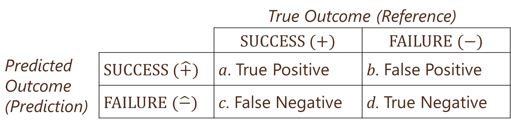

```{r echo=FALSE}
knitr::opts_chunk$set(comment=NA)
```

# Logistic Regression

## Motivation

* Marketers often observe binary outcomes
    * Did a customer:
        * purchase?
        * subscribe?
        * renew?
        * respond?
* Using linear regression is not appropriate…
* …But logistic regression still allows us to:
    * Understand IV/DV relationships
    * Make predictions


## R Packages and Datasets for Topic 3

``` {r t3packagesdata, message=FALSE}
library(ggplot2)       # Advanced graphing capabilities
library(cowplot)       # Plots in grid
library(tidyr)         # Easier programming   
library(flextable)     # Better HTML Tables
library(htmlTable)     # Better HTML Tables
library(jtools)        # Concise regression results
library(dplyr)         # Easier programming
library(caret)         # Create data partitions
load("Topic03/directmktg.rdata")
source("Topic03/or_table.R")
source("Topic03/logreg_cm.R")
source("Topic03/logreg_roc.R")
source("Topic03/gainlift.R")
source("Topic03/logreg_cut.R")
```
[Download directmktg.rdata](Topic03/directmktg.rdata)

## Why not use linear regression?

Want to see how $age$ affects $buy$

* $buy=\begin{cases}1\text{ if yes/true}\\0\text{ if no/false}\end{cases}$

Examine relationship with a scatterplot

* What do we see?
    ```{r t3scatter01, echo=FALSE, cache=TRUE, fig.cap="Scatterplot with binary DV ([R code](#figure-reffigt3scatter01))"}
    directmktg %>%
        mutate(buy01=as.numeric(buy)-1) %>%
        ggplot(aes(x=age, y=buy01)) +
            geom_point(size=3, color="red") +
            theme(text=element_text(size=15)) +
            labs(x="Age", y="Buy")
    ```


* Try linear regression: $buy=\alpha+\beta_1 age$  
<caption>(\#tab:t3linreg01) Linear Regression Results ([R code](#table-reftabt3linreg01))</caption>
    ```{r t3linreg01, echo=FALSE, cache=TRUE}
    model <- directmktg %>%
        mutate(buy=as.numeric(buy)-1) %>%
        lm(buy ~ age, .)
    summ(model, model.info=FALSE, digits=4)
    ```

* Good $R^2$ and $age$ is highly significant
* So what's the problem?

* Predict $buy$ from linear regression results:<br>
$\hat{buy}=-.7154+.0285age$

* Prediction line shown in plot
    ```{r t3scatter02, echo=FALSE, cache=TRUE, fig.cap="Predicted Values from Linear Regression ([R code](#figure-reffigt3scatter02))"}
    directmktg %>%
        select(age) %>%
        mutate(yhat=predict.lm(model,.)) %>%
        mutate(neg=as.factor(ifelse(yhat<0,"Yes","No"))) %>%
        ggplot(aes(x=age, y=yhat, color=neg)) +
            geom_point(size=3) +
            scale_color_manual(values=c("Yes"="red",
                                        "No"="black"),
                               guide="none") +
        theme(text=element_text(size=15)) +
        labs(x="Age", y="Linear Prediction")
    ```

* Add $age$ categories and plot mean $buy$ for each category
    * What "shape" does this resemble?
    * Can we use this "shape" to model the relationship?

    ```{r t3lineshape, echo=FALSE, cache=TRUE, fig.cap="Buy for Age Groups ([R code](#figure-reffigt3lineshape))"}
    # Create data frame grouped by age
    dmgrp <- directmktg %>%
        # 'cut' breaks a continuous variable into groups of each width
        # 'as.numeric' keeps the new variable as integer (vs. factor)
        mutate(agegrp = as.numeric(cut(age, 9))) %>%
        group_by(agegrp) %>%
        summarise(age=mean(age), buy=mean(as.numeric(buy)-1))
    
    # Run logistic model to create prediction to make s-curve
    binmod <- glm(buy~age, directmktg, family="binomial")
    # Create dataframe with predicted values
    dmpred <- directmktg %>%
        select(age, buy) %>%
        mutate(yhat=predict(binmod, type="response"),
               buy=as.numeric(buy)-1)
    
    # Create combined plot; each geom with separate data
    ggplot() + 
        geom_point(data=directmktg, 
                   aes(x=age, y=(as.numeric(buy)-1)), 
                   size=3, color="red") + 
        geom_line(data=dmgrp, 
                  aes(x=age, y=buy), 
                  size=1.5, color="midnightblue") +
        geom_line(data=dmpred, 
                  aes(x=age, y=yhat), 
                  size=1.5, color="darkorange") +
        theme(text=element_text(size=15)) + 
        labs(x="Age", y="Buy")
    ```

## Understanding Logistic Regression

* Uses the logistic function:<br>
$f(z)=\frac{e^u}{1+e^u}$  
    * $f(z)$ is the probability of event happening
    * $u$ is a linear function, such as: $\alpha+\beta x$
* Ensures predictions are never above 1 or below 0
    ```{r t3logitcurve, echo=FALSE, cache=TRUE, fig.cap="Logistic Function ([R code](#figure-reffigt3logitcurve))"}
    # Create simulated data frame based on logistic function
    u=seq(-7,7,.05)
    fz=exp(u)/(1+exp(u))
    ufz=data.frame(u=u, fz=fz)
    # Plot function
    ufz %>%
        ggplot(aes(x=u, y=fz)) +
            geom_line(color="darkorange", size=1.5) +
            theme(text=element_text(size=15),
                  panel.grid.major.x = element_blank()) +
            scale_x_continuous(breaks=0, minor_breaks=NULL) +
            scale_y_continuous(breaks=seq(0,1,1), minor_breaks=NULL) +
            labs(x="u", y="f(z)")
    ```

* Probability of event success vs. failure $=\frac{f(z)}{1-f(z)}=$ Odds Ratio ($OR$)
    * Suppose probability of success $=.01$, then:<br>
    $OR=\frac{.01}{1-.01}=.0101$
        * Suppose probability of success $=.001$, then:<br>
    $OR=\frac{.001}{1-.001}=.0010$
        * Suppose probability of success $=.99$, then:<br>
    $OR=\frac{.99}{1-.99}=99$
        * Suppose probability of success $=.999$, then:<br>
    $OR=\frac{.999}{1-.999}=999$
        * Suppose probability of success $=.5$, then:<br>
    $OR=\frac{.5}{1-.5}=1$
* Substituting logistic function for $f(z)$ into Odds Ratio $\Rightarrow$<br>
$OR=e^u=e^{\alpha+betax}$
    * $\frac{f(z)}{1-f(z)}=\frac{\frac{e^u}{1+e^u}}{1-\frac{e^u}{1+e^u}}=\frac{\frac{e^u}{1+e^u}}{\frac{1+e^u}{1+e^u}-\frac{e^u}{1+e^u}}=\frac{\frac{e^u}{1+e^u}}{\frac{1}{1+e^u}}=e^u$
* Can transform exponential function into linear $\Rightarrow$<br>
$Logit=\ln(OR)=\alpha+\beta x$

## Conducting Logistic Regression

* Model Estimation
* Assessing Model Fit
    * Goodness of Fit Measures
    * Classification Matrix
    * ROC Curve
* Interpreting Coefficients
* Gains and Lift

### Model Estimation

* Best to use training data and holdout data  
    * Estimate model on training data (~75% of sample)
    * Check prediction accuracy on holdout data (~25%)
* Can estimate either (1) $OR$ or (2) $Logit$ formulation
    (1) $OR=e^{\alpha+\beta_1x_1+\cdots+\beta_kx_k}$
    (2) $Logit=\alpha+\beta_1x_1+\cdots+\beta_kx_k$
* Independent variables:
    * Can be one or more
    * Can be continuous or categorical/factor

### Assessing Model Fit

#### Goodness-of-Fit Measures

* Overall significance based on $-2LL$
    * Lower (closer to $0$) $-2LL$ indicates a better fit
    * Compare $-2LL$ of estimated model with "null" model
* McFadden's Pseudo-$R^2$
    * Values range from 0 to 1 like linear regression
    * Interpreted in a similar manner
        * Amount of variation in DV explained by IVs

#### Classification Matrix

* How does the model do in predicting outcomes?
* Generate predicted probability of success, $p(\text{SUCCESS})$, for each observation
    * If $p(\text{SUCCESS})\ge0.5$, predict $\text{SUCCESS}=1$
    * If $p(\text{SUCCESS})<0.5$, predict $\text{SUCCESS}=0$, or $\text{FAILURE}$
* Check predictions against actual outcomes
    * Examine both training and holdout data
    
```{r t3classmatimg, echo=FALSE, fig.cap="Classification Matrix"}

```
* Three main measures
    * Sensitivity: Predicted success given actual success
        * $p(\hat{+}|+)=a/(a+c)$
    * Specificity: Predicted failure given actual failure
        * $p(\hat{-}|-)=d/(b+d)$
    * Overall correctly classified
        * $(a+d)/(a+b+c+d)$
* Sensitivity vs. Specificity
    * Ideally, want both to be high, but...<br>
    the $p(\text{SUCCESS})\ge\pi$ threshold can be changed
    * Why change $\pi$? Avoid false positives or negatives
    * By default:
        * Increasing sensitivity decreases specificity
        * Increasing specificity decreases sensitivity
* Overall correctly classified
    * Compare with *Proportional Chance Criterion (*$PCC$*)*
        * $PCC$ is the "average" probability of classification based on group sizes
    * $PCC=p^2+(1-p)^2$ where $p$ is the proportion of sample in the $\text{SUCCESS}$ group
    * Overall correctly classified $>PCC$ considered good fit when examining holdout data
    
#### ROC Curve

* Plot sensitivity by $1-$ specificity as $\pi$ goes from $0$ to $1$
* More area under curve means better model
<table style="text-align: center;"><tr><td><strong>Area under Curve</strong></td><td><strong>Discrimination</strong></td></tr>
<tr><td style="font-family: cambria;"><em>AUC</em> = .5</td><td>None</td></tr>
<tr><td style="font-family: cambria;">.5 < <em>AUC</em> < .7</td><td>Poor</td></tr>
<tr><td style="font-family: cambria;">.7 &le; <em>AUC</em> < .8</td><td>Acceptable</td></tr>
<tr><td style="font-family: cambria;">.8 &le; <em>AUC</em> < .9</td><td>Excellent</td></tr>
<tr><td style="font-family: cambria;"><em>AUC</em> &ge; .9</td><td>Outstanding</td></tr>
</table>
    ```{r t3sampleroc, echo=FALSE, fig.cap="Sample ROC Curve"}
    spec <- seq(0,1,.001)
    sens <- sqrt(1-spec^2)
    df <- data.frame(spec,sens)
    data.frame(spec,sens) %>% 
        mutate(sens=ifelse(sens>1,1,sens)) %>%
        mutate(sens=ifelse(sens<0,0,sens)) %>%
        ggplot(aes(x=spec, y=sens)) +
            geom_line(color="darkorange", size=2) +
            scale_x_reverse() + 
            geom_segment(x=-1, y=0, xend=0, yend=1, 
                         color="forestgreen", size=2) + 
            geom_segment(x=-.495, y=.495, xend=-.375, yend=.375,
                         arrow=arrow(ends="first")) +
            annotate("text", x=.375, y=.35, 
                     label="Chance Model", size=6) +
            theme(text=element_text(size=15)) +
            labs(x="Specificity", y="Sensitivity")
    ```
 
### Interpreting Coefficients

* Relationship between DV and each IV
* $H_0: \beta_k=0$ *vs.* $H_a: \beta_k\ne0$
* Interpret significant relationships
    * Interpretation depends on $OR$ or $Logit$ estimation
    * Direction of relationship:
        * $Logit$ estimation: $\beta_k>0$ for positive, $\beta_k<0$ for negative
        * $OR$ estimation: $\beta_k>1$ for positive, $\beta_k<1$ for negative
    * Magnitude of change:
        * $Logit$ estimation: coefficients are not particularly useful
        * $OR$ estimation:
            * Percentage change in odds
            * Compare probabilities between groups
            
### Gain and Lift

* Evaluate performance of classification
* Example:
    * Suppose $10\%$ of $2000$ customers will accept offer
    * For $100$ random customers, expect $10$ accepted offers
    * Model predicts some customers more likely to accept
    * Instead of contacting $100$ random customers…<br>Contact $100$ most likely to accept based on model
    * Continue doing this in groups of $100$ (or $200$, etc.)
* Gain and lift provide measures of how much better the model performs vs. no model/random
* Process
    1) Predict $p(\text{SUCCESS}) for each observation and sort descending
    2) Split into 10 (deciles) or 20 (demi-deciles) ordered groups
    3) Calculate $\%$ observations and $\%$ successes for each group

#### Gain

* Cumulative successes up to that group divided by total successes across all groups
* Plot on $y$-axis, with cumulative percent of observations on $x$-axis
    ```{r t3typgain, echo=FALSE, fig.cap="Typical Gain Chart Shape"}
    pcc <- seq(.05,1,.01)
    pcp <- .3376*log(pcc)+1.0944

    data.frame(pcc,pcp) %>%
        mutate(pcp=ifelse(pcp>1,1,pcp)) %>%
        ggplot(aes(x=pcc, y=pcp)) +
            geom_line(color="midnightblue", size=1) + 
            scale_x_continuous("Proportion Customers Contacted",
                              limits=c(.05,1), breaks=seq(.1,1,.1)) +
            scale_y_continuous("Proportion Customers Positive",
                              limits=c(.05,1), breaks=seq(.1,1,.1)) +
            geom_segment(x=.05, y=.05, xend=1, yend=1, 
                         color="red", size=1) +
            geom_segment(x=.9, y=.775, xend=.9, yend=.895,
                         arrow=arrow(ends="last")) +
            annotate("text", x=.9, y=.765, 
                     label="Baseline Model", size=5) +
            theme(text=element_text(size=15)) +
            geom_segment(x=.2, y=0, xend=.2, yend=.55105376, 
                         linetype=2, color="darkorange", size=.75) +
            geom_segment(x=0, y=.2, xend=.2, yend=.2, 
                         linetype=2, color="darkorange", size=.75) +
            geom_segment(x=0, y=.55105376, xend=.2, yend=.55105376,
                         linetype=2, color="darkorange", size=.75)
    ```

#### Lift

* Ratio of cumulative success up to that group divided by expected success from no model
* Plot on $y$-axis, with cumulative percent of observations on $x$-axis
    ```{r t3typlift, echo=FALSE, fig.cap="Typical Lift Chart Shape"}
    lift <- 2.7863*pcc^3-4.5901*pcc^2+.2319*pcc+2.5673
    data.frame(pcc,lift) %>%
        mutate(lift=ifelse(lift<1,1,lift)) %>%
        ggplot(aes(x=pcc, y=lift)) +
            geom_line(color="midnightblue", size=1) + 
            scale_x_continuous("Proportion Customers Contacted",
                               limits=c(.05,1), breaks=seq(.1,1,.1)) +
            scale_y_continuous("Lift",
                               limits=c(1,2.6), breaks=seq(1,2.5,.25)) +
            geom_segment(x=.05, y=1, xend=1, yend=1, color="red", size=1) +
            geom_segment(x=.5, y=1, xend=.5, yend=1.25,
                         arrow=arrow(ends="first")) +      
            annotate("text", x=.5, y=1.3, label="Baseline Model", size=5) +
            theme(text=element_text(size=15)) +   
            geom_segment(x=.2, y=1, xend=.2, yend=2.452366, 
                         linetype=2, color="darkorange", size=.75) +
            geom_segment(x=0, y=2.452366, xend=.2, yend=2.452366, 
                         linetype=2, color="darkorange", size=.75)
    ```
  
### Sensitivity/Specificity Plots

* Sensitivity, Specificity, and Accuracy depend on the cutoff value for predicting SUCCESS/ FAILURE
    * While 0.5 is the most common threshold, it might not be the best threshold for prediction
* Sensitivity/Specificity Plots can show the analyst how each changes with different cutoff values
    * The analyst can try to balance the three depending on the purpose of project
    ``` {r t3sensspecplot, echo=FALSE, fig.cap="Sample Sensitivy/Specificity Plot"}
    pcc <- seq(0,1,.01)
    sens <- 1.0189-.01678*pcc-.8349*pcc^2
    spec <- 1.9211*pcc-.8349*pcc^2-.0778
    acc <- .45+1.6*pcc-1.6*pcc^2
    data.frame(pcc, sens, spec, acc) %>%
   mutate(sens=ifelse(sens>1,1,sens)) %>%
   mutate(spec=ifelse(spec<0,0,spec)) %>%
   mutate(spec=ifelse(spec>1,1,spec)) %>%
   ggplot(aes(x=pcc)) + 
   geom_line(aes(y=acc), color="red4", size=1.2) +
   geom_line(aes(y=sens), color="forestgreen", size=.7) + 
   geom_line(aes(y=spec), color="blue", size=.7) +
   geom_point(aes(y=sens), color="forestgreen") +
   geom_point(aes(y=spec), color="blue") + 
   scale_x_continuous("Cutoff Value", breaks=seq(0,1,.1)) +
   scale_y_continuous("Measure Value", breaks=seq(0,1,.1)) +
   geom_segment(x=.3, y=.423, xend=.4, yend=.3, arrow=arrow(ends="first")) +
   annotate("text", x=.4, y=.28, label="Specificity", size=5) + 
   geom_segment(x=.85, y=0.401, xend=.75, yend=.3, arrow=arrow(ends="first"))+
   annotate("text", x=.75, y=.28, label="Sensitivity", size=5) + 
   geom_segment(x=.2, y=.706, xend=.1, yend=.82, arrow=arrow(ends="first"))+
   annotate("text", x=.1, y=.85, label="Accuracy", size=5) +
   theme(text=element_text(size=15))
    ```

## Logistic Regression Example

### Overview

* Purchase data for direct marketing campaign
    * 400 observations of individual responses
    * DV: Purchase made, $buy$ (factor: Yes, No)
    * IVs:
        * Age, $age$
        * Estimated Salary ($000s), $salary$
        * Gender, $gender$ (factor: Male, Female)
* Predict likelihood of purchase

### Estimation Results

* Logit formulation results  
<caption>(\#tab:t3logit01) Logistic Regression Results (Logit Formulation) ([R code](#table-reftabt3logit01))</caption>
    ``` {r t3logit01, echo=FALSE, cache=TRUE}
    # Use 'caret' package to create training and test/holdout samples
    # This will create two separate dataframes: train and test
    set.seed(4320)
    inTrain <- createDataPartition(y=directmktg$buy, p=.75, list=FALSE)
    train <- directmktg[inTrain,]
    test <- directmktg[-inTrain,]
    
    # Estimate the model on the training data
    model <- glm(buy ~ age + salary + gender, train, family="binomial")
    summ(model, model.info=FALSE, digits=4)
    
    # Get p-value
    p <- with(model, pchisq(null.deviance - deviance,
                       df.null-df.residual,
                       lower.tail=FALSE))
    cat("Model p-value =",sprintf("%.4f",p))
    ```

* Odds Ratio Coefficients  
<caption>(\#tab:t3logit01or) Logistic Regression Odds Ratio Coefficients ([R code](#table-reftabt3logit01or))</caption>

    ```{r t3logit01or, echo=FALSE}
    # Use the 'or_table.R' user-defined script
    # It was loaded above with the packages
    flextable(or_table(model))
    ```

### Overall Model Fit

* Based on the likelihood ratio $\chi^2$ test with a $p\text{-value}<.0001$, the overall model is significant (see Table \@ref(tab:t3logit01))
* McFadden's Pseudo-$R^2$ of $.464$ means that the model explains about $46\%$ of the variation between buyers/non-buyers (see Table \@ref(tab:t3logit01))
* Classification Matrix for the Training Sample shows:
    * High sensitivity ($72.2\%$)
    * High specificity ($91.2\%$)
    * Correctly classified ($84.4\%$) > PCC ($54.0\%$)  
    
    <caption>(\#tab:t3cmtrain) Classification Matrix for Training Sample ([R code](#table-reftabt3cmtrain))</caption>
    ```{r t3cmtrain, echo=FALSE, cache=TRUE}
    # Use the 'logreg_cm.R' user-defined script
    # It was loaded above with the packages
    # Requires package 'caret'
    logreg_cm(model,      # Object with model results
              train,      # Data to use (i.e., training vs. testing)
              "Yes")      # Factor level for "True"
    ```

* Classification Matrix for the Test/Holdout Sample shows:
    * High sensitivity ($77.1\%$)
    * High specificity ($90.6\%$)
    * Correctly classified ($85.9\%$) > PCC ($54.3\%$)  

    <caption>(\#tab:t3cmtest) Classification Matrix for Test/Holdout Data ([R code](#table-reftabt3cmtest))</caption>
    ```{r t3cmtest, echo=FALSE, cache=TRUE}
    # Use the 'logreg_cm.R' user-defined script
    # It was loaded above with the packages
    # Requires package 'caret'
    logreg_cm(model,      # Object with model results
              test,      # Data to use (i.e., training vs. testing)
              "Yes")      # Factor level for "True"
    ```

* ROC Curve for Training Sample
    * Area $>.90$ suggests an outstanding model fit

    ```{r t3roctrain, echo=FALSE, cache=TRUE, message=FALSE, fig.cap="ROC Curve for Training Sample ([R code](#figure-reffigt3roctrain))"}
    # Use the 'logreg_roc.R' user-defined script
    # It was loaded above with the packages
    # Requires package 'pROC' and 'ggplot2
    logreg_roc(model,      # Object with model results
               train)      # Data to use (i.e., training vs. testing)
    ```

* ROC Curve for Holdout Sample
    * Area $>.90$ suggests an outstanding model fit

    ```{r t3roctest, echo=FALSE, cache=TRUE, message=FALSE, fig.cap="ROC Curve for Test/Holdout Sample ([R code](#figure-reffigt3roctest))"}
    # Use the 'logreg_roc.R' user-defined script
    # It was loaded above with the packages
    # Requires package 'pROC' and 'ggplot2
    logreg_roc(model,      # Object with model results
               test)      # Data to use (i.e., training vs. testing)
    ```    

### Interpreting Coefficients

* $age$ is positive ($OR>1$) and significant ($p<.001$)
    * $1$ year increase in $age$ increases odds of buying by a factor of $1.28$ (or odds of buying increase by $25\%$)
* $salary$ is positive ($OR>1$) and significant ($p<.001$)
    * $\$1000$ increase in $salary$ increases odds of buying by a factor of $1.04$ (or odds of buying increase by $4\%$)
* $gender$ is negative ($OR<1$), but not significant ($p=.245$)
    * Had it been significant...
    Being female decreases odds of buying by a factor of $.67$ (or odds of buying decrease by $33\%$)
* Can visually examine how $\Pr(buy)$ changes with IVs
    ```{r t3mpage01, echo=FALSE, cache=TRUE, fig.cap="Margin Plots for Age, Salary, and Gender ([R code](#figure-reffigt3mpage01))"}
    # Use 'effects' package
    library(effects)

    # Want to predict Pr(buy) for different levels of age
    age.pred <- data.frame(predictorEffect("age",  # Focal variable
                                           model))

    # Use 'age.pred' for margin plot, assign to 'p1'
    p1 <- age.pred %>%
      ggplot(aes(x=age,   # ad_tv on x-axis
                 y=fit)) +   # 'sales' prediction on y-axis
        geom_line(size=1) +   # Draw predicted line
        geom_ribbon(aes(ymin=lower,  # Draws the confidence interval bands
                        ymax=upper),
                        alpha=0.2) + # Sets transparency level
        scale_y_continuous(limits=c(0,1)) +
        labs(x="Age", y="Pr(Buy)") +
        theme(text=element_text(size=15))

    # Repeat for other two variables
    sal.pred <- data.frame(predictorEffect("salary", model))
    p2 <- sal.pred %>%
      ggplot(aes(x=salary,   # ad_tv on x-axis
                 y=fit)) +   # 'sales' prediction on y-axis
        geom_line(size=1) +   # Draw predicted line
        geom_ribbon(aes(ymin=lower,  # Draws the confidence interval bands
                        ymax=upper),
                        alpha=0.2) + # Sets transparency level
        scale_y_continuous(limits=c(0,1)) +
        labs(x="Salary", y="Pr(Buy)") +
        theme(text=element_text(size=15))

    g.pred <- data.frame(predictorEffect("gender", model))
    p3 <- g.pred %>%
      ggplot(aes(x=gender, y=fit, group=1)) +
        geom_point(size=4) +
        geom_line(color="orange") +
        geom_errorbar(aes(ymin=lower, ymax=upper), width=0.2) +
        scale_y_continuous(limits=c(0,1)) +
        labs(x="Gender", y="Pr(Buy)") +
        theme(text=element_text(size=15))

    # Arrange three plots in a grid using package 'cowplot'
    plot_grid(p1,p2,p3, nrow=2)
    ```

### Gain

* Can examine gain for both the training and holdout samples...
* But using holdout is more informative
* Contacting the top $25\%$ of predicted buyers yields nearly $60\%$ of actual buyers
    
    <caption>(\#tab:t3gaintable) Gain Table for Training and Test/Holdout Samples ([R code](#table-reftabt3gaintable))</caption>

    ```{r t3gaintable, echo=FALSE}
    # Use the 'gainlift.R' user-defined script
    # It was loaded above with the packages
    # Requires packages 'ggplot2', 'dplyr', and 'tidyr'
    # Returns a list of four things:
    #   gainplot, liftplot, gaintable, lifttable
    glresults <- gainlift(model, train, test, "Yes")
    glresults$gaintable
    ```

    ```{r t3gainplot, echo=FALSE, fig.cap="Gain Chart for Training and Test/Holdout Samples ([R code](#figure-reffigt3gainplot))"}
    # Plot was already returned in the previous call to 'gainlift'
    glresults$gainplot
    ```

### Lift

* Can examine gain for both the training and holdout samples...
* But using holdout is more informative
* Contacting the top $25\%$ of predicted buyers provides lift of nearly 2.5

    <caption>(\#tab:t3lifttable) Lift Table for Training and Test/Holdout Samples ([R code](#table-reftabt3lifttable))</caption>

    ```{r t3lifttable, echo=FALSE}
    # Table was already returned in the previous call to 'gainlift'
    glresults$lifttable
    ```

    ```{r t3liftplot, echo=FALSE, fig.cap="Lift Chart for Training and Test/Holdout Samples ([R code](#figure-reffigt3liftplot))"}
    # Plot was already returned in the previous call to 'gainlift'
    glresults$liftplot
    ```

### Sensitivity/Specificity Plots

* Examine to see if different thresholds are warranted
    * Looking at the plots for both the training sample (see Figure \@ref(fig:t3sensspec01)) and the test/holdout sample (see Figure \@ref(fig:t3sensspec02)), it might be worthwhile to try a cutoff threshold between 0.35 and 0.40
        * Doing so will balance specificity and sensitivity without hurting accuracy
    ```{r t3sensspec01, echo=FALSE, fig.cap="Sensitivity/Specificity Plot for Training Sample ([R code](#figure-reffigt3sensspec01))"}
    # Use the 'logreg_cut.R' user-defined script
    # It was loaded above with the packages
    # Requires packages 'ggplot2'
    logreg_cut(model, train, "Yes")
    ```
    ```{r t3sensspec02, echo=FALSE, fig.cap="Sensitivity/Specificity Plot for Test/Holdout Sample ([R code](#figure-reffigt3sensspec02))"}
    # Use the 'logreg_cut.R' user-defined script
    # It was loaded above with the packages
    # Requires packages 'ggplot2'
    logreg_cut(model, test, "Yes")
    ```
    
    
## Suggested Readings

* *R for Marketing Research and Analytics. 2nd Edition* (2019). Chapman, Chris; McDonnel Feit, Elea
    * BGSU Library Link:<br><a href="http://maurice.bgsu.edu/record=b4966554~S9" target="_blank" rel="noopener noreferrer">http://maurice.bgsu.edu/record=b4966554~S9</a>
    * eBook through BGSU Library:<br><a href="https://link-springer-com.ezproxy.bgsu.edu/book/10.1007%2F978-3-030-14316-9" target="_blank" rel="noopener noreferrer">https://link-springer-com.ezproxy.bgsu.edu/book/10.1007%2F978-3-030-14316-9</a>
    * Chapter 9.2: Linear Models for Binary Outcomes: Logistic Regression
* *OpenIntro Statistics. 4th Edition* (2019). Diez, David; Cetinkaya-Rundel, Mine; Barr, Christopher D.
    * Available at OpenIntro.org:<br><a href="https://www.openintro.org/book/os/" target="_blank" rel="noopener noreferrer">https://www.openintro.org/book/os/</a>
    * Chapter 9: Multiple and logistic regression
    
* *Multivariate Data Analysis*. Hair, Joseph F.; Black, William C.; Babin, Barry J.; Anderson, Rolph E.
    * 7th Edition: Search for “multivariate data analysis 7th edition hair”
        Chapter 6: Logistic Regression with a Binary Dependent Variable
    * 5th Edition: Course reserves
        * Chapter 5: Multiple Discriminant Analysis and Logistic Regression (pp. 276-281; 314-321)

## R Code

### Figure \@ref(fig:t3scatter01) {.unlisted .unnumbered}

```{r t3scatter01code, eval=FALSE}
directmktg %>%
    mutate(buy01=as.numeric(buy)-1) %>%  # Change 'buy' to 0-1
    ggplot(aes(x=age, y=buy01)) +
        geom_point(size=2) +
        labs(x="Age", y="Buy")
```

### Figure \@ref(fig:t3scatter02) {.unlisted .unnumbered}

```{r t3scatter02code, eval=FALSE}
directmktg %>%
    select(age) %>%  # Select only the age variable
    mutate(yhat=predict.lm(model,.)) %>%  # Predict y from model
    # Next line creates variable to highlight negative predictions
    mutate(neg=as.factor(ifelse(yhat<0,"Yes","No"))) %>% 
    ggplot(aes(x=age, y=yhat, color=neg)) +
        geom_point(size=3) +
        scale_color_manual(values=c("Yes"="red",   # Manually set point colors
                                    "No"="black"),
                           guide="none") +
        labs(x="Age", y="Linear Prediction")
```

### Figure \@ref(fig:t3lineshape) {.unlisted .unnumbered}

```{r t3lineshapecode, eval=FALSE}
# Create data frame grouped by age
dmgrp <- directmktg %>%
    # 'cut' breaks a continuous variable into groups of each width
    # 'as.numeric' keeps the new variable as integer (vs. factor)
    mutate(agegrp = as.numeric(cut(age, 9))) %>%
    group_by(agegrp) %>%
    summarise(age=mean(age), buy=mean(as.numeric(buy)-1))

# Run logistic model to create prediction to make s-curve
binmod <- glm(buy~age, directmktg, family="binomial")
# Create dataframe with predicted values
dmpred <- directmktg %>%
    select(age, buy) %>%
    mutate(yhat=predict(binmod, type="response"),
           buy=as.numeric(buy)-1)

# Create combined plot; each geom with separate data
ggplot() + 
    geom_point(data=directmktg, 
               aes(x=age, y=(as.numeric(buy)-1)), 
               size=3, color="red") + 
    geom_line(data=dmgrp, 
              aes(x=age, y=buy), 
              size=1.5, color="midnightblue") +
    geom_line(data=dmpred, 
              aes(x=age, y=yhat), 
              size=1.5, color="darkorange") +
    theme(text=element_text(size=15)) + 
    labs(x="Age", y="Buy")
```

### Figure \@ref(fig:t3logitcurve) {.unlisted .unnumbered}

```{r t3logitcurvecode, eval=FALSE}
# Create simulated data frame based on logistic function
u=seq(-7,7,.05)
fz=exp(u)/(1+exp(u))
ufz=data.frame(u=u, fz=fz)
# Plot function
ufz %>%
    ggplot(aes(x=u, y=fz)) +
        geom_line(color="darkorange", size=1.5) +
        theme(text=element_text(size=15),
              panel.grid.major.x = element_blank()) +
        scale_x_continuous(breaks=0, minor_breaks=NULL) +
        scale_y_continuous(breaks=seq(0,1,1), minor_breaks=NULL) +
        labs(x="u", y="f(z)")
```

### Figure \@ref(fig:t3roctrain) {.unlisted .unnumbered}

```{r t3roctraincode, eval=FALSE}
# Use the 'logreg_roc.R' user-defined script
# It was loaded above with the packages
# Requires package 'pROC' and 'ggplot2
logreg_roc(model,      # Object with model results
           train)      # Data to use (i.e., training vs. testing)
```

### Figure \@ref(fig:t3roctest) {.unlisted .unnumbered}

```{r t3roctestcode, eval=FALSE}
# Use the 'logreg_roc.R' user-defined script
# It was loaded above with the packages
# Requires package 'pROC' and 'ggplot2
logreg_roc(model,      # Object with model results
           test)      # Data to use (i.e., training vs. testing)
```

### Figure \@ref(fig:t3mpage01) {.unlisted .unnumbered}

```{r t3mpage01code, eval=FALSE}
# Use 'effects' package
library(effects)

# Want to predict Pr(buy) for different levels of age
age.pred <- data.frame(predictorEffect("age",  # Focal variable
                                       model))

# Use 'age.pred' for margin plot, assign to 'p1'
p1 <- age.pred %>%
  ggplot(aes(x=age,   # ad_tv on x-axis
             y=fit)) +   # 'sales' prediction on y-axis
    geom_line(size=1) +   # Draw predicted line
    geom_ribbon(aes(ymin=lower,  # Draws the confidence interval bands
                    ymax=upper),
                    alpha=0.2) + # Sets transparency level
    scale_y_continuous(limits=c(0,1)) +
    labs(x="Age", y="Pr(Buy)")

# Repeat for other two variables
sal.pred <- data.frame(predictorEffect("salary", model))
p2 <- sal.pred %>%
  ggplot(aes(x=salary,   # ad_tv on x-axis
             y=fit)) +   # 'sales' prediction on y-axis
    geom_line(size=1) +   # Draw predicted line
    geom_ribbon(aes(ymin=lower,  # Draws the confidence interval bands
                    ymax=upper),
                    alpha=0.2) + # Sets transparency level
    scale_y_continuous(limits=c(0,1)) +
    labs(x="Salary", y="Pr(Buy)")

g.pred <- data.frame(predictorEffect("gender", model))
p3 <- g.pred %>%
  ggplot(aes(x=gender, y=fit, group=1)) +
    geom_point(size=4) +
    geom_line(color="orange") +
    geom_errorbar(aes(ymin=lower, ymax=upper), width=0.2) +
    scale_y_continuous(limits=c(0,1)) +
    labs(x="Gender", y="Pr(Buy)")

# Arrange three plots in a grid using package 'cowplot'
plot_grid(p1,p2,p3, nrow=2)
```

### Figure \@ref(fig:t3gainplot) {.unlisted .unnumbered}

```{r t3gainplotcode, eval=FALSE}
# Plot was already returned in the previous call to 'gainlift'
glresults$gainplot
```

### Figure \@ref(fig:t3liftplot) {.unlisted .unnumbered}

```{r t3liftplotcode, eval=FALSE}
# Plot was already returned in the previous call to 'gainlift'
glresults$gainlift
```

### Figure \@ref(fig:t3sensspec01) {.unlisted .unnumbered}

```{r t3sensspec01code, eval=FALSE}
# Use the 'logreg_cut.R' user-defined script
# It was loaded above with the packages
# Requires packages 'ggplot2'
logreg_cut(model, train, "Yes")
```

### Figure \@ref(fig:t3sensspec02) {.unlisted .unnumbered}

```{r t3sensspec02code, eval=FALSE}
# Use the 'logreg_cut.R' user-defined script
# It was loaded above with the packages
# Requires packages 'ggplot2'
logreg_cut(model, test, "Yes")
```

### Table \@ref(tab:t3linreg01) {.unlisted .unnumbered}

```{r t3linreg01code, eval=FALSE}
model <- directmktg %>%
    mutate(buy=as.numeric(buy)-1) %>%
    lm(buy ~ age, .)
# NOTE: 'summ' uses the 'jtools' package
summ(model, model.info=FALSE, digits=4)
# For virtual environment, use 'summary' from Base R,
# but manually calculate McFadden's Pseudo-Rsq
summary(model)
Mrsq <- 1-model$deviance/model$null.deviance
cat("McFadden's Pseudo-Rsquared = ", round(Mrsq, digits=4)
```

### Table \@ref(tab:t3logit01) {.unlisted .unnumbered}

``` {r t3logit01code, eval=FALSE}
# Use 'caret' package to create training and test/holdout samples
# This will create two separate dataframes: train and test
set.seed(4320)
inTrain <- createDataPartition(y=directmktg$buy, p=.75, list=FALSE)
train <- directmktg[inTrain,]
test <- directmktg[-inTrain,]

# Estimate the model on the training data
model <- glm(buy ~ age + salary + gender, train, family="binomial")
# NOTE: 'summ' uses the 'jtools' package
summ(model, model.info=FALSE, digits=4)
# For virtual environment, use 'summary' from Base R
```

### Table \@ref(tab:t3logit01or) {.unlisted .unnumbered}

```{r t3logit01orcode, eval=FALSE}
# Use the 'or_table.R' user-defined script
# It was loaded above with the packages
flextable(or_table(model))
```

### Table \@ref(tab:t3cmtrain) {.unlisted .unnumbered}

```{r t3cmtraincode, eval=FALSE}
# Use the 'logreg_cm.R' user-defined script
# It was loaded above with the packages
# Requires package 'caret'
logreg_cm(model,      # Object with model results
          train,      # Data to use (i.e., training vs. testing)
          "Yes")      # Factor level for "True"
```

### Table \@ref(tab:t3cmtest) {.unlisted .unnumbered}

```{r t3cmtestcode, eval=FALSE}
# Use the 'logreg_cm.R' user-defined script
# It was loaded above with the packages
# Requires package 'caret'
logreg_cm(model,      # Object with model results
          test,      # Data to use (i.e., training vs. testing)
          "Yes")      # Factor level for "True"
```

### Table \@ref(tab:t3gaintable) {.unlisted .unnumbered}

```{r t3gaintablecode, eval=FALSE}
# Use the 'gainlift.R' user-defined script
# It was loaded above with the packages
# Requires packages 'ggplot2', 'dplyr', and 'tidyr'
# Returns a list of four things:
#   gainplot, liftplot, gaintable, lifttable
glresults <- gainlift(model, train, test, "Yes")
glresults$gaintable
```

### Table \@ref(tab:t3lifttable) {.unlisted .unnumbered}

```{r t3;lifttablecode, eval=FALSE}
# Table was already returned in the previous call to 'gainlift'
glresults$lifttable
```
