```{r echo=FALSE}
knitr::opts_chunk$set(comment=NA)
options(scipen=5)  # Turns off scientific notation
```

# Segmentation

## R Packages and Datasets for Topic 5

``` {r t5packagesdata, message=FALSE}
library(ggplot2)       # Advanced graphing capabilities
library(flextable)     # Better HTML Tables
library(dplyr)         # Easier programming
library(dendextend)    # Nicer dendrograms
library(vtable)        # Nicer tables
load("Topic05/ffseg.rdata")
```
``` {r t5packagesdata2, echo=FALSE, message=FALSE}
library(kableExtra)
```

## Segmentation Overview

### Why segment the market?

* Markets are heterogeneous
    * Difficult to meet needs with one marketing mix
* Can create homogeneous segments
    * Each segment offered a different marketing mix

### Market Segment vs. Segmentation

***Market Segment***  
Subgroup of people or organizations sharing one or more characteristics that cause them to have similar product needs.

***Market Segmentation***  
Process of dividing a market into meaningful, relatively similar, and identifiable segments or groups.

### Criteria for Successful Segmentation

**Identifiable and Measurable**  
Characteristics provide a basis for segmentation

**Substantial**  
Large and profitable enough to make it worthwhile

**Accessible**  
Able to receive communications and distributions

**Responsive**  
Respond to marketing efforts and changes in mix

### Bases for Consumer Markets

**Behavioral Segmentation**

* Benefits sought (*e.g., quality, taste, convenience, excitement, etc.*)
* Product usage (*e.g., heavy, light, non, former, first-time, etc.*)
* Usage situations (*e.g., celebration, emergency, everyday, etc.*)
* Price sensitivity (*e.g., value-conscious, status-conscious, etc.*)

**Demographic Segmentation**

* Age
* Gender
* Income
* Occupation
* Education
* Ethnicity
* Generation

**Psychographic Segmentation**

* Personality (*e.g., outgoing, shy, materialistic, controlled, etc.*)
* Lifestyle (*e.g., homebody, couch potato, workaholic, etc.*)
* Motives (*e.g., safety, status, relaxation, convenience, etc.*)


**Geographic Segmentation**

* Regional
* City size
* Population density
* Block group
* Climate

#### Which base to use?

* Using Geographics or Demographics is easy, but it won’t help determine needs.
* Knowing how a product fits a lifestyle or benefits consumers seek is important, but it won’t help identify specific customers.
* A combination of bases likely works best, but the bases to be used depend on the purpose of segmentation.

## Cluster Analysis

### Overview

***Cluster analysis*** classifies objects so that objects are similar to others in the cluster with respect to some predetermined criterion.

* Resulting clusters exhibit:
    * High within-cluster homogeneity  ($a$ in Figure \@ref(fig:t5clusterexample))
    * High between-cluster heterogeneity ($b$ in Figure\@ref(fig:t5clusterexample))
    
```{r t5clusterexample, echo=FALSE, cache=TRUE, fig.cap="Cluster Example", out.width="50%"}
   knitr:: 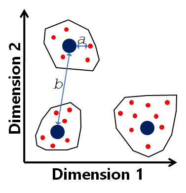
```

* Basic steps
    * Choose variables (i.e., bases)
    * Define measure of similarity
    * Develop method for assigning objects
    
### Measures of Similarity

Similarity measure depends on data type

* For continuous data...<br>Use distance-type measures
* For binary data...<br>Use similarity coefficients
* For mixed data...<br>Use special measures

#### Continuous data

Distance-type measures

* Euclidean: $\sqrt{(x_{1i}-x_{1j})^2 + \cdots +(x_{ni}-x_{nj})^2}$
* Squared Euclidean: $(x_{1i}-x_{1j})^2 + \cdots +(x_{ni}-x_{nj})^2$
* Absolute: $|x_{1i}-x_{1j}|^2 + \cdots +|x_{ni}-x_{nj}|^2$
* NOTE: If all variables are continuous and measured on different scales, best to standardize them first

Euclidean Distance Example

* Suppose three individuals rated importance of three attributes

``` {r t5distancetable, echo=FALSE}
Person <- c("Alex", "Sam", "Pat")
Price <- c(6,5,6)
Quality <- c(5,1,6)
Service <- c(6,6,5)
df <- data.frame(cbind(Person, Price, Quality, Service))
kable(df, format="html") %>% 
  kable_styling("striped", full_width=FALSE) %>% 
  add_header_above(c(" "=1, "Importance"=3))
```

* Calculate Euclidean Distances between each pair
    * Alex/Sam: $\sqrt{6-5)^2+(5-1)^2+(7-2)^2}=\sqrt{42}=6.48$
    * Alex/Pat: $\sqrt{6-6)^2+(5-6)^2+(7-5)^2}=\sqrt{5}=2.24$
    * Sam/Pat: $\sqrt{5-6)^2+(1-6)^2+(2-5)^2}=\sqrt{35}=5.92$
    
* Pairwise Similarity Matrix

```{r t5pwsim1, echo=FALSE, message=FALSE, warning=FALSE}
Person <- c("Alex", "Sam", "Pat")
Alex <- c("0","6.48","2.24")
Sam <- c(NA, "0", "5.92")
Pat <- c(NA, NA, "0")
df <- data.frame(Person, Alex, Sam, Pat)
kbl(df, table.attr = "style = \"color: black;\"") %>%
  kable_styling("basic", full_width=FALSE) %>%
  column_spec(3, background = ifelse(is.na(df$Sam),"black","white")) %>%
  column_spec(4, background = ifelse(is.na(df$Pat),"black","white")) %>%
  column_spec(1:2, background="white")

```

#### Binary Data

Similarity Coefficients

* Based on a $2×2$ cross-tab between objects

    ```{r, echo=FALSE, out.width="50%"}
        knitr:: 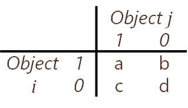
    ```

    $a$ = number of variables where $i$ and $j$ both had $1$s  
    $d$ = number of variables where $i$ and $j$ both had $0$s  
    $b$ = number of variables where $i$ is $1$ and $j$ is $0$  
    $c$ = number of variables where $i$ is $0$ and $j$ is $1$  

* Matching coefficient: $(a+d)/(a+b+c+d)$
    ```{r t5pwsim2, echo=FALSE, message=FALSE, warning=FALSE}
    Person <- c("Alex", "Sam", "Pat")
    Price <- c(1,1,0)
    Quality <- c(1,0,0)
    Service <- c(1,0,0)
    df <- data.frame(cbind(Person, Price, Quality, Service))
    kable(df, format="html") %>% 
      kable_styling("striped", full_width=FALSE) %>% 
      add_header_above(c(" "=1, "Research"=3))
    ```
* Calculate matching coefficient between each pair
    * Alex/Sam: $(1+0)/(1+2+0+0)=1/3=33.3\%$
    * Alex/Pat: $(0+0)/(0+3+0+0)=0/3=0.0\%$
    * Sam/Pat: $(0+2)/(0+1+0+2)=2/3=66.6\%$
* Pairwise similarity matrix
    ```{r t5pwsim3, echo=FALSE, message=FALSE, warning=FALSE}
    Person <- c("Alex", "Sam", "Pat")
    Alex <- c("100%","33.3%","0.0%")
    Sam <- c(NA, "100%", "66.6%")
    Pat <- c(NA, NA, "100%")
    df <- data.frame(Person, Alex, Sam, Pat)
    kbl(df, table.attr = "style = \"color: black;\"") %>%
      kable_styling("basic", full_width=FALSE) %>%
      column_spec(3, background = ifelse(is.na(df$Sam),"black","white")) %>%
      column_spec(4, background = ifelse(is.na(df$Pat),"black","white")) %>%
      column_spec(1:2, background="white")

    ```

#### Mixed data

Special measures

* Gower coefficent
    * Creates a measure between 0 and 1 for each variable
    * For continuous variables:
        * For each variable, absolute distance divided by range for that variable
    * For binary variables:
        * Matching as before
        
### Assigning Objects

* **Heirarchical**: Construct a treelike structure up (agglomerative) or down (divisive) based on similarity of objects
* **Partitioning**: Assign objects to one of a specified number of clusters based on similarity of object to the cluster

#### Hierarchical: Agglomerative

##### Stages

1. Consider each object as its own cluster
2. Join two closest objects based on similarity measure and algorithm
3. Join next two closest objects (individual or cluster)
4. Repeat step 3 until all items clustered
    
    ```{r t5dendro1, echo=FALSE, fig.cap="Sample Dendrogram"}
    df <- matrix( sample(seq(1,2000),80), ncol = 10)
    rownames(df) <- paste0("obj_" , seq(1,8))
    colnames(df) <- paste0("variable",seq(1,10))
    source("Topic05/myhc.R")
    out <- myhc(df, dist="euc", method="ave", clustop="N")
    ```

##### Linkage Rules

How to compute distance between clusters?  

Four main linkage rules

**Single**

* Join clusters where minimum distance of any two cases between clusters is smallest  
    ```{r echo=FALSE, out.width='50%', cache=TRUE, fig.cap="Single Linkage Visualization"}
   knitr:: 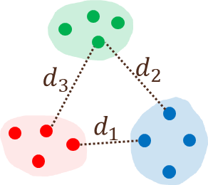
    ```
\begin{align}
    \left. \begin{array}{l}
       d_1 = .55 \\
       d_2 = .84 \\
       d_3 = .85
    \end{array}\right\} \text{Red and Blue clusters will be joined}
\end{align}

**Complete**

* Join clusters where maximum distance of any two cases between clusters is smallest  
    ```{r echo=FALSE, out.width='50%', cache=TRUE, fig.cap="Complete Linkage Visualization"}
   knitr:: 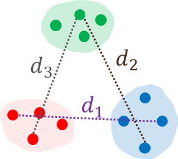
    ```
\begin{align}
    \left. \begin{array}{l}
       d_1 = 1.51 \\
       d_2 = 1.51 \\
       d_3 = 1.34
    \end{array}\right\} \text{Red and Green clusters will be joined}
\end{align}

**Average**

* Minimum average distance between all cases in one cluster and another cluster  
    ```{r echo=FALSE, out.width='50%', cache=TRUE, fig.cap="Average Linkage Visualization"}
   knitr:: 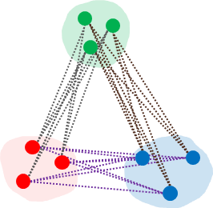
    ```

**Ward’s**

* Join clusters with a minimum increase in the sum of squared distances within all clusters combined

##### Problems

* Which linkage rule?
    * Ward’s is often a good choice, but may need to look at others based on results
* How many clusters?
    * With small samples, dendrograms work well
    * With large samples, can use stopping rules
    * Consider managerial implications
    
##### How Many Clusters?

* Using a dendrogram for small samples
    * Draw horizontal line to visualize clusters easier
    
    ```{r t5dendro2, echo=FALSE, message=FALSE, warning=FALSE, fig.cap="Horizontal Line Showing 4 Clusters"}
    df <- matrix( sample(seq(1,2000),250), ncol = 10)
    rownames(df) <- paste0("obj_" , seq(1,25))
    colnames(df) <- paste0("variable",seq(1,10))
    hc <- hclust(dist(scale(df)))
    dend <- as.dendrogram(hc)
    plot(dend, main="Euclidiean Distance / Average Linkage", ylab="Similarity Measure",
     sub="All Branches")
    abline(h=5.6, lty=1, lwd=3, col=1)
    
    ```
    ```{r t5dendro3, echo=FALSE, message=FALSE, warning=FALSE, fig.cap="3-Cluster Solution"}
    plot(dend, main="Euclidiean Distance / Average Linkage", ylab="Similarity Measures",
     sub="All Branches")
    dend %>% rect.dendrogram(k=3, which=c(1:3),
                         border = c(1:3), lty = 4, lwd = 4, col=rgb(0, 0, 0.2, 0.05))
    abline(h=6.1, lty=1, lwd=3, col=1)
    ```
    ```{r t5dendro4, echo=FALSE, message=FALSE, warning=FALSE, fig.cap="4-Cluster Solution"}
    plot(dend, main="Euclidiean Distance / Average Linkage", ylab="Similarity Measures",
     sub="All Branches")
    dend %>% rect.dendrogram(k=4, which=c(1:4),
                         border = c(4:7), lty = 4, lwd = 4, col=rgb(0, 0, 0.2, 0.05))
    abline(h=5.6, lty=1, lwd=3, col=1)
    ```

* Use a stopping rule for large samples
    * The Duda-Hart stopping rule provides an index value for different cluster solutions
    * Large values of the index, combined with small values of pseudo-*T*-squared values indicate more distinct solutions
    ```{r t5dh00, echo=FALSE, message=FALSE}
    df <- ffseg %>%
      select(clean, variety, quality, location, 
             speed, healthy, price, friendly)
    source("Topic05/clustop.R")
    out <- clustop(df, dist="euc", method="ward")
    kbl(out, align="ccc") %>%
      kable_styling("basic", full_width=FALSE) %>%
      row_spec(c(2,4,6,8), background = "yellow")
    
    ```
#### Partitioning: $k$-means

##### Stages

1. Identify number of clusters desired
2. Identify the cluster “seeds”
3. Allocate all objects to cluster based on distance from “seed”
4. Calculate new cluster centers
5. Reallocate items based on distance to cluster centers one at a time
6. Repeat 4 & 5 until within-cluster variability is minimized

##### Illustration for 3-cluster solution

1. Ask for 3-cluster solution
2. Randomly assign cluster seeds  
    ```{r echo=FALSE, out.width='50%', cache=TRUE}
   knitr:: 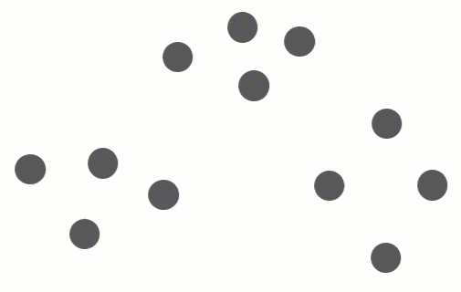
    ```

3. Allocate all objects based on distance to seeds  
    ```{r echo=FALSE, out.width='50%', cache=TRUE}
   knitr:: 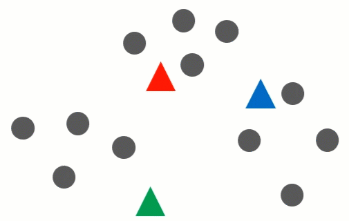
    ```

4. Calculate new cluster centers  
    ```{r echo=FALSE, out.width='50%', cache=TRUE}
   knitr:: 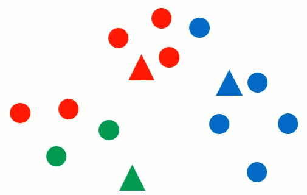
    ```

5. Reallocate items based on distance to cluster centers one at a time  
    ```{r echo=FALSE, out.width='50%', cache=TRUE}
   knitr:: 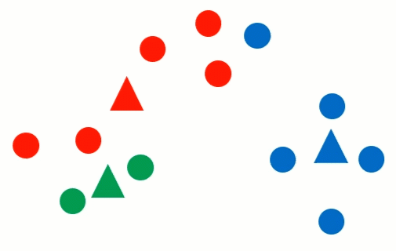
    ```

4. Repeat Step 4: Calculate new cluster centers  
    ```{r echo=FALSE, out.width='50%', cache=TRUE}
   knitr:: 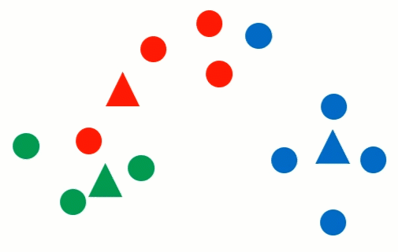
    ```

5. Repeat Step 5: Reallocate items based on distance to cluster centers one at a time  
    ```{r echo=FALSE, out.width='50%', cache=TRUE}
   knitr:: 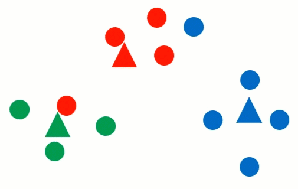
    ```

4. Repeat Step 4: Calculate new cluster centers  
    ```{r echo=FALSE, out.width='50%', cache=TRUE}
   knitr:: 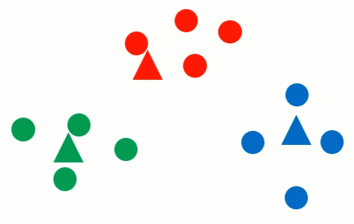
    ```

* At this point, no further reallocation can make the within cluster variance smaller, so this is the best 3-cluster solution

##### How many clusters?

* Create a scree plot based on the within sum of squares (WSS) for about 1 to 15 different solutions
* Compare solutions around the scree
* Consider managerial implications  
    ```{r t5scree01, echo=FALSE, cache=TRUE, fig.cap="Example Scree Plot"}
    source("Topic05/wssplot.R")
    data(USArrests)
    wssplot(scale(USArrests), 15)
    ```

### Describe the Segments

* Answers the question: How do the clusters differ on relevant dimensions?
* Create a profile using measures of central tendency, dispersion, etc. for variables used in clustering
* Profile clusters using data not included in clustering to get a feel for who is in the clusters
* Can use statistical techiniques to help identify characteristics that predict cluster membership

## Segmentation (Cluster Analysis) Example

### Overview

*Goal*

* Segment students based on importance of attributes when choosing a fast food restaurant
* Keep number of clusters manageable

*Bases: Attribute Importance*

* Cleanliness ($clean$)
* Variety ($variety$)
* Food Quality ($quality$)
* Location ($location$)
* Service Speed ($speed$)
* Price ($price$)
* Healthy options ($healthy$)
* Friendliness ($friendly$)

*Additional Information*

* Frequency of eating out
* Class level
* Meal plan
* Gender
* Living location
* College

### Examine the Data

<caption>(\#tab:t5exdata01) Summary Statistics for Cluster Variables ([R code](#table-reftabt5exdata01))</caption>
    
``` {r t5exdata01, cache=TRUE, echo=FALSE}
# Create df with attribute importance variables
segdata <- ffseg %>% 
  select(clean, variety, quality, location, speed, healthy, price, friendly)
# Create summary table with package 'vtable' (not availalbe in virtual env.)
sumtable(segdata, out="return") %>% kable(caption=NULL)
```

* Nothing out of the ordinary for survey data

### Hierarchical Cluster Analysis

* Distance measure: Euclidean
    * All variables are continuous and on the same scale, but will be standardized anyway
* Linkage method: Ward's
* Over $750$ cases...  So dendrogram won't help
* Calculate Duda-Hart index for $1$ to $15$ clusters
    * Look at top $5$ index values
    * $2$, $3$, $4$, and $6$ cluster solutions seem like good candidates to explore

    <caption>(\#tab:t5dh01) Duda-Hart Index ([R code](#table-reftabt5dh01))</caption>  

    ```{r t5dh01, echo=FALSE, message=FALSE}
    # Standardize data using 'scale()' function
    segdata <- data.frame(scale(segdata))
    # Use 'clustop.R' user defined function
    #   Requires package 'NbClust', which isn't available in virtual env.
    source("TOpic05/clustop.R")
    library(NbClust)
    dh <- clustop(segdata,   # Dataframe with cluster variables
                  dist="euc",   # Use 'euclidean' distance measure
                  method="ward",   # Use 'Wards' linkage
                  minclust=1, maxclust=10)  # Only complete for up to 10 clusters
    kbl(dh, align="ccc") %>%
      kable_styling("basic", full_width=FALSE) %>%
      row_spec(c(2,3,4,6,7,8), background = "yellow")    
    ```

* Examine dendrogram of top 6 branches only

    ```{r t5top5dend01, echo=FALSE, fig.cap="Dendrogram with Top 6 Branches Only ([R code](#figure-reffigt5top5dend01))"}
    # Load 'mydend.R' user defined function
    source("Topic05/myhc.R")
    out <- myhc(segdata,    # Dataframe with cluster variables
         dist="euc",    # Use 'euclidean' distance measure
         method="ward",   # Use 'Wards' linkage
         cuts=c(2,3,4,6),  # Get data for 4 cut levels
         clustop="N")   # Do not get Duda-Hart
    ```

* Examine cluster sizes for different cluster solutions
    * Overall, 4-cluster solution is chosen
        * All clusters are of decent size and no one cluster is too large

    <caption>(\#tab:t5clustsize01) Cluster Sizes for Different $k$ Solutions ([R code](#table-reftabt5clustsize01))</caption>

    ```{r t5clustsize01, echo=FALSE}
    kable(out$kcount, caption=NULL)    # Table with cluster sizes
    kable(out$kperc, caption=NULL)     # Table with cluster size proportions
    ```

* Describe segments using cluster variables (table and chart)
    * Cluster $1$ seems to rate most everything as important, but especially $clean$, $quality$, $price$, and $location$
    * Cluster $4$ doesn't seem to think much is important, except maybe $price$, and really doesn't care about $healthy$, $friendly$, and $variety$
    * Cluster $3$ rates $quality$, $clean$ and somewhat $healthy$ as important, but not much else
    * Cluster $2$ doesn't have any attributes that are rated too high or too low compared to the other clusters

    <caption>(\#tab:t5c4describe1) Cluster Variable Means by Cluster ([R code](#table-reftabt5c4describe1))</caption>

    ``` {r t5c4describe1, echo=FALSE}
    ffseg$c4 <- as.factor(cutree(out$hc,4))  # Add cluster membership to original
    # Create object with segmentation variables listed
    segvars <- c("clean", "variety", "quality", 
                 "location", "speed", "healthy", 
                 "price", "friendly")
    # Use 'cldescr.R' user defined function
    source("Topic05/cldescr.R")
    outseg <- cldescr(ffseg,  # Orig data with cluster membership added
                      segvars,  # Segmentation variables
                      "C",  # Indication that variables are continuous
                      "c4")   # Cluster membership variable name

    # Table of means
    kable(outseg$means, caption=NULL, digits=2)
    ```
    
    ``` {r t5c4describe2, echo=FALSE, message=FALSE, fig.cap="Mean Attribute Importance by Cluster ([R code](#figure-reffigt5c4describe2))"}
    library(reshape2)  # Used to covert data from wide to long
    sumsegl <- melt(outseg$means,    # Wide table of summary statistics
                    id.vars="Cluster",  # ID variable
                    variable.name="attr", # Column name identifying attribute
                    value.name="mean")   # Column name identifying value
    sumsegl %>% ggplot(aes(x=attr, y=mean, fill=Cluster)) +
      geom_col(position="dodge") + 
      coord_cartesian(ylim=c(1,7)) +
      scale_y_continuous(breaks=seq(1,7,1)) +
      geom_text(aes(label=round(mean,2)), hjust=1.1, fontface="bold",
                angle=90, position=position_dodge(width=.9)) +
      theme(legend.position="bottom") + 
      labs(x="Attribute", y="Mean Importance", fill="Cluster")
    ```

* Describe segments using non-cluster variables
    * Only the variable $eatin$ (1 = Prefer to eat in; 5 = Prefer Get to Go) and $gender$ showed significant differences between clusters
        * Cluster $3$ was significantly more likely to want to eat in than Clusters $2$ and $4$
        * Cluster $4$ was significantly more likely to be male than the other clusters

    <caption>(\#tab:t5descnseg1) Eat-In and Gender Means by Cluster ([R code](#table-reftabt5descnseg1))</caption>

    ```{r t5descnseg1, echo=FALSE}
    # Use 'cldescr.R' user defined function
    outnseg <- cldescr(ffseg,  # Orig data with cluster membership added
                       "eatin",  # Prefer to eat in (1) vs. get to go (5)
                       "C",  # Indication that variable is continuous
                       "c4")   # Cluster membership variable name
    # Table of means
    kable(outnseg$means, caption=NULL, digits=2)
    
    outnseg <- cldescr(ffseg,  # Orig data with cluster membership added
                       "gender",  # Male or Female
                       "F",  # Indication that variable is factor
                       "c4")   # Cluster membership variable name
    # Table of means
    kable(outnseg$means, caption=NULL, digits=2)
    ```

### *k-Means* Cluster Analysis

* Distance Measure
    * All variables are continuous and on the same scale, but will be standardized anyway
* Calculate WSS to create a scree plot for $1$ to $15$ cluster solutions
* Somewhere between $3$ and $5$ clusters looks best

    ```{r t5scree02, echo=FALSE, fig.cap="Scree Plot for Fast Food Data ([R code](#figure-reffigt5scree02))"}
    source("Topic05/wssplot.R")   # User defined function for scree plot
    g <- wssplot(segdata,   # Standardized data from earlier
            15,   # Max clusters
            seed=4320)
    g + annotate("path", 
                 x=4+2*cos(seq(0,2*pi, length.out=100)),
                 y=4000+500*sin(seq(0,2*pi, length.out=100)),
                 color="orange", size=3)
    ```

* Quick examination of $3$, $4$, and $5$ cluster solutions
* Each solution has good sized clusters
    * Use $3$ cluster solution because cluster sizes closest to each other...
        * And we saw a $4$ cluster solution using hierarchical agglomerative clustering

    <caption>(\#tab:t5clstsizes) Cluster Sizes  3, 4, and 5 Cluster Solutions  ([R code](#table-reftabt5clstsizes))</caption>
    
    ```{r t5clstsizes, echo=FALSE}
    # 'ksize.R' must first be sourced (if not already)
    source("Topic05/ksize.R")
    ks <- ksize(segdata,   # Scaled cluster variables from earlier
            centers=c(3,4,5),   # Request for 3, 4, and 5 cluster solutions
            nstart=25,  # Request 25 random starting sets
            seed=4320)  # Set seed to 4320 for reproducible results

    kable(ks$kcount, caption=NULL, format="html") %>%
      kable_styling(full_width=FALSE)
    kable(ks$perc, caption=NULL, format="html") %>%
      kable_styling(full_width=FALSE)
    ```

* Examine cluster centers (table and chart) 
    * Similar to describing segments using cluster variables
    * Cluster $1$ doesn't think much is important other than $location$ and $price$
    * Cluster $2$ thinks most everything is important other than $variety$, $healthy$, and $friendly$
    * Cluster $3$ thinks $clean$ and $quality$ are much more important than other attributes
    
    <caption>(\#tab:t5desckmseg1) Cluster Centers for 3 Cluster Solution  ([R code](#table-reftabt5desckmseg1))</caption>
    
    ```{r t5desckmseg1, echo=FALSE}
    # Use user-defined function 'kcenters.R'
    source("Topic05/kcenters.R")
    set.seed(4320)  # Match seed from above
    k3 <- kmeans(segdata,  # Scaled segmentation variables
                 centers=3,  # 3 cluster solution
                 nstart=25)  # 25 random starting sets
    outkc <- kcenters(k3)  # Call to 'kcenters' passing the 'k3' cluster object
    kable(outkc$table, digits=4, caption=NULL)
    ```
    ``` {r t5desckmseg2, echo=FALSE, message=FALSE, fig.cap="Cluster Centers by Cluster ([R code](#figure-reffigt5desckmseg2))"}
    outkc$plot
    ```
* Describe segments using non-cluster variables
    * Only the variables $eatin$ (1 = Prefer to eat in; 5 = Prefer Get to Go), $gender$, and $live$ showed significant differences between clusters
        * Cluster $3$ was significantly more likely to want to eat in than both other clusters
        * Cluster $1$ was significantly more likely to be male than both other clusters
        * Cluster $3$ was significantly more likely to be a commuter than both other clusters

    <caption>(\#tab:t5desck3seg1) Eat-In, Gender and Live Means by Cluster ([R code](#table-reftabt5descnseg1))</caption>

    ```{r t5desck3seg1, echo=FALSE}
    # Add cluster membership to original data
    ffseg$k3 <- factor(k3$cluster)
    # Use 'cldescr.R' user defined function
    outk3seg <- cldescr(ffseg,  # Orig data with cluster membership added
                       "eatin",  # Prefer to eat in (1) vs. get to go (5)
                       "C",  # Indication that variable is continuous
                       "k3")   # Cluster membership variable name
    # Table of means
    kable(outk3seg$means, caption=NULL, digits=2)
    
    outk3seg <- cldescr(ffseg,  # Orig data with cluster membership added
                       "gender",  # Male or Female
                       "F",  # Indication that variable is factor
                       "k3")   # Cluster membership variable name
    # Table of means
    kable(outk3seg$means, caption=NULL, digits=2)
    
    outk3seg <- cldescr(ffseg,  # Orig data with cluster membership added
                       "live",  # Male or Female
                       "F",  # Indication that variable is factor
                       "k3")   # Cluster membership variable name
    # Table of means
    kable(outk3seg$means, caption=NULL, digits=2)
    ```

## Suggested Readings

* *Marketing Data Science* (2015). Miller, Thomas W.
     * BGSU Library Link:<br><a href="http://maurice.bgsu.edu:2083/record=b41416968~S0" target="_blank" rel="noopener noreferrer">http://maurice.bgsu.edu:2083/record=b41416968~S0</a>
    * eBook through BGSU Library:<br><a href="https://learning.oreilly.com/library/view/marketing-data-science/9780133887662/?ar=" target="_blank" rel="noopener noreferrer">https://learning.oreilly.com/library/view/marketing-data-science/9780133887662/?ar=</a><br>Note: Might need to create an account; select "Not Listed. Click here" from the "Select your institution" drop down box. Use your BGSU email to create the account.
    * Chapter 4: Finding New Customers
* *Principles of Marketing Engineering and Analytics, 3rd Edition* (2017). Lilien, Gary L., Rangaswamy, Arvind, and De Bruyn, Arnaud.
    * Course reserves
        * Pages 75-97 from Chapter 3: Segmentation and Targeting
* *Multivariate Data Analysis*. Hair, Joseph F.; Black, William C.; Babin, Barry J.; Anderson, Rolph E.
    * 7th Edition: Search for “multivariate data analysis 7th edition hair”
        * Chapter 8: Cluster Analysis
    * 5th Edition: Course reserves
        * Chapter 9: Cluster Analysis

## R Code

### Figure \@ref(fig:t5top5dend01) {.unlisted .unnumbered}

```{r t5top5dend01code, eval=FALSE}
# Load 'myhc.R' user defined function
source("Topic05/myhc.R")
out <- myhc(segdata,    # Dataframe with cluster variables
       dist="euc",    # Use 'euclidean' distance measure
       method="ward",   # Use 'Wards' linkage
       cuts=c(2,3,4,6),   # Get data for 4 cut levels
       clustop="N")  # Do not get Duda-Hart
out$kcount    # Table with cluster sizes
out$kperc     # Table with cluster size proportions
```

### Figure \@ref(fig:t5c4describe2) {.unlisted .unnumbered}

``` {r t5c4describe2code, eval=FALSE}
library(reshape2)  # Used to covert data from wide to long
# Convert 'wide' table to 'long' table
sumsegl <- melt(outseg$means,    # Wide table of summary statistics
                id.vars="Cluster",  # ID variable
                variable.name="attr", # Column name identifying attribute
                value.name="mean")   # Column name identifying value
# Plot data
sumsegl %>% ggplot(aes(x=attr, y=mean, fill=Cluster)) +
geom_col(position="dodge") + 
  coord_cartesian(ylim=c(1,7)) +
  scale_y_continuous(breaks=seq(1,7,1)) +
  geom_text(aes(label=round(mean,2)), hjust=1.1, fontface="bold",
            angle=90, position=position_dodge(width=.9)) +
  theme(legend.position="bottom") + 
  labs(x="Attribute", y="Mean Importance", fill="Cluster")
```

### Figure \@ref(fig:t5scree02) {.unlisted .unnumbered}

```{r t5scree02code, eval=FALSE}
source("Topic05/wssplot.R")   # User defined function for scree plot
wssplot(segdata,   # Standardized data from earlier
        15,   # Max clusters
        seed=4320)  # Random number seed
```

### Figure \@ref(fig:t5desckmseg2) {.unlisted .unnumbered}

``` {r t5desckmseg2code, eval=FALSE,}
# outkc was created using the code for thetable
outkc$plot
```

### Table \@ref(tab:t5exdata01) {.unlisted .unnumbered}

``` {r t5exdata01code, eval=FALSE}
# Create df with attribute importance variables
segdata <- ffseg %>% 
  select(clean, variety, quality, location, speed, healthy, price, friendly)
# Create summary table with package 'vtable' (not availalbe in virtual env.)
sumtable(segdata, out="return") %>% kable(caption=NULL)
```

### Table \@ref(tab:t5dh01) {.unlisted .unnumbered}

```{r t5dh01code, eval=FALSE, cache=TRUE}
# Stardarize data using 'scale()' function
segdata <- data.frame(scale(segdata))

# Use 'clustop.R' user defined function
#   Requires package 'NbClust', which isn't availabe in virtual env.
source("TOpic05/clustop.R")
library(NbClust)

dh <- clustop(segdata,   # Dataframe to with cluster variables
              dist="euc",   # Use 'euclidean' distance measure
              method="ward",   # Use 'Wards' linkage
              minclust=1, maxclust=10)  # Only complete for up to 10 clusters
dh
```

### Table \@ref(tab:t5clustsize01) {.unlisted .unnumbered}

```{r t5clustsize01code, eval=FALSE}
# 'out' was a list of two data frame ('kcount' and 'kperc') returned from the
# call to the 'myhc' user defined function
out$kcount    # Table with cluster sizes
out$kperc     # Table with cluster size proportions
```

### Table \@ref(tab:t5c4describe1) {.unlisted .unnumbered}

``` {r t5c4describe1code, eval=FALSE}
ffseg$c4 <- as.factor(cutree(out$hc,4))  # Add cluster membership to original
# Create object with segmentation variables listed
segvars <- c("clean", "variety", "quality", 
             "location", "speed", "healthy", 
             "price", "friendly")
# Use 'cldescr.R' user defined function
source("Topic05/cldescr.R")
outseg <- cldescr(ffseg,  # Orig data with cluster membership added
                  segvars,  # Segmentation variables
                  "C",  # Indication that variables are continuous
                  "c4")   # Cluster membership variable name
# Table of means
outseg$means
```

### Table \@ref(tab:t5descnseg1) {.unlisted .unnumbered}

```{r t5descnseg1code, eval=FALSE}
# Use 'cldescr.R' user defined function
outnseg <- cldescr(ffseg,  # Orig data with cluster membership added
                   "eatin",  # Prefer to eat in (1) vs. get to go (5)
                   "C",  # Indication that variable is continuous
                   "c4")   # Cluster membership variable name
# Table of means
outnseg$means
  
outnseg <- cldescr(ffseg,  # Orig data with cluster membership added
                   "gender",  # Male or Female
                   "F",  # Indication that variable is factor
                   "c4")   # Cluster membership variable name
# Table of means
outnseg$means
```

### Table \@ref(tab:t5clstsizes) {.unlisted .unnumbered}

```{r t5clstsizescode, eval=FALSE}
# 'ksize.R' must first be sourced (if not already)
source("Topic05/ksize.R")
ks <- ksize(segdata,   # Scaled cluster variables from earlier
        centers=c(3,4,5),   # Request for 3, 4, and 5 cluster solutions
        nstart=25,  # Request 25 random starting sets
        seed=4320)  # Set seed to 4320 for reproducible results
ks$kcount
ks$kperc
```

### Table \@ref(tab:t5desckmseg1) {.unlisted .unnumbered}

```{r t5desckmseg1code, eval=FALSE}
# Use user-defined function 'kcenters.R'
source("Topic05/kcenters.R")
set.seed(4320)  # Match seed from above
k3 <- kmeans(segdata,  # Scaled segmentation variables
             centers=3,  # 3 cluster solution
             nstart=25)  # 25 random starting sets
outkc <- kcenters(k3)  # Call to 'kcenters' passing the 'k3' cluster object
# outkc contains two objects: 'table' and 'plot'
outkc$table  # Print table
```

### Table \@ref(tab:t5desck3seg1) {.unlisted .unnumbered}

```{r t5desck3seg1code, eval=FALSE}
# Add cluster membership to original data
fseg$k3 <- factor(k3$cluster)
# Use 'cldescr.R' user defined function
outk3seg <- cldescr(ffseg,  # Orig data with cluster membership added
                   "eatin",  # Prefer to eat in (1) vs. get to go (5)
                   "C",  # Indication that variable is continuous
                   "k3")   # Cluster membership variable name
# Table of means
outk3seg$means
    
outk3seg <- cldescr(ffseg,  # Orig data with cluster membership added
                   "gender",  # Male or Female
                   "F",  # Indication that variable is factor
                   "k3")   # Cluster membership variable name
# Table of means
outk3seg$means

outk3seg <- cldescr(ffseg,  # Orig data with cluster membership added
                   "live",  # Where they live
                   "F",  # Indication that variable is factor
                   "k3")   # Cluster membership variable name
# Table of means
outk3seg$means
```