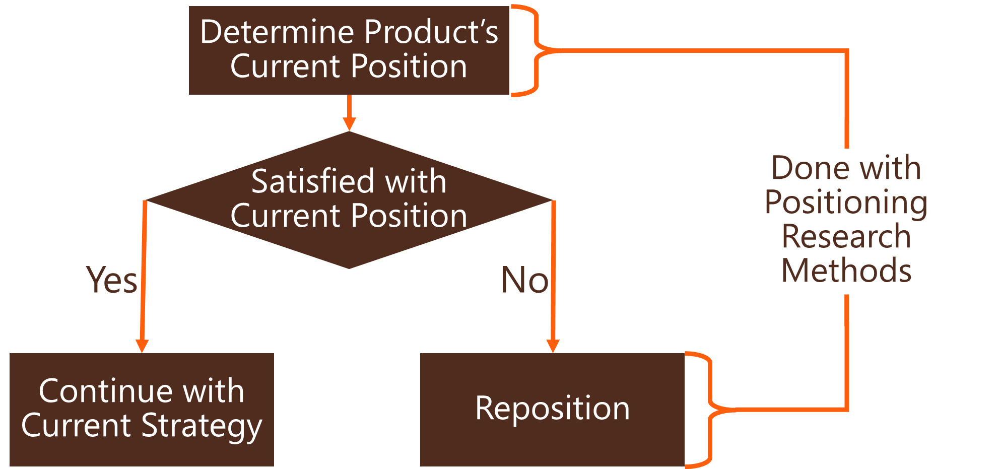
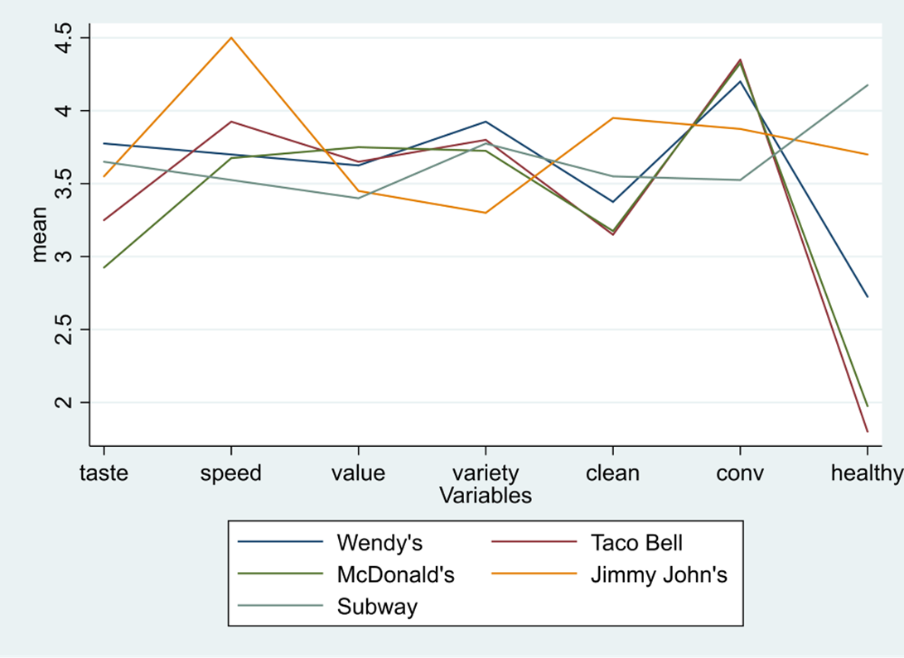
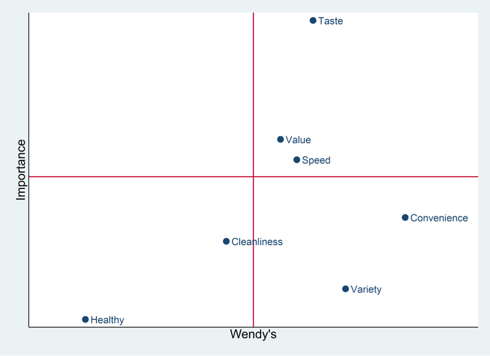
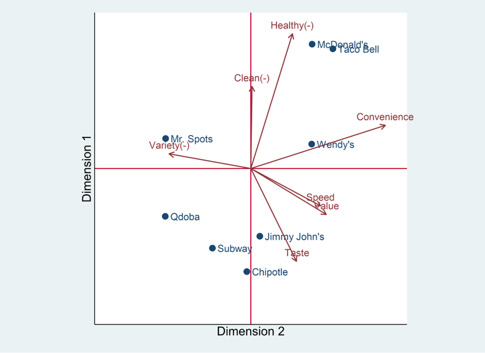
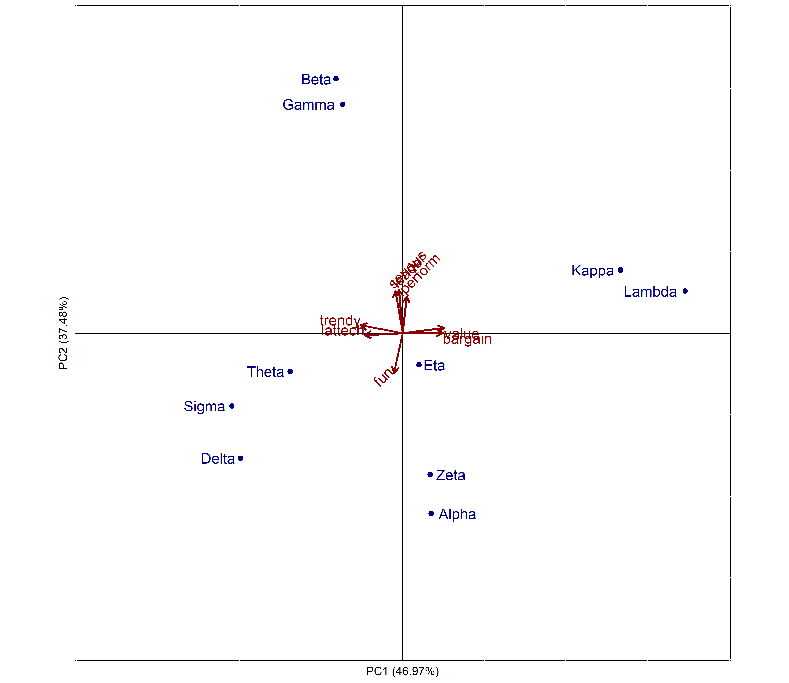
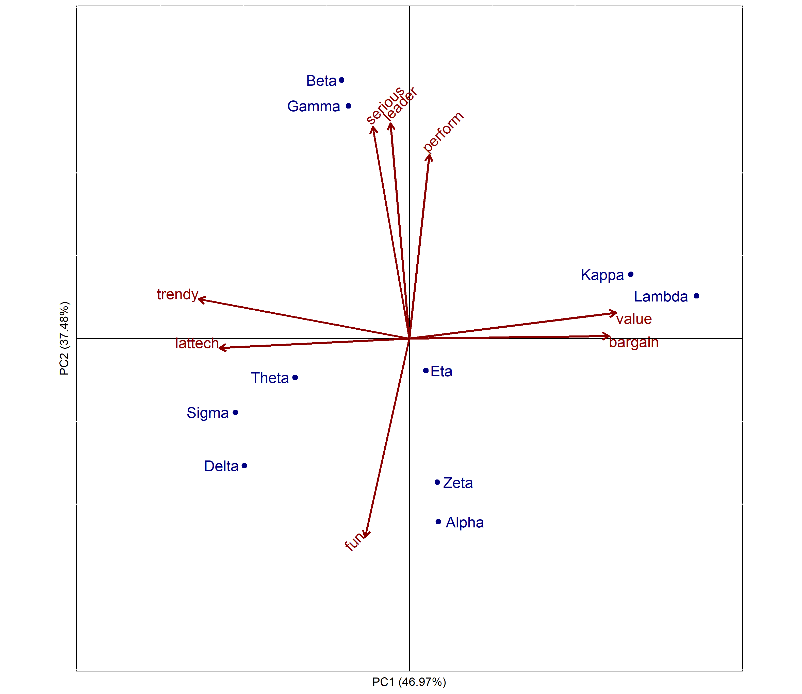

```{r echo=FALSE}
knitr::opts_chunk$set(comment=NA)
options(scipen=5)  # Turns off scientific notation
```

# Positioning

## R Packages and Datasets for Topic 5

``` {r t6packagesdata, message=FALSE}
library(ggplot2)       # Advanced graphing capabilities
library(flextable)     # Better HTML Tables
library(dplyr)         # Easier programming
library(dendextend)    # Nicer dendrograms
library(vtable)        # Nicer tables
load("Topic06/ffattrib.rdata")
```
``` {r t6packagesdata2, echo=FALSE, message=FALSE}
library(kableExtra)
```

## Positioning Overview

### The Concept of Positioning

* Positioning is not what you do to a product
* Positioning is what you do to the mind of the prospect

### Position vs. Positioning

* ***Position*** The place a brand, product line, or organization in general occupies in consumers’ minds relative to competing offerings. 
* ***Positioning*** Developing a specific marketing mix to influence potential customers’ overall perception of a brand, product line, or organization in general.

### Difficulty of Positioning

* Positioning is easy when your product is clearly superior in an important way...
    * But few are
* Most product markets have a lot of parity, so...
    * Positioning is more important *and* more difficult
    
### Competitive Market Structure

* Difficulty of positioning depends on level of product competitiveness
    * Easy positioning...
        * Product Superiority: Clearly superior in many important ways
    * "In the middle" positioning...
        * Product Differentiation: One or more specific features superior to the competition (but otherwise similar)\
    * Difficult positioning...
        * Product Parity: No essential differences from one product to another
        
### Positioning with Product Parity

* Remember... Positioning is what you do to the mind of the prospect
* Thus... Need to create points of difference, whether:
    1. They exist or not
    2. They are meaningful or not
    
### Requirements for Effective Positioning

1. Uniqueness
2. Desirability
3. Believability

Not all three are required… But the more there are, the more likely the positioning will be effective

#### Uniqueness

* Be different in some way 
* Must get through the clutter
    * Slightly better on an important feature<br>-vs.-<br>Unique on a less important feature
* More brands = more difficult
* Find a niche that is not yet occupied

#### Desirability

* Difference should be on something relatively important to the consumer
    * Example: Is being clear in the cola market important?
* Don’t look for any gap in the market...<br>Look for gaps that turn prospects into buyers

#### Believability

* Claims of superiority must be accepted
* Believability rests on:
    * How reasonable the claim is
    * Objective support for the claim
* A common error is to strive for too many positions

### Steps in Positioning

1. Assess the positions occupied by competing products
2. Determine the dimensions underlying these positions
3. Choose a market position where efforts will have the greatest impact

    
```{r, echo=FALSE, cache=TRUE, out.width="50%"}
   knitr:: 
```

### Positioning Research Methods

#### Image Profile

* Average ratings of brands/products on a number of attributes
* Easy to create, but…
* Difficult to interpret

```{r, echo=FALSE, cache=TRUE, out.width="50%"}
   knitr:: 
```

#### Quadrant Analysis

* x-axis contains the average ratings of one brand/product on a number of attributes
* y-axis contains the average importance of each attribute
* Easily shows what attributes to emphasize, but…
* Only looks at one brand/product at a time

```{r, echo=FALSE, cache=TRUE, out.width="50%"}
   knitr:: 
```

#### Perceptual Maps

* Shows the location of competing brands/ products in a “virtual” space
* Enable marketers to see at a glance how own brand/product relates to the competition

```{r, echo=FALSE, cache=TRUE, out.width="50%"}
   knitr:: 
```

##### Types of Perceptual Maps

* Discriminant  Analysis Maps
    * Based on identifying differences between objects with respect to several variables simultaneously
* Multidimensional Scaling Maps
    * Based only on similarities between objects 
* Factor Analysis Maps
    * Based on the dimensions underlying a set of variables
    * **EMPHASIS OF THIS CLASS**
    
## Factor Analysis

* Generic term for identifying dimensions underlying a set of variables
* Finds uncorrelated linear dimensions that capture the most variance in the data
* Main types:	
    1. exploratory factor analysis
    2. principal components analysis
    
## Principal Components Analysis (PCA)

Recomputes a set of variables in terms of linear equations (components) that capture linear relationships in the data
* First component captures as much variance as possible from all variables
* Second component captures as much variance as possible that remains
* Continue until as many components as variables
* Analyst retains/analyzes a subset of components

### PCA Process

1. Determine number of factors to retain
2. Rotate factors to aid interpretation
3. Interpret factors
4. Use results in further analysis (e.g.,	perceptual maps)

#### Step 1: Determine number of factors to retain

* How many factors?  
    * Eigenvalues > 1
        * E.g., Keep two components, accounting for about 85% of variation

    ``` {r echo=FALSE, message=FALSE}
    source("Topic06/pcaex.R")
    load("Topic06/greekbrands.rdata")
    gb.results <- pcaex(greekbrands, "brand",)
    kable(gb.results$table) %>%
      kable_styling("basic", full_width=FALSE)
    ```

    * Examine Scree Plot
        * Sometimes called an elbow plot
        * Look for bend or kink in the plot 
        * Number of components to retain is the number prior to that kink
        
    ```{r echo=FALSE, message=FALSE}
    gb.results$table %>% ggplot(aes(x=Component, y=Eigenvalue)) +
      geom_line() +
      geom_point() +
      scale_x_continuous(breaks=1:8, minor_breaks = NULL) +
      geom_segment(aes(x=2.5, y=0.25, xend=2.5, yend=3.25), color="orange", size=2)
    ```

#### Step 2: Rotate factors to aid interpretation

* Factor loadings are the correlation between each variable and each factor
    * Higher loadings indicate the variable is representative of the factor
* Unfortunately, unrotated loadings may not provide a meaningful pattern to understand the factors

    ``` {r echo=FALSE}
    gb.2comp <- pcaex(greekbrands, group="brand", pref="pref", comp=2)
    kable(gb.2comp$unrotated) %>%
      kable_styling("basic", full_width=FALSE)
    ```

* Rotating the factors redistributes the variance from earlier factors to later factors to make more meaningful patterns
* Factor/component loading guidelines<br>
$\rho<0.4\Longrightarrow$ no loading<br>
$0.4\le \rho<0.6\Longrightarrow$ low" loading<br>
$\rho\ge0.6\Longrightarrow$ "high" loading<br>

    ``` {r echo=FALSE}
    kable(gb.2comp$rotated) %>%
      kable_styling("basic", full_width=FALSE)
    ```

#### Step 3: Interpret factors

* (not)$lattech$, $bargain$, $value$, (not)$trendy$ describe factor 1
    * Might label factor 1 as "latest"
* $perform$, $leader$, (not)$fun$, and $serious$ describe factor 2
    * Might label factor 2 as "performance"

    ``` {r echo=FALSE}
    kable(gb.2comp$rotated) %>%
      kable_styling("basic", full_width=FALSE) %>%
      column_spec(2, background = ifelse(abs(gb.2comp$rotated[,1])>.4,
                                         "palegreen","white")) %>%
      column_spec(3, background = ifelse(abs(gb.2comp$rotated[,2])>.4,
                                         "lightskyblue","white")) 
    ```

#### Step 4: Use results in further analysis

* Results could be used in linear regerssion, logistic regression, cluster analysis, perceptual mapping, etc.

## Creating a Percptual Map using PCA

Steps:

1. Map Brands
2. Map Attributes
3. Interpret Map

### Map Brands

* Using rotated loading matrix and average brand scores for each variable, obtain a score for each brand on each component

    ```{r echo=FALSE}
    alphamean <- greekbrands %>%
      group_by(brand) %>%
      summarise_all(mean) %>%
      mutate_at(-1, ~(scale(.))) %>%
      filter(brand=="Alpha") %>%
      select(-c(1,10))
    attribute <- colnames(greekbrands[,1:8])
    meanxf1 <- round(gb.2comp$rotated[,1]*alphamean,4)
    meanxf2 <- round(gb.2comp$rotated[,2]*alphamean,4)  
    df <- data.frame(cbind(t(round(alphamean,4)),gb.2comp$rotated[,1], t(meanxf1),
                           gb.2comp$rotated[,2], t(meanxf2)))
    df <- cbind(attribute, df)
    cnames <- c("Attribute", "Alpha's Mean", "Factor 1", 
                "Mean x Factor 1", "Factor 2", "Mean x Factor 2")
    row.names(df) <- NULL
    func <- function(z) if(is.numeric(z)) sum(z) else ''
    sumrow <- as.data.frame(lapply(df, func))
    df <- rbind(df,sumrow)
    names(df) <- cnames
    kable(df) %>%
      kable_styling("basic") %>%
      column_spec(c(2,3,5), color = ifelse(df$Attribute=="","white","black"))
    ```

* Use factor scores for each brand as coordinates on the perceptual map

    ``` {r echo=FALSE}
    stdmean <- greekbrands %>%
      group_by(brand) %>%
      summarise_all(mean) %>%
      mutate_at(-1, ~(scale(.))) %>%
      select(-10)
    scr1 <- as.matrix(stdmean[,2:9])%*%matrix(gb.2comp$rotated[,1])
    scr2 <- as.matrix(stdmean[,2:9])%*%matrix(gb.2comp$rotated[,2])
    coord <- cbind(stdmean[,1], "scr1"=round(scr1,4), "scr2"=round(scr2,4))
    kable(coord)
    ```

### Map Attributes

* Factor loadings serve as the coordinates for the attributes
    * Loadings often need to be scaled to be used on the same map as the brands

```{r, echo=FALSE, cache=TRUE, out.width="75%", fig.cap="Loadings NOT Scaled"}
   knitr:: 
```
```{r, echo=FALSE, cache=TRUE, out.width="75%", fig.cap="Loadings Scaled"}
   knitr:: 
```

### Interpret Map

* Length of line represents amount of variance explained for that attribute
* Lines extend in opposite direction
* Perpendicular line from brand to attribute vector shows how brand is perceived on that attribute
    * Further along the vector, the higher the association between that brand and attribute
* Distance between brands shows how similar the market perceives them to be

## Joint-Space Maps

**Perceptions vs. Preferences**

Preferences are fundamentally different than perceptions

* Customers may perceive a brand as safe, but it may not be an determinant attribute
* Preferences may not change according to the magnitude of an attribute

Joint-space maps:

* Incorporates perceptions and preferences into same map
* Interpreted in a similar manner to attribute vectors
* Preference “driven” by attributes vectors most parallel to preference vector

    ```{r echo=FALSE}
    source("Topic06/percmap.R")
    percmap(greekbrands, group="brand", pref="pref")
    ```

## Positioning Example

### Overview

* Goal: Create a joint-space map of BGSU students perceptions and preferences of fast food 			restaurants

* Attributes: All measured on 5-point scale
    * Cleanliness(-), $clean_neg$
    * Convenience, $conv$
    * Healthy options, $healthy$
    * Variety(-), $variety_neg$
    * Value, $value$
    * Taste, $taste$
    
### Examine the Data

* Mean (top table) and standard deviation (bottom table) for each restaurant for each attribute
    * Nothing out of the ordinary
    * Some attributes have more variation ($conv$, $healthy$, and $taste$)

    <caption>(\#tab:t06examine) Attribute Means (Top) and Standard Deviations (Bottom) ([R code](#table-reftabt06examine))</caption>

    ```{r t06examine, echo=FALSE}
    # Create dataframe of attributes
    ffpos <- ffattrib %>%
      mutate(clean_neg=6-clean,          # Reverse code 'clean'
             variety_neg=6-variety) %>%  # Reverse code 'variety'
      select(rest, clean_neg, conv, healthy,  # Select needed columns
             variety_neg, value, taste, pref)   # Include preference also
    
    # Examine data
    ffpos %>%
      group_by(rest) %>%
      select(-pref) %>%  # Don't examine preference
      summarise_all(mean)   # 'summarise_all()' summarizes all variables
    
    ffpos %>%
      group_by(rest) %>%
      select(-pref) %>%  # Don't examine preference
      summarise_all(sd)
    ```

* Correlation matrix of attributes
    * Some variables have fairly high correlations with others
        * $taste$ and $value$
        * $clean_neg$ and $healthy$
        * $clean_neg$ and $taste$

    <caption>(\#tab:t06correlation) Attribute Correlation Matrix ([R code](#table-reftabt06correlation))</caption>

    ```{r t06correlation, echo=FALSE, message=FALSE}
    # Correlation matrix on only continuous items minus preference
    round(cor(ffpos[,-c(1,8)]), 4)   
    ```

### How many factors

* How many factors should be retained?
    * Only the first two components have eigenvalues > 1, and they explain nearly 82% of the variation
    * Thus, retaining two components seems appropriate

    <caption>(\#tab:t06pca01) Eigenvalue Table ([R code](#table-reftabt06pca01))</caption>

    ``` {r t06pca01, echo=FALSE}
    source("Topic06/pcaex.R")
    numfact <- pcaex(ffpos, group="rest", pref="pref")
    numfact$table
    ```
    
    ``` {r t06scree01, echo=FALSE, fig.cap="Scree Plot ([R code](#figure-reffigt06scree))"}
    numfact$plot
    ```
    
### Rotate factors

* Rotate factors to aid in interpretation (after rerunning with 2 components)
    * Cleanliness, Healthy options, and Taste load on the first dimension
    * Convenience and Value load on the second dimension
    * Variety doesn’t load much on either dimension

    <caption>(\#tab:t06pca02) Rotated Factor Loadings ([R code](#table-reftabt06pca02))</caption>

    ``` {r t06pca02, echo=FALSE}
    ff.2comp <- pcaex(ffpos, group="rest", pref="pref", comp=2)
    # ff.2comp$rotated
    
    kable(ff.2comp$rotated) %>%
      kable_styling("basic", full_width=FALSE) %>%
      column_spec(2, background = ifelse(abs(ff.2comp$rotated[,1])>.4,
                                         "palegreen","white")) %>%
      column_spec(3, background = ifelse(abs(ff.2comp$rotated[,2])>.4,
                                         "lightskyblue","white")) 
    ```
    
### Create perceptual map

* What two restaurants are most similar?
* Which restaurant has the least variety?
* Which restaurant has the highest taste?
* Which two restaurants have the lowest value?
* Which attribute is least described by the map?

    ``` {r t06prefmap01, echo=FALSE, fig.dim=c(8,8), fig.cap="Perceptual Map"}
    source("Topic06/percmap.R")
    ffpos2 <- ffpos[,-8]
    percmap(ffpos2, group="rest")
    ```
    
### Create joint-space map

* What attribute most drives preference?
* Which attribute least drives preference?
* Which two restaurants are least preferred?

    ``` {r t06prefmap02, echo=FALSE, fig.dim=c(8,8), fig.cap="Joint Space Map ([R code](#figure-reffigt06prefmap02))"}
    percmap(ffpos, group="rest", pref="pref")
    ```
    
## Suggested Readings

* *Principals of Marketing Engineering and Analytics, 3rd Edition* (2017). Lilien, Gary L., Rangaswamy, Arvind, and De Bruyn, Arnaud. 
    * Course reserves
        * Chapter 4: Positioning
* *Multivariate Data Analysis*. Hair, Joseph F.; Black, William C.; Babin, Barry J.; Anderson, Rolph E.
    * 7th Edition: Search for “multivariate data analysis 7th edition hair”
        * Chapter 3: Exploratory Factor Analysis
    * 5th Edition: Course reserves
        * Chapter 9: Factor Analysis

## R Code

### Figure \@ref(fig:t06scree01) {.unlisted .unnumbered}

``` {r t06scree01code, eval=FALSE}
# Call plot from previously store numfact object (from output of call to 'pcaex')
numfact$plot
```

### Figure \@ref(fig:t06prefmap02) {.unlisted .unnumbered}

``` {r t06prefmap02code, eval=FALSE}
percmap(ffpos, # Data
        group="rest",  # Brand/Group variable 
        pref="pref")  # Preference variable
```

### Table \@ref(tab:t06examine) {.unlisted .unnumbered}

```{r t06examinecode, eval=FALSE}
# Create dataframe of attributes
ffpos <- ffattrib %>%
  mutate(clean_neg=6-clean,          # Reverse code 'clean'
         variety_neg=6-variety) %>%  # Reverse code 'variety'
  select(rest, clean_neg, conv, healthy,  # Select needed columns
         variety_neg, value, taste, pref)   # Include preference also
    
# Examine data
ffpos %>%
  group_by(rest) %>%
  select(-pref) %>%  # Don't examine preference
  summarise_all(mean)   # 'summarise_all()' summarizes all variables
    
ffpos %>%
  group_by(rest) %>%
  select(-pref) %>%  # Don't examine preference
  summarise_all(sd)
```

### Table \@ref(tab:t06correlation) {.unlisted .unnumbered}

```{r t06correlationcode, eval=FALSE}
# Correlation matrix on only continuous items minus preference
cor(ffpos[,-c(1,8)])   
```

### Table \@ref(tab:t06pca01) {.unlisted .unnumbered}

``` {r t06pca01code, eval=FALSE}
# Load user defined function
source("Topic06/pcaex.R")  

# Use user defined function and store results
numfact <- pcaex(ffpos, # Data
                 group="rest", # Group/Brand variable
                 pref="pref")  # Preference variable (if it exists)

numfact$table  # Output the table
```

### Table \@ref(tab:t06pca02) {.unlisted .unnumbered}

``` {r t06pca02code, eval=FALSE}
ff.2comp <- pcaex(ffpos, # Data
                  group="rest",  # Group/Brand variable
                  pref="pref",  # Preference variable (if it exists)
                  comp=2)  Number of components
    
ff.2comp$rotated  # Request rotated factor loading table
```