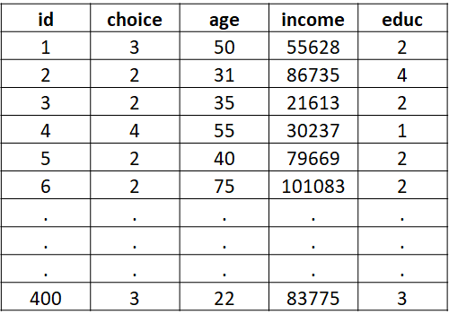
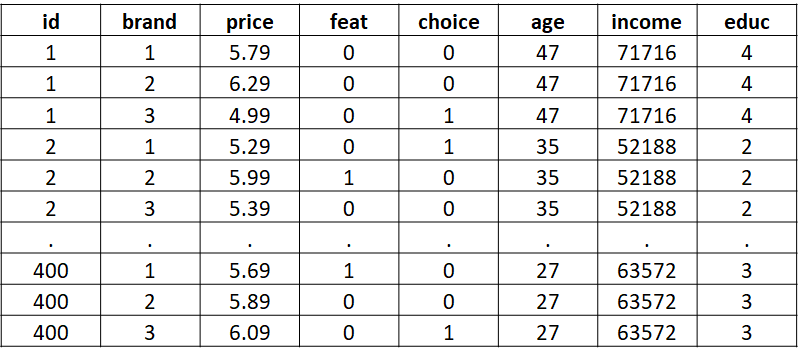

```{r echo=FALSE}
knitr::opts_chunk$set(comment=NA)
options(scipen=5)  # Turns off scientific notation
```

# Customer Choice

## R Packages and Datasets for Topic 7

``` {r t7packagesdata, message=FALSE}
library(ggplot2)       # Advanced graphing capabilities
library(dplyr)         # Easier programming
library(nnet)          # Used for standard MNL
library(mlogit)        # Used for alternative specific MNL
```
``` {r t7packagesdata2, echo=FALSE, message=FALSE}
library(flextable)
library(kableExtra)
```
## Motivation

* Not all decisions customers make are binary
    * Will a customer purchase Plan A, B, or C?
    * Which product options were chosen?
* Linear regression even more incorrect, and Binary logistic regression won’t work…
* …But the binary model can be extended to multiple nominal outcomes to serve the same purposes
    * Understand IV/DV relationships
    * Make predictions

## Understanding Multinomial Logistic

Based on Random Utility Theory

* Given a choice set, consumers assign a level of attractiveness to each alternative $\rightarrow$ "Utility"
    * Utility for alternative $j$: $U_j=x_j\beta+\varepsilon_j$
    
* Assume consumer chooses option with highest utility
    * Probability consumer chooses alternative $j$:  
    \begin{equation}
       P(Choice=j)=\frac{e^{x_j\beta}}{\sum_{k=1}^J e^{x_k\beta}}
    \end{equation}

* Suppose utilities for three choices:<br>
$U_1=15$<br>
$U_2=25$<br>
$U_3=30$  
    * Consumer picks choice 3
* Now add 5 units to each utility:<br>
$U_1=20$<br>
$U_2=30$<br>
$U_3=35$  
    * Consumer still picks choice 3
* Thus, absolute values of utilities do not matter
    * Only relative differences
    * So what?
* To make model work, set one choice as baseline and compare other choices to it

## Conducting Multinomial Logistic

* Model Estimation
* Assessing Model Fit
    * Goodness of Fit Measures
    * Classification Matrix
* Interpreting Coefficients

### Model Estimation

* Data dictate model type
    * Standard multinomial logistic regression
        * Info on customer, but not on choice attributes  
    ```{r, echo=FALSE, cache=TRUE, out.width="50%"}
    knitr:: 
    ```
    * Alternative specific logistic regression
        * Info on choice attributes (and maybe on customer)  
    ```{r, echo=FALSE, cache=TRUE, out.width="50%"}
    knitr:: 
    ```

* Best to use training data and holdout data
* Independent variables:
    * Can be one or more
    * Can be continuous or nominal
    
### Assessing Model Fit

#### Goodness-of-Fit Measures

* Overall significance based on $-2LL$
    * Lower (closer to $0$) $-2LL$ indicates a better fit
    * Compare $-2LL$ of estimated model with "null" model in the Likelihood Ratio Test
    * Used for both standard and alternative specific MNL
* McFadden's Pseudo $R^2$ Measure
    * Values range from 0 to 1 like linear regression
    * Interpreted in a similar manner
        * Amount of variation in DV explained by IVs 
    * Used for standard MNL
    
#### Classification Matrix

* How does the model do in predicting outcomes?
* Generate predicted probability for choosing each alternative, $p(CHOICE)=j)$, for each observation
    * Predict $CHOICE=j$ if $p(CHOICE=j)>p(All\ other\ CHOICE)$
* Check predictions against actual outcomes
    * Examine both training and holdout data
* Overall correctly classified
    * Compare with *Proportional Chance Criterion (*$PCC$*)*
        * $PCC$ is the "average" probability of classification based on group sizes
    * $PCC=\sum_{k=1}^j p_k^2$ where $p$ is the proportion of sample in alternative $k$
    * Overall correctly classified $>PCC$ considered good fit when examining holdout data

### Interpreting Coefficients

* Relationship between DV and each IV
* $H_0: \beta_k=0$ *vs.* $H_a: \beta_k\ne0$
* Interpret significant relationships
    * Interpretation depends on $RRR$ or $Logit$ estimation
    * $RRR$ is the "relative risk ratio"
        * "Risk" is the probability of occurrence: $p(CHOICE=j)$
        * "Relative risk ratio" is probability of occurrence compared to probability of some other occurrence happening:<br>$\frac{p(CHOICE=j)}{p(CHOICE=k)}$
    * In MNL, compare probability of choice of interest with the probability of the baseline choice
    * Direction of relationship:
        * $Logit$ estimation: $\beta_k>0$ for positive, $\beta_k<0$ for negative
        * $RRR$ estimation: $\beta_k>1$ for positive, $\beta_k<1$ for negative
    * Magnitude of change:
        * $Logit$ estimation: coefficients are not particularly useful
        * $RRR$ estimation: Relative risk ratio for one unit change in $x_k$
    * Average predicted probabilities
    
## Standard MNL Regression Example 1

### Data

* Breakfast food preference data
    * $880$ observations of individual responses
    * DV: Type preferred, $bfast$ (bar, oatmeal, cereal)
    * IVs:
        * Age category, $agecat$ (<31, 31-45, 46-60, 60+)
        * Lifestyle, $lifestyle$ (active, inactive)
* Predict preference
* Use training and holdout samples

    ``` {r t7splitsample, echo=FALSE, cache=TRUE}
    load("Topic07/bfast.rdata")
    # Use 'caret' package to create training and test/holdout samples
    # This will create two separate dataframes: train and test
    library(caret)
    set.seed(4320)
    inTrain <- createDataPartition(y=bfast$bfast, p=.75, list=FALSE)
    train <- bfast[inTrain,]
    test <- bfast[-inTrain,]
    ```

### Estimation Results

<caption>(\#tab:t7stest1) Estimation Results ([R code](#table-reftabt7stest1))</caption>
```{r t7stest1, echo=FALSE, cache=TRUE}
library(nnet)  # Library required for multinomial logistic regression
st.mod <- multinom(bfast ~ agecat + lifestyle, # Formula
                   data=train, trace=FALSE)    # Data
# Use 'stmnl.R' user defined function to get clean results
source("Topic07/stmnl.R")
stmnl(st.mod)
```

### Overall Model Fit

* Based on the likelihood ratio test with $p<.0001$, the overall model is significant
* McFadden's Pseudo $R^2$ of .20 means that the model explains about 20% of the variation in breakfast food preference
* Classification matrix for training sample
    * Hit ratio $>$ PCC, so model fits well based on training sample  
    
    <caption>(\#tab:t07cm01) Classification Matrix for Training Sample ([R code](#table-reftabt07cm01))</caption>
    ```{r t7cm01, echo=FALSE, cache=TRUE}
    # Use 'stmnl_cm.R' user-defined function for classification matrix
    source("Topic07/stmnl_cm.R")
    flextable(stmnl_cm(st.mod, train))
    ```
    
* Classification matrix for training sample
    * Hit ratio $>$ PCC, so model fits well based on training sample  

    <caption>(\#tab:t07cm02) Classification Matrix for Holdout Sample ([R code](#table-reftabt07cm02))</caption>
    ```{r t7cm02, echo=FALSE, cache=TRUE}
    # Use 'stmnl_cm.R' user-defined function for classification matrix
    flextable(stmnl_cm(st.mod, test))
    ```
    
### Interpreting Coefficients

* *46-60* and *Over 60* are negative ($RRR<1$) and significant ($p<.05$) for choosing *Bar* over *Cereal* compared to the *Under 31*
    * Relative probability of choosing *Bar* over *Cereal* is $61\%$ lower for *46-60* and $68\%$ lower for *Over 60* compared to *Under 31*
* All age categories are positive ($RRR>1$) and significant ($p<.05$) for choosing *Oatmeal* over *Cereal* compared to *Under 31*
    * Relative probability of choosing *Oatmeal* over *Cereal* is $299\%$, $1470\%$, and $4930\%$  higher for *31-45*, *46-60*, and *Over 61*, respectively, compared to *Under 31*
* In general, younger people are more likely to choose *Bar* while older people are more likely to choose *Oatmeal* versus *Cereal*
* *Inactive* is negative ($RRR<1$) and signficant ($p<.05$) for choosing *Bar* over *Cereal*, but is not significant ($p=.191$) for choosing *Oatmeal* over *Cereal*
    * Relative probability of choosing *Bar* over *Cereal* is $52\%$ lower for *Inactive* compared to *Active*
    
### Average Predicted Probabilities

* Look at predicted probabilities of selecting each option for levels of each independent variable
    * Rule of thumb says that if confidence intervals of two categories don't overlap, they are significantly different
    
<caption>(\#tab:t7pp01tbl) Average Predicted Probabilities for *agecat* ([R code](#table-reftabt7pp01tbl))</caption>
```{r t7pp01tbl, echo=FALSE, message=FALSE}
# Use 'stmnl_pp.R' user defined function
source("Topic07/stmnl_pp.R")
results.agecat <- stmnl_pp(st.mod,          # Model
                           "agecat",        # Focal Variable
                           "Age Category")  # Label for plot
flextable(results.agecat$table)
```
```{r t7pp01plot, echo=FALSE, cache=TRUE, fig.cap="*agecat* Average Predicted Probibility Plot ([R code](#figure-reffigt7pp01plot))"}
results.agecat$plot
```

<caption>(\#tab:t7pp01tbl2) Average Predicted Probabilities for *lifestyle* ([R code](#table-reftabt7pp01tbl2))</caption>
```{r t7pp01tbl2, echo=FALSE, message=FALSE}
results.lifestyle <- stmnl_pp(st.mod,          # Model
                              "lifestyle",     # Focal Variable
                              "Lifestyle")     # Label for plot
flextable(results.lifestyle$table)
```

```{r t7pp01plot2, echo=FALSE, cache=TRUE, fig.cap="*lifestyle* Average Predicted Probibility Plot ([R code](#figure-reffigt7pp01plot2))"}
results.lifestyle$plot
```

## Standard MNL Regression Example 2

### Data

* Same as before, but suppose we replace $agecat$ with actual age for each respondent

### Estimation Results

<caption>(\#tab:t7stest2) Estimation Results ([R code](#table-reftabt7stest2))</caption>
```{r t7stest2, echo=FALSE, cache=TRUE}
st.mod2 <- multinom(bfast ~ age + lifestyle,    # Formula
                    data=train, trace=FALSE)                 # Data
stmnl(st.mod2)
```

### Overall Model Fit

* Based on the likelihood ratio test with $p<.0001$, the overall model is significant
* McFadden's Pseudo $R^2$ of .189 means that the model explains about 19% of the variation in breakfast food preference
* Classification matrix for training sample
    * Hit ratio $>$ PCC, so mone fits well based on training sample  

    <caption>(\#tab:t07cm03) Classification Matrix for Training Sample ([R code](#table-reftabt07cm03))</caption>
    ```{r t7cm03, echo=FALSE, cache=TRUE}
    # Use 'stmnl_cm.R' user-defined function for classification matrix
    flextable(stmnl_cm(st.mod2, train))
    ```
    
* Classification matrix for training sample
    * Hit ratio $>$ PCC, so mone fits well based on training sample  

    <caption>(\#tab:t07cm04) Classification Matrix for Holdout Sample ([R code](#table-reftabt07cm04))</caption>
    ```{r t7cm04, echo=FALSE, cache=TRUE}
    # Use 'stmnl_cm.R' user-defined function for classification matrix
    flextable(stmnl_cm(st.mod2, test))
    ```
    
### Interpreting Coefficients

* $age$ is negative ($RRR<1$) and significant ($p=.0001$) for choosing *Bar* over *Cereal*
    * For a $1$ unit increase in $age$, we would expect about a $2.6\%$ decrease in the relative probability of choosing *Bar* over *Cereal*
* $age$ is positive ($RRR>1$) and significant ($p<.0001$) for choosing *Oatmeal* over *Cereal*
    * For a $1$ unit increase in $age$, we would expect about a $7.9\%$ increase in the relative probability of choosing *Oatmeal* over *Cereal*
* *Inactive* is negative ($RRR<1$) and significant ($p=.0002$) for choosing *Bar* over *Cereal*, but is not significant ($p=.1468$) for choosing *Oatmeal* over *Cereal*
    * Relative probability of choosing *Bar* over *Cereal* is $53\%$ lower for *Inactive* compared to *Active*
    
### Average Predicted Probabilities

* Look at predicted probabilities of selecting each option for levels of each independent variable
    * Rule of thumb says that if confidence intervals of two categories don't overlap, they are significantly different  

<caption>(\#tab:t7pp01tbl3) Average Predicted Probabilities for *age* ([R code](#table-reftabt7pp01tbl3))</caption>
```{r t7pp01tbl3, echo=FALSE, cache=TRUE}
# Use 'stmnl_pp.R' user defined function
results.age <- stmnl_pp(st.mod2,          # Model
                        "age",        # Focal Variable
                        "Age")  # Label for plot
flextable(results.age$table)
```
```{r t7pp01plot3, echo=FALSE, cache=TRUE, fig.cap="*age* Average Predicted Probibility Plot ([R code](#figure-reffigt7pp01plot3))"}
results.age$plot
```

## Alternative Specific MNL Example

### Data

* Yogurt choice
    * $2412$ yogurt choice occasions of individuals
        * Observe choice among four brands
    * DV: $choice$ (*Yes* for brand chosen; *No* for brand not chosen)
    * Alternative Specific IVs:
        * Feature, $feat$ ($1$ if brand on feature, $0$ otherwise)
        * Price, $price$
    * Case Specific IVs:
        * Income (000s), $income$
* Predict brand chosen
* Use training and holdout samples  

    <caption>(\#tab:t7showdata) Yogurt Data (First 3 Observations) ([R code](#table-reftabt7showdata))</caption>
    ```{r t7showdata, echo=FALSE}
    # Data already split into training and test samples;
    # Both saved as separate data frames in 'yogurt.rdata'
    # Training data: train.yog
    # Testing data: test.yog
    load("Topic07/yogurt.rdata")
    flextable(head(train.yog,12))
    ```

### Estimation Results

* Using Odds Ratio formulation
    * Choice specific varaibles assumed to have same effect on all choices
    * Case specific variables assumed to have different effect on choices

    <caption>(\#tab:t7asestres1) Estimation Results (With Classificaition Matrices) ([R code](#table-reftabt7asestres1))</caption>
    ```{r t7asestres1, echo=FALSE}
    library(tidyr)
    # Use 'asmnl_est.R' user defined function to get:
    #    Model Fit
    #    OR Coefficient Estimates
    #    Classification matrix results for testing and holdout
    #    A stored model object to use later
    source("Topic07/asmnl_est.R")
    # To use function, must store formula in object:
    #     IVs before the '|' are alternative specific
    #     IVs after the '|' are case specific
    asform <- choice ~ feat + price | income
    asmod <- asmnl_est(formula=asform,     # Formula to estimate
                       data=train.yog,     # Training sample data
                       id="id",            # Case ID variable
                       alt="brand",        # Alternative/brand variable
                       choice="choice",    # Choice variable (i.e., if alt was chosen)
                       testdata=test.yog)  # Holdout sample data
    ```
    
### Overall Model Fit

* Based on the significant test with $p<.0001$, the overall model is significant
* McFadden's $R^2$ of $.2397$ suggests that about $24\%$ of the variance in choice is explained by the model
* Classification matrix for the Training Sample
    * $Hit\text{ }Ratio=\frac{577+12+38+497}{1811}=62.07\%$
    * $PCC=\frac{728^2+54^2+415^2+614^2}{1811^2}=32.99\%$
    * $Hit\text{ }Ratio>PCC$, so model fits well based on training sample
* Classification matrix for the Holdout Sample
    * $Hit\text{ }Ratio=\frac{199+2+12+152}{601}=60.73\%$
    * $PCC=\frac{242^2+17^2+138^2+204^2}{601^2}=33.09\%$
    * $Hit\text{ }Ratio>PCC$, so model fits well based on holdout sample
    
### Interpreting Coefficients

#### Choice specific results

* $feat$ is significant ($p=.0046$) in choice of brand.  The odds ratio of $feat$ ($1.5267>1$) means the effect of $feat$ on choice of $brand_j$ is positive. Specifically, when $brand_j$ is on feature, we would expect the odds of choosing $brand_j$ to increase by about $53\%$.
* $price$ is significant ($p<.0001$) in choice of brand.  The odds ratio of $price$ ($.6425<1$) means the effect of $price$ on choice of $brand_j$ is negative. Specifically, for a $\$1$ increase in the price of $brand_j$, we would expect the odds of choosing $brand_j$ to decrease by about $36\%$.
* To To further interpret significant variables, we can examine the marginal effects of an increase in a continuous variable at its mean value
    * In our example, we can see how much an increase in $price$ decreases probability of a brand being selected (at that brand’s mean price)
    * In addition, we can see how an increase in price of one brand, increases the probability of the other brands being selected

    <caption>(\#tab:t7margeff01) Marginal Effects ([R code](#table-reftabt7margeff01))</caption>    
    ```{r t7margeff01, echo=FALSE}
    # Use 'asmnl_me.R' user defined function to get marginal effects
    # for continuous variables
    source("Topic07/asmnl_me.R")
    asmnl_me(asmod)   # Model results saved from above
    ```

* Marginal effects for $price$ for *Dannon*
    * At mean values, the probability of being selected is $48.27\%$
    * For a $\$1$ increase in *Dannon*:
        * We expect a $11.05\%$ decrease in the probability of selecting *Dannon*
        * We expect increases in the probability of selecting *Weight* ($5.50\%$) and *Yoplait* ($5.45\%$)
* Marginal effects for $price$ for *Weight*
    * At mean values, the probability of being selected is $25.72\%$
    * For a $\$1$ increase in *Weight*:
        * We expect a $8.45\%$ decrease in the probability of selecting *Weight*
        * We expect increases in the probability of selecting *Dannon* ($5.50\%$) and *Yoplait* ($2.90\%$)
* Marginal effects for $price$ for *Yoplait*
    * At mean values, the probability of being selected is $25.53\%$
    * For a $\$1$ increase in *Yoplait*:
        * We expect a $8.40\%$ decrease in the probability of selecting *Yoplait*
        * We expect increases in the probability of selecting *Dannon* ($5.45\%$) and *Weight* ($2.90\%$)
        
#### Case Specific Results

* Case specific IVs can have different effects by brand
    * Margin plots can be used to visualize case specific IVs
    
```{r t7ascsmp, echo=FALSE, fig.cap="Margin Plot for Income ([R code](#figure-reffigtt7ascsmp))"}
source("Topic07/asmnl_mp.R")
asmnl_mp(asmod,"income", "C")
```
    
* $income$ has a significant effect on the choice of all three brands relative to *Dannon*
    * Based on $OR=.8975$, for a $\$1000$ increase in $income$, we expect a $10.2\%$ decrease in the odds of choosing *Hiland* over *Dannon*
    * Based on $OR=.9886$, for a $\$1000$ increase in $income$, we expect a $1.1\%$ decrease in the odds of choosing *Weight* over *Dannon*
    * Based on $OR=1.0756$, for a $\$1000$ increase in $income$, we expect a $7.6\%$ increase in the odds of choosing *Yoplait* over *Dannon*
* Marginal effects for $income$
    * For a $\$1000$ increase in $income$ at the mean, we expect the probability of selecting:
        * *Dannon* to decrease by $0.73\%$
        * *Hiland* to decrease by $0.07\%$
        * *Weight* to decrease by $0.68\%$
        * *Yoplait* to increase by $1.47\%$
    * Based on the margin plot, the probability of selecting:
        * *Dannon* increases with $income$ up to about \$43K, but then starts to decrease
        * *Hiland* decreases with $income$
        * *Weight* increases with $income$ up to about \$35K, but then starts to decrease
        * *Yoplait* increases with $income$
        
## Suggested Readings

* *Marketing Analytics: Data Driven Techniques with Excel* (2014). Winston, Wayne L. 
    * BGSU Library Link:<br><a href="http://ezproxy.bgsu.edu/login?url=https://ebookcentral.proquest.com/lib/bowlinggreen-ebooks/detail.action?docID=1629159" target="_blank" rel="noopener noreferrer">http://ezproxy.bgsu.edu/login?url=https://ebookcentral.proquest.com/lib/bowlinggreen-ebooks/detail.action?docID=1629159</a>
        * Chapter 18: Discrete Choice Analysis
* *Applied Logistic Regression* (2013). Hosmer, David W.; Lemeshow, Stanley; Sturdivant, Rodney X. 
    * BGSU Library Link:<br><a href="https://ezproxy.bgsu.edu/login?url=http://rave.ohiolink.edu/ebooks/ebc2/9781118548387" target="_blank" rel="noopener noreferrer">https://ezproxy.bgsu.edu/login?url=http://rave.ohiolink.edu/ebooks/ebc2/9781118548387</a>
        * Chapter 8.1: The Multinomial Logistic Regression Model
* *Logistic Regression: A Self-Learning Text* (2010). Kleinbaum, David G.; Klein, Mitchel. 
    * BGSU Library Link:<br><a href="https://ezproxy.bgsu.edu/login?url=https://dx.doi.org/10.1007/978-1-4419-1742-3" target="_blank" rel="noopener noreferrer">https://ezproxy.bgsu.edu/login?url=https://dx.doi.org/10.1007/978-1-4419-1742-3</a>
        * Chapter 12: Polytomous Logistic Regression
        
## R Code

### Figure \@ref(fig:t7pp01plot) {.unlisted .unnumbered}

```{r t7pp01plotcode, eval=FALSE}
results.agecat$plot  # Object 'results.agecat' produced with Table 7.4
```

### Figure \@ref(fig:t7pp01plot2) {.unlisted .unnumbered}

```{r t7pp01plot2code, eval=FALSE}
results.lifestyle$plot  # Object 'results.lifestyle' produced with Table 7.5
```

### Figure \@ref(fig:t7pp01plot3) {.unlisted .unnumbered}

```{r t7pp01plot3code, eval=FALSE}
results.age$plot  # Object 'results.age' produced with Table 7.9
```

### Figure \@ref(fig:t7ascsmp) {.unlisted .unnumbered}

```{r t7ascsmpcode, eval=FALSE}
source("Topic07/asmnl_mp.R")
asmnl_mp(asmod,"income", "C")
```

### Table \@ref(tab:t7stest1) {.unlisted .unnumbered}

```{r t7stest1code, eval=FALSE}
load("Topic07/bfast.rdata")
# Use 'caret' package to create training and test/holdout samples
# This will create two separate dataframes: train and test
library(caret)
set.seed(4320)
inTrain <- createDataPartition(y=bfast$bfast, p=.75, list=FALSE)
train <- bfast[inTrain,]
test <- bfast[-inTrain,]

library(nnet)  # Library required for multinomial logistic regression
st.mod <- multinom(bfast ~ agecat + lifestyle, # Formula
                   data=train, trace=FALSE)    # Data
# Use 'stmnl.R' user defined function to get clean results
source("Topic07/stmnl.R")
stmnl(st.mod)
```

### Table \@ref(tab:t7cm01) {.unlisted .unnumbered}

```{r t7cm01code, eval=FALSE}
# Use 'stmnl_cm.R' user-defined function for classification matrix
source("Topic07/stmnl_cm.R")
stmnl_cm(st.mod, train)
```

### Table \@ref(tab:t7cm02) {.unlisted .unnumbered}

```{r t7cm02code, eval=FALSE}
# Use 'stmnl_cm.R' user-defined function for classification matrix
source("Topic07/stmnl_cm.R")
stmnl_cm(st.mod, test)
```

### Table \@ref(tab:t7pp01tbl) {.unlisted .unnumbered}

```{r t7pp01tblcode, eval=FALSE}
# Use 'stmnl_pp.R' user defined function
source("Topic07/stmnl_pp.R")
results.agecat <- stmnl_pp(st.mod,          # Model
                           "agecat",        # Focal Variable
                           "Age Category")  # Label for plot
results.agecat$table
```

### Table \@ref(tab:t7pp01tbl2) {.unlisted .unnumbered}

```{r t7pp01tbl2code, eval=FALSE}
results.lifestyle <- stmnl_pp(st.mod,          # Model
                              "lifestyle",     # Focal Variable
                              "Lifestyle")     # Label for plot
results.lifestyle$table
```

### Table \@ref(tab:t7stest2) {.unlisted .unnumbered}

```{r t7stest2code, eval=FALSE}
st.mod2 <- multinom(bfast ~ age + lifestyle,    # Formula
                    data=train, trace=FALSE)                 # Data
stmnl(st.mod2)
```

### Table \@ref(tab:t7cm03) {.unlisted .unnumbered}

```{r t7cm03code, eval=FALSE}
# Use 'stmnl_cm.R' user-defined function for classification matrix
stmnl_cm(st.mod2, train)
```

### Table \@ref(tab:t7cm04) {.unlisted .unnumbered}

```{r t7cm04code, eval=FALSE}
# Use 'stmnl_cm.R' user-defined function for classification matrix
stmnl_cm(st.mod2, test)
```

### Table \@ref(tab:t7pp01tbl3) {.unlisted .unnumbered}

```{r t7pp01tbl3code, eval=FALSE}
# Use 'stmnl_pp.R' user defined function
results.age <- stmnl_pp(st.mod2,          # Model
                        "age",        # Focal Variable
                        "Age")  # Label for plot
results.age$table
```

### Table \@ref(tab:t7showdata) {.unlisted .unnumbered}

```{r t7showdatacode, eval=FALSE}
# Data already split into training and test samples;
# Both saved as separate data frames in 'yogurt.rdata'
# Training data: train.yog
# Testing data: test.yog
load("Topic07/yogurt.rdata")
head(train.yog,12)
```

### Table \@ref(tab:t7asestres1) {.unlisted .unnumbered}

```{r t7asestres1code, eval=FALSE}
# Use 'asmnl_est.R' user defined function to get:
#    Model Fit
#    OR Coefficient Estimates
#    Classification matrix results for testing and holdout
#    A stored model object to use later
source("Topic07/asmnl_est.R")
# To use function, must store formula in object:
#     IVs before the '|' are alternative specific
#     IVs after the '|' are case specific
asform <- choice ~ feat + price | income
asmod <- asmnl_est(formula=asform,     # Formula to estimate
                   data=train.yog,     # Training sample data
                   id="id",            # Case ID variable
                   alt="brand",        # Alternative/brand variable
                   choice="choice",    # Choice variable (i.e., if alt was chosen)
                   testdata=test.yog)  # Holdout sample data
```

### Table \@ref(tab:t7margeff01) {.unlisted .unnumbered}

```{r t7margeff01code, eval=FALSE}
# Use 'asmnl_me.R' user defined function to get marginal effects
# for continuous variables
source("Topic07/asmnl_me.R")
asmnl_me(asmod)   # Model results saved from above
```