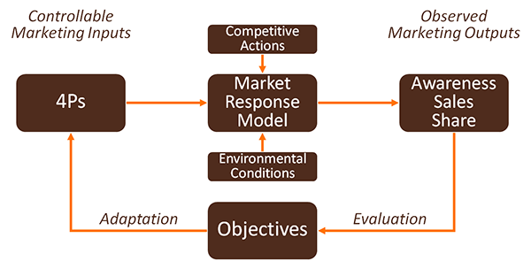
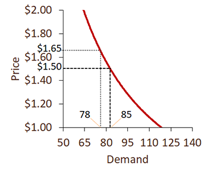
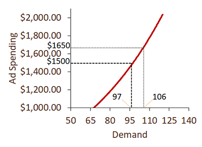
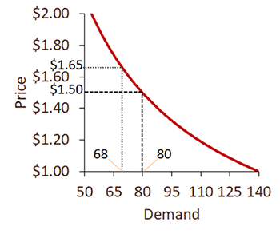
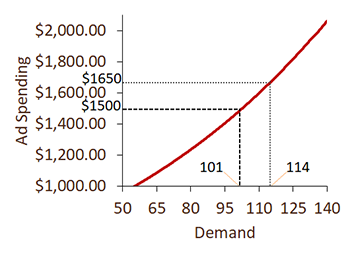

```{r echo=FALSE}
knitr::opts_chunk$set(comment=NA)
options(scipen=5)  # Turns off scientific notation
```

# Marketing Mix Decisions

## R Packages and Datasets for Topic 9

``` {r t9packagesdata, message=FALSE}
library(ggplot2)       # Advanced graphing capabilities
library(dplyr)         # Easier programming
library(cowplot)
load("Topic09/adsales.rdata")
load("Topic09/cereal.rdata")
load("Topic09/cheese.rdata")
```
``` {r t9packagesdata2, echo=FALSE, message=FALSE}
library(flextable)
library(kableExtra)
```

## Overview

### The Marketing Mix

Unique blend of **product**, **place**, **promotion**, and **pricing** strategies designed to produce mutually satisfying exchanges with a target market.

### Market Response Models

Marketing Inputs $\rightarrow$ The Market $\rightarrow$ Marketing Outputs

* Marketing inputs include:
    * Price
    * Ad Spending
    * Promotion Spending
* Marketing outputs include:
    * Sales
    * Market share
    * Profit
    
### Marketing Decision Models

```{r echo=FALSE, out.width='100%', cache=TRUE}
knitr:: 
```
    
### Advantages of Response Models

1. Allows marketers to identify how marketing efforts affect outcomes
    ```{r echo=FALSE, out.width='100%', cache=TRUE}
    knitr:: 
    ```
2. Marketers can answer resources allocation questions
3. Marketers can determine relative impacts to allocate resources optimally
4. Marketers can capture the effects of competitive marketing efforts

## Elasticity

### Elasticity of Demand

Consumers’ responsiveness or sensitivity to marketing changes.

$E=\frac{\text{% Change in Demand}}{\text{% Change in Marketing}}$

* Elastic Demand
    * $E>1$
    * Consumers sensitive to marketing changes
* Inelastic Demand
    * $E<1$
    * Consumers insensitive to marketing changes
    
### Inelastic Demand

Marketing changes will not significantly affect demand for the product

* $PED=\frac{\text{% Change in Demand}}{\text{10\%}=.82<1$  
    ```{r echo=FALSE, cache=TRUE}
    knitr:: 
    ```
* $AED=\frac{\text{% Change in Demand}}{\text{10\%}=.93<1$  
    ```{r echo=FALSE, cache=TRUE}
    knitr:: 
    ```

### Elastic Demand

Marketing changes will significantly affect demand for the product

* $PED=\frac{\text{% Change in Demand}}{\text{10\%}=1.5>1$  
    ```{r echo=FALSE, cache=TRUE}
    knitr:: 
    ```
* $AED=\frac{\text{% Change in Demand}}{\text{10\%}=1.29>1$  
    ```{r echo=FALSE, cache=TRUE}
    knitr:: 
    ```
    
## Modeling Advertising Response

**Problem 1**: an additive model ($sales=\alpha+\beta\times adv$) isn’t appropriate to represent a concave relationship

**Problem 2**: using linear regression on a concave form ($sales=e^\alpha adv^\beta$) won’t work

**Solution**: transform the equation using the natural log ($ln(sales)=\alpha+\beta\times ln(adv)$)

**Result**: allows the use of linear regression to model the concave relationship

$ln(sales)=\alpha+\beta\times ln(adv)$

* $\alpha$ is the $ln(sales)$ when $adv\approx0$
    * $e^\alpha$ is the $sales$ when $adv\approx0$
* $\beta$ is the effect on sales for a $1\%$ increase in $adv$
    * In other words, $\beta$ is the advertising elasticity of demand
    * $\beta$ *should be* positive
    * To calculate the effect on $sales$ for an $x\%$ increase, calculate $1.x^\beta -1$

## Modeling Price Response

**Problem 1**: an additive model ($sales=\alpha+\beta\times price$) isn’t appropriate to represent a concave relationship

**Problem 2**: using linear regression on a concave form ($sales=e^\alpha price^\beta$) won’t work

**Solution**: transform the equation using the natural log ($ln(sales)=\alpha+\beta\times ln(price)$)

**Result**: allows the use of linear regression to model the concave relationship

$ln(sales)=\alpha+\beta\times ln(price)$

* $\alpha$ is the $ln(sales)$ when $price\approx0$
    * $e^\alpha$ is the $sales$ when $price\approx0$
* $\beta$ is the effect on sales for a $1\%$ increase in $price$
    * In other words, $\beta$ is the price elasticity of demand
    * $\beta$ *should be* negative
    * To calculate the effect on $sales$ for an $x\%$ increase, calculate $1.x^\beta -1$

## Modeling Advertising Response Example

### Data

* Advertising and Sales data for 200 firms
* DV: Sales (in millions), $sales$
* IVs: 
    * TV Advertising (in 000s), $tv$
    * Radio Advertising (in 000s), $radio$
    * Paper Advertising (in 000s), $paper$
* Model: $sales=e^\alpha tv^{\beta_1} radio^{\beta_2} paper^{\beta_3}$

### Scatterplots

* Fit lines show the sales and advertising relationships are not linear

```{r t09scatter01, echo=FALSE, message=FALSE, fig.cap="Advertising-Sales Scatterplots ([R code](#figure-reffigt09scatter01))"}
library(effects)
library(cowplot)
logtv <- lm(log(sales)~log(tv), data=adsales)
logradio <- lm(log(sales)~log(radio), data=adsales)
logpaper <- lm(log(sales)~log(paper), data=adsales)
tvpred <- data.frame(predictorEffect("tv", logtv))
radiopred <- data.frame(predictorEffect("radio", logradio))
paperpred <- data.frame(predictorEffect("paper", logpaper))
p1 <- adsales %>% ggplot(aes(x=tv, y=sales)) +
  geom_point() + geom_line(aes(x=tv, y=exp(fit)), data=tvpred, color="orange", size=1) + 
  geom_smooth(method="lm", se=FALSE, size=1, color="red", linetype="dashed") +
  labs(x="Television Advertising", y="Sales")
p2 <- adsales %>% ggplot(aes(x=radio, y=sales)) +
  geom_point() + geom_line(aes(x=radio, y=exp(fit)), data=radiopred, color="orange", size=1) + 
  geom_smooth(method="lm", se=FALSE, size=1, color="red", linetype="dashed") + 
  labs(x="Radio Advertising", y="Sales")
p3 <- adsales %>% ggplot(aes(x=paper, y=sales)) +
  geom_point() + geom_line(aes(x=paper, y=exp(fit)), data=paperpred, color="orange", size=1) + 
  geom_smooth(method="lm", se=FALSE, size=1, color="red", linetype="dashed") +
  labs(x="Newspaper Advertising", y="Sales")
plot_grid(p1,p2,p3, nrow=2)
```

### Estimation

* Transform data to use the multiplicative model
    * $sales=e^\alpha tv^{\beta_1} radio^{\beta_2} paper^{\beta_3}$<br>$\rightarrow$ Take natural log of both sides
    * $ln(sales)=ln(e^\alpha tv^{\beta_1} radio^{\beta_2} paper^{\beta_3})$<br>$ln(sales)=\alpha+\beta_1ln(tv)+\beta_2ln(radio)+\beta_3ln(paper)$
    * NOTE:
        * $ln(x^y)=y\times ln(x)$
        * $ln(x\times y)=ln(x)+ln(y)$
        * $ln(e)=1$
        
### Results

<caption>(\#tab:t09adresp1) Advertising Response Results  ([R code](#table-reftabt09adresp1))</caption>

```{r t09adresp1, echo=FALSE}
library(jtools)
adresp <- lm(log(sales)~log(tv)+log(radio)+log(paper), data=adsales)
summ(adresp, digits=4, model.info=FALSE)
```


* Model is significant ($p<.0001$) and explains about $93\%$ of the variance
* All three types of advertising are significant and in the expected direction
* Advertising elasticities:
    * Television: $.350$ (inelastic)
    * Radio: $.172$ (inelastic)
    * Paper: $.016$ (inelastic)

## Modeling Price Response Example

### Data

* Price and Sales data for one cereal over 380 weeks
* DV: Units sold (in 000s), $sold$
* IV: Price (in dollars), $price$  
* Model: $sold=e^\alpha price^\beta$

### Scatterplot

* Fit line show the units sold and price relationship is not linear

```{r t09scatter02, echo=FALSE, message=FALSE, fig.cap="Price-Units Sold Scatterplot ([R code](#figure-reffigt09scatter02))"}
logprice <- lm(log(sold)~log(price), data=cereal)
pricepred <- data.frame(predictorEffect("price", logprice)) %>% mutate(fit=exp(fit))
cereal %>% ggplot(aes(x=price, y=sold)) +
  geom_point() + geom_line(aes(x=price, y=fit), data=pricepred, color="orange", size=1) + 
  geom_segment(aes(x=1, y=3413, xend=(5325/1912), yend=0), size=1, color="red", linetype="dashed") +
  labs(x="Price ($)", y="Units Sold (000s)") + scale_y_continuous(limits=c(0,11500))
```

### Estimation

* Transform data to use the multiplicative model
    * $sold=e^\alpha price^\beta$<br>$\rightarrow$ Take natural log of both sides
    * $ln(sold)=ln(e^\alpha price^\beta)$<br>$ln(sold)=\alpha+\beta ln(price)$
    * NOTE:
        * $ln(x^y)=y\times ln(x)$
        * $ln(x\times y)=ln(x)+ln(y)$
        * $ln(e)=1$

### Results

<caption>(\#tab:t09priceresp1) Price Response Results  ([R code](#table-reftabt09priceresp1))</caption>

```{r t09priceresp1, echo=FALSE}
priceresp <- lm(log(sold)~log(price), data=cereal)
summ(priceresp, digits=4, model.info=FALSE)
```


* Model is significant ($p<.0001$) and explains about $48\%$ of the variance
* Price is significant and in the expected direction
* Price elasticity:  $-1.696$ (elastic)

## Modeling Price and Advertising Response Example

### Data

* Price, Advertising, and Sales data for a cheese product across 10 cities over about 5 years
* DV: Sales volume, $vol$
* IVs:
    * Price (in dollars), $price$  
    * Advertising spending index, $adv$
* Model: $vol=e^\alpha price^{\beta_1} adv^{\beta_2}$

### Scatterplot

* Fit lines show the volume relationships with price and advertising are not linear

```{r t09scatter03, echo=FALSE, message=FALSE, fig.cap="Price and Advertising Scatterplots with Sales Volume ([R code](#figure-reffigt09scatter03))"}
logpr2 <- lm(log(vol)~log(price), data=cheese)
logad2 <- lm(log(vol)~log(adv), data=cheese)
pr2pred <- data.frame(predictorEffect("price", logpr2))
ad2pred <- data.frame(predictorEffect("adv", logad2))
p1 <- cheese %>% ggplot(aes(x=price, y=vol)) +
  geom_point() + geom_line(aes(x=price, y=exp(fit)), data=pr2pred, color="orange", size=1) + 
  geom_smooth(method="lm", se=FALSE, size=1, color="red", linetype="dashed") +
  labs(x="Price", y="Sales Volume") +
  scale_y_continuous(limits=c(0,15000))
p2 <- cheese %>% ggplot(aes(x=adv, y=vol)) +
  geom_point() + geom_line(aes(x=adv, y=exp(fit)), data=ad2pred, color="orange", size=1) + 
  geom_smooth(method="lm", se=FALSE, size=1, color="red", linetype="dashed") + 
  labs(x="Advertising", y="Sales Volume") +
  scale_y_continuous(limits=c(0,15000))

plot_grid(p1,p2, ncol=2)
```

### Estimation

* Transform data to use the multiplicative model
    * $vol=e^\alpha price^{\beta_1} adv^{\beta_2}$\rightarrow$ Take natural log of both sides
    * $ln(vol)=ln(e^\alpha price^{\beta_1} adv^{\beta_2})$<br>$ln(sold)=\alpha+\beta_1 ln(price)+\beta_2 ln(adv)$
    * NOTE:
        * $ln(x^y)=y\times ln(x)$
        * $ln(x\times y)=ln(x)+ln(y)$
        * $ln(e)=1$

### Results

<caption>(\#tab:t09pradresp1) Price and Advertising Response Results  ([R code](#table-reftabt09pradresp1))</caption>

```{r t09pradresp1, echo=FALSE}
pradresp <- lm(log(vol)~log(price)+log(adv), data=cheese)
summ(pradresp, digits=4, model.info=FALSE)
```


* Model is significant ($p<.0001$) and explains about $36\%$ of the variance
* Both advertising and price are significant and in the expected direction
* Elasticities:
    * Price: $-1.336$ (elastic)
    * Advertising: $.210$ (inelastic)

## Suggested Readings

* *Principles of Marketing Engineering and Analytics, 3rd Edition* (2017). Lilien, Gary L., Rangaswamy, Arvind, and De Bruyn, Arnaud.
    * Course reserves
        * Chapter 7: The Marketing Mix
        
## R Code

### Figure \@ref(fig:t09scatter01) {.unlisted .unnumbered}

```{r t09scatter01code, eval=FALSE}
load("Topic09/adsales.rdata")   # Load data
library(effects)  # Used to create a log-log fit line
library(cowplot)  # Used to create a grid for the three plots

# Run simple log-log models for each IV
logtv <- lm(log(sales)~log(tv), data=adsales)
logradio <- lm(log(sales)~log(radio), data=adsales)
logpaper <- lm(log(sales)~log(paper), data=adsales)

# Use results from log-log models to get a "fit line" for the scatter plots
tvpred <- data.frame(predictorEffect("tv", logtv))
radiopred <- data.frame(predictorEffect("radio", logradio))
paperpred <- data.frame(predictorEffect("paper", logpaper))

# Create first plot
p1 <- adsales %>% 
  ggplot(aes(x=tv, y=sales)) +   # Call to ggplot
  geom_point() +  #Plot points
  geom_line(aes(x=tv, y=exp(fit)),  # Plot 'log-log' fit line
            data=tvpred, color="orange", size=1) + 
  geom_smooth(method="lm", se=FALSE,    # Plot linear fit line
              size=1, color="red", linetype="dashed") +
  labs(x="Television Advertising", y="Sales")

# Repeat for second and third plots
p2 <- adsales %>% 
  ggplot(aes(x=radio, y=sales)) +
  geom_point() + 
  geom_line(aes(x=radio, y=exp(fit)), 
            data=radiopred, color="orange", size=1) + 
  geom_smooth(method="lm", se=FALSE, 
              size=1, color="red", linetype="dashed") + 
  labs(x="Radio Advertising", y="Sales")
p3 <- adsales %>% 
  ggplot(aes(x=paper, y=sales)) +
  geom_point() + 
  geom_line(aes(x=paper, y=exp(fit)), 
            data=paperpred, color="orange", size=1) + 
  geom_smooth(method="lm", se=FALSE, 
              size=1, color="red", linetype="dashed") +
  labs(x="Newspaper Advertising", y="Sales")

# Plot three scatter plots together using cowplot package
plot_grid(p1,p2,p3, nrow=2)
```

### Figure \@ref(fig:t09scatter02) {.unlisted .unnumbered}

```{r t09scatter02code, eval=FALSE}
load("Topic09/cereal.rdata")  # Load data
library(effects)  # Used to create a log-log fit line

logprice <- lm(log(sold)~log(price), data=cereal)  # Run simple log-log model

# Use results from log-log model to get a "fit line" for the scatter plot
pricepred <- data.frame(predictorEffect("price", logprice))

# Create plot
cereal %>% ggplot(aes(x=price, y=sold)) +
  geom_point() + 
  geom_line(aes(x=price, y=exp(fit)), 
            data=pricepred, color="orange", size=1) + 
  geom_segment(aes(x=1, y=3413, xend=(5325/1912), yend=0), # Manually produce 
               size=1, color="red", linetype="dashed") +   # linear fit line
  labs(x="Price ($)", y="Units Sold (000s)") + 
  scale_y_continuous(limits=c(0,11500))
```

### Figure \@ref(fig:t09scatter03) {.unlisted .unnumbered}

```{r t09scatter03code, eval=FALSE}
load("Topic09/cheese.rdata")  # Load Data

library(effects)
library(cowplot)

logpr2 <- lm(log(vol)~log(price), data=cheese)
logad2 <- lm(log(vol)~log(adv), data=cheese)

pr2pred <- data.frame(predictorEffect("price", logpr2))
ad2pred <- data.frame(predictorEffect("adv", logad2))

p1 <- cheese %>% ggplot(aes(x=price, y=vol)) +
  geom_point() + geom_line(aes(x=price, y=exp(fit)), 
                           data=pr2pred, color="orange", size=1) + 
  geom_smooth(method="lm", se=FALSE, 
              size=1, color="red", linetype="dashed") +
  labs(x="Price", y="Sales Volume") +
  scale_y_continuous(limits=c(0,15000))

p2 <- cheese %>% ggplot(aes(x=adv, y=vol)) +
  geom_point() + geom_line(aes(x=adv, y=exp(fit)), 
                           data=ad2pred, color="orange", size=1) + 
  geom_smooth(method="lm", se=FALSE, 
              size=1, color="red", linetype="dashed") + 
  labs(x="Advertising", y="Sales Volume") +
  scale_y_continuous(limits=c(0,15000))

plot_grid(p1,p2, ncol=2)
```

### Table \@ref(tab:t09adresp1code) {.unlisted .unnumbered}

```{r t09adresp1code, eval=FALSE}
library(jtools)
adresp <- lm(log(sales)~log(tv)+log(radio)+log(paper), data=adsales)
summ(adresp, digits=4, model.info=FALSE)
```

### Table \@ref(tab:t09priceresp1code) {.unlisted .unnumbered}

```{r t09priceresp1code, eval=FALSE}
library(jtools)
priceresp <- lm(log(sold)~log(price), data=cereal)
summ(priceresp, digits=4, model.info=FALSE)
```

### Table \@ref(tab:t09pradresp1code) {.unlisted .unnumbered}


```{r t09pradresp1code, eval=FALSE}
library(jtools)
pradresp <- lm(log(vol)~log(price)+log(adv), data=cheese)
summ(pradresp, digits=4, model.info=FALSE)
```
