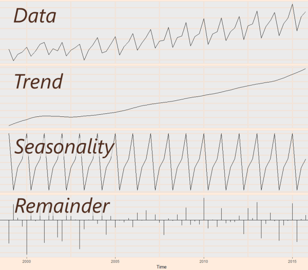
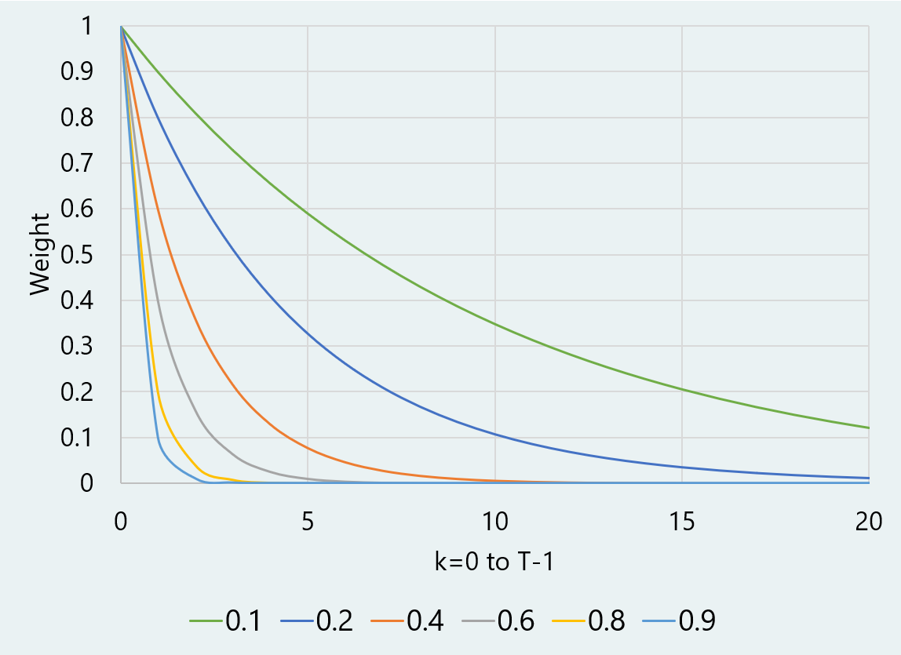
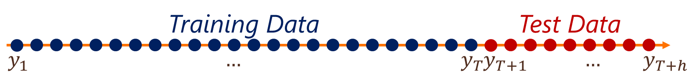

```{r echo=FALSE}
knitr::opts_chunk$set(comment=NA)
options(scipen=5)  # Turns off scientific notation
```

# Forecasting I

## R Packages and Datasets for Topic 10

``` {r t10packagesdata, message=FALSE}
library(ggplot2)       # Advanced graphing capabilities
library(dplyr)         # Easier programming
library(fpp3)
library(slider)
library(cowplot)
load("Topic10/monthlysales.rdata")
```
``` {r, echo=FALSE}
library(flextable)
```

## Overview

### The Concept of Forecasting

* Firms must make forecasts, but...<br>...Forecasing is difficult and challenging
* Marketing strategy focuses on the long term...<br>...Making the task more difficult and challenging
* Forecasting *is not* about "getting the future right"
* Forecasting *is* about helping manage uncertainty
* **Question to Ask**
    * What are we forecasting?
    * Why do we need the forecast?
    
## Forecasting Methods

* Judgmental
    * Sales force estimates
    * Jury of experts
    * Structured processes
* Market/Product Analysis
    * Surveys
    * Market tests
    * ATAR
* Time Series
    * Naïve methods 
    * Smoothing techniques
    * Box-Jenkins methods
* Regression/Econometric
    * Linear
    * Non-Linear

## Forecasting - Time Series

* Decomposition: splitting data into components
    * Trend
    * Seasonality
    * Reaminder
    
```{r echo=FALSE, cache=TRUE}
knitr:: 
```
    
## Naïve Methods

### Naïve

* Forecast future values to be same as the last observation<br>$\hat{y_t}=y_{t-1}$  
* Easy to use, but…  
* What about…
   * Seasonality?  
   * Trend?
   
```{r echo=FALSE, cache=TRUE, warning=FALSE}
ms <- monthlysales %>% 
    mutate(Month=yearmonth(t)) %>% 
    as_tsibble(index=Month)
train <- ms[1:(nrow(ms)-12), ]
forecast <- ms[(nrow(ms)-11):nrow(ms), ]
train_fit <- train %>% 
      fabletools::model('Naive'=NAIVE(sales))
fc <- train_fit %>% forecast(h=12)
fitted <- fitted(train_fit) %>% filter(.model=="Naive")
train %>% autoplot(sales) +
    geom_line(data=fitted, aes(y=.fitted, color=.model)) +
    autolayer(fc, level=NULL, size=1, color="red") + 
    labs(y="sales") +
    guides(color=guide_legend(title="Model")) + 
    theme(legend.position = "bottom") +
    scale_color_manual(values=c("red"))

```

### Seasonal Naïve

* Forecast future values to be same as the last observation of the same period<br>$\hat{y_t}=y_{t-m}$  
* Easy to use, but…  
* What about…
   * Trend?
   
```{r echo=FALSE, cache=TRUE, warning=FALSE}
train_fit <- train %>% 
      fabletools::model('Naive'=NAIVE(sales),
            'Seas.Naive'=SNAIVE(sales))
fc <- train_fit %>% forecast(h=12)
fitted <- fitted(train_fit) %>% filter(.model=="Seas.Naive")
train %>% autoplot(sales) +
    geom_line(data=fitted, aes(y=.fitted), color="blue") +
    autolayer(fc, level=NULL, size=1) + 
    labs(y="sales") +
    guides(color=guide_legend(title="Model")) + 
    theme(legend.position = "bottom") +
    scale_color_manual(values=c("red", "blue"))

```

### Naïve with Drift

* Forecast future values to be same as the last observation plus the average change per period<br>$\hat{y_t}=y_{t-1}+(\frac{y_{t-1}-y_1}{T-1})$  
* Easy to use, but…  
* What about…
   * Seasonality?
   
```{r echo=FALSE, cache=TRUE, warning=FALSE}
train_fit <- train %>% 
      fabletools::model('Naive'=NAIVE(sales),
            'Seas.Naive'=SNAIVE(sales),
            'Naive.Drift'=NAIVE(sales~drift()))
fc <- train_fit %>% forecast(h=12)
fitted <- fitted(train_fit) %>% filter(.model=="Naive.Drift")
train %>% autoplot(sales) +
    geom_line(data=fitted, aes(y=.fitted), color="forestgreen") +
    autolayer(fc, level=NULL, size=1) + 
    labs(y="sales") +
    guides(color=guide_legend(title="Model")) + 
    theme(legend.position = "bottom") +
    scale_color_manual(values=c("red", "forestgreen", "blue" ))

```

### Seasonal Naïve with Drift

* Forecast future values to be same as the last observation of the same time period plus the average change per period
   
```{r echo=FALSE, cache=TRUE, warning=FALSE}
train_fit <- train %>% 
      fabletools::model('Naive'=NAIVE(sales),
            'Seas.Naive'=SNAIVE(sales),
            'Naive.Drift'=NAIVE(sales~drift()),
            'Seas.Naive.Drift'=SNAIVE(sales~drift()))
fc <- train_fit %>% forecast(h=12)
fitted <- fitted(train_fit) %>% filter(.model=="Seas.Naive.Drift")
train %>% autoplot(sales) +
    geom_line(data=fitted, aes(y=.fitted), color="orange") +
    autolayer(fc, level=NULL, size=1) + 
    labs(y="sales") +
    guides(color=guide_legend(title="Model")) + 
    theme(legend.position = "bottom") +
    scale_color_manual(values=c("red", "forestgreen", "blue", "orange" ))

```

### Summary

* Naïve models may work, but…  
* Usually serve as a benchmark rather than preferred method

## Smoothing Techniques

### Moving Average

* Classic method to smooth randomness<br>
$\begin{aligned}
    \hat{y_t}=\frac{1}{m}\sum_{j=1}^{m}y_{t-j}
\end{aligned}$
* Short-range forecast  
    * Best for one-step ahead forecast  
* Doesn’t account for trend or seasonality

   
```{r echo=FALSE, cache=TRUE, warning=FALSE}
madata <- ms %>% mutate(sales2=sales)
madata$sales2[(nrow(madata)-11):nrow(madata)] <- NA
madata <- madata %>% 
    mutate("Mov.Avg.12"=slide_dbl(sales2, .f=~mean(.x, na.rm=T), .before=12, .after=-1, .complete=TRUE))
madatafc <- madata[(nrow(madata)-11):nrow(madata), ] %>% 
      mutate(".model"="Mov.Avg.12",".mean"=Mov.Avg.12, sales=Mov.Avg.12) %>% 
      select(".model", ".mean", sales, Month)
madata <- madata[1:90,]
train %>% autoplot(sales) +
    geom_line(data=madata, aes(y=Mov.Avg.12), color="red") +
    geom_line(data=madatafc, aes(y=sales, color=.model)) + 
    labs(y="sales") +
    guides(color=guide_legend(title="Model")) + 
    theme(legend.position = "bottom")

train %>% autoplot(sales) +
    geom_line(data=madata, aes(y=Mov.Avg.12), color="red") +
    geom_line(data=madatafc, aes(y=sales, color=.model)) +
    geom_point(data=madatafc, aes(y=sales), color="red") +
    labs(y="sales") +
    guides(color=guide_legend(title="Model")) + 
    theme(legend.position = "bottom") +
    scale_x_yearmonth(limits=c(as.Date("2006-07-01"), as.Date("2008-06-01")))

```


### Exponential Smoothing

* Weighted moving average approach with geometrically declining weights  
* Uses smoothing parameter 
    * A larger parameter puts more weight on recent periods

```{r echo=FALSE, cache=TRUE}
knitr:: 
```

* Parameter can be manually input…  
* Better to optimize  parameter by minimizing the error  
* Doesn’t really account for trend and seasonality

```{r echo=FALSE, cache=TRUE, warning=FALSE}
train_fit <- train %>% 
      fabletools::model("Exp.Smooth"=ETS(sales ~ error("A")+trend("N")+season("N")))
fc <- train_fit %>% forecast(h=12)
fitted <- fitted(train_fit) %>% filter(.model=="Exp.Smooth")
fc <- suppressWarnings(bind_rows(fc,madatafc))
train %>% autoplot(sales) +
    geom_line(data=fitted, aes(y=.fitted), color="blue") +
    autolayer(fc, level=NULL, size=1) + 
    labs(y="sales") +
    guides(color=guide_legend(title="Model")) + 
    theme(legend.position = "bottom") +
    scale_color_manual(values=c("blue", "red" ))

```

### Holt-Winters Smoothing

* Extends exponential smoothing  
    * Adds additional smoothing parameters for:  
        * Trend  
        * Seasonality  
* Better if forecasting multiple periods
* Two methods: Additive and Multiplicative

```{r echo=FALSE, cache=TRUE, warning=FALSE}
train_fit <- train %>% 
      fabletools::model("Exp.Smooth"=ETS(sales ~ error("A")+trend("N")+season("N")),
                        "H-W.Add"=ETS(sales ~ error("A")+trend("A")+season("A")),
                        "H-W.Mult"=ETS(sales ~ error("M")+trend("A")+season("M")))
fc <- train_fit %>% forecast(h=12)
fitted <- fitted(train_fit) %>% filter(.model=="H-W.Add" | .model=="H-W.Mult")
fc <- suppressWarnings(bind_rows(fc,madatafc))
train %>% autoplot(sales) +
    geom_line(data=fitted, aes(y=.fitted, color=.model)) +
    autolayer(fc, level=NULL, size=1) + 
    labs(y="sales") +
    guides(color=guide_legend(title="Model")) + 
    theme(legend.position = "bottom") +
    scale_color_manual(values=c("blue", "forestgreen", "orange", "red" ))

```

* Additive
    * Use when seasonal effects are roughly constant throughout
* Multiplicative
    * Use when seasonal effects respond proportionally to the trend
    
``` {r t101hwaddmult1, echo=FALSE, warning=FALSE}
load("Topic10/elecsales.rdata")
load("Topic10/msales.rdata")
source("Topic10/tsplot.R")
es2 <- elecsales %>%
   mutate(Month=yearmonth(t)) %>% 
   as_tsibble(index=Month) %>% 
   filter_index(~"1979-12")
ms2 <-  msales %>% 
   mutate(Month=yearmonth(t)) %>% 
   as_tsibble(index=Month)
mstsp <- tsplot(ms2, "t", "sales", "ym", 0) + labs(title="Time Series 1")
estsp <- tsplot(es2, "t", "sales", "ym", 0) + labs(title="Time Series 2")
plot_grid(mstsp, estsp, ncol=2)
msgrad <- ms2 %>% 
  ggplot(aes(x=month(yearmonth(t)), y=sales, 
             color=as.factor(year(yearmonth(t))))) +
  geom_line() + 
  theme_bw() +
  theme(panel.grid.major.x = element_blank(),
         panel.grid.minor.x = element_blank()) + 
  labs(x="Month", color="Year", title="Time Series 1") +
  scale_x_continuous(limits=c(1,12), breaks=1:12)
esgrad <- es2 %>% 
  ggplot(aes(x=month(yearmonth(t)), y=sales, 
             color=as.factor(year(yearmonth(t))))) +
  geom_line() + 
  theme_bw() +
  theme(panel.grid.major.x = element_blank(),
         panel.grid.minor.x = element_blank()) + 
  labs(x="Month", color="Year", title="Time Series 2") +
  scale_x_continuous(limits=c(1,12), breaks=1:12)
plot_grid(msgrad, esgrad, ncol=2)
```

## Regression-based

* Can be used to model simple trend and seasonality
* Linear model: $y_t=\alpha+\beta x_t$
* To model trend, substitute $t$ for $x_t$<br>$y_t=\alpha+\beta t$
* To model seasonality, substitute $s$ dummies for $x_t$:<br>$y_t=\alpha+\gamma_1 S_1+\dots+\gamma_{s-1}S_{s-1}$
* Combine to model trend and seasonality:<br>$y_t=\alpha+\beta t+\gamma_1 S_1+\dots+\gamma_{s-1}S_{s-1}$

### Trend only

* $y_t=\alpha+\beta t$
* Forecast is simply a straight line
   
```{r echo=FALSE, cache=TRUE, warning=FALSE}
train_fit <- train %>% 
      fabletools::model('Lin.Reg.Trend'=TSLM(sales ~ trend()))
fc <- train_fit %>% forecast(h=12)
fitted <- fitted(train_fit) %>% filter(.model=="Lin.Reg.Trend")
train %>% autoplot(sales) +
    geom_line(data=fitted, aes(y=.fitted, color=.model)) +
    autolayer(fc, level=NULL, size=1, color="red") + 
    labs(y="sales") +
    guides(color=guide_legend(title="Model")) + 
    theme(legend.position = "bottom") +
    scale_color_manual(values=c("red"))

```

### Trend and Seasonality

* $y_t=\alpha+\beta t+\gamma_1 S_1+\dots+\gamma_{s-1}S_{s-1}$  
* Forecast follows pattern

```{r echo=FALSE, cache=TRUE, warning=FALSE}
train_fit <- train %>% 
      fabletools::model('Lin.Reg.Trend'=TSLM(sales ~ trend()),
            'Lin.Reg.Seas.Trend'=TSLM(sales ~ trend()+season()))
fc <- train_fit %>% forecast(h=12)
fitted <- fitted(train_fit) %>% filter(.model=="Lin.Reg.Seas.Trend")
train %>% autoplot(sales) +
    geom_line(data=fitted, aes(y=.fitted, color=.model)) +
    autolayer(fc, level=NULL, size=1, color="red") + 
    labs(y="sales") +
    guides(color=guide_legend(title="Model")) + 
    theme(legend.position = "bottom") +
    scale_color_manual(values=c("blue","red"))

```

## Forecast Accuracy

* Important to evaluate forecast accuracy  
* Predicted values of test data time periods  
    ```{r echo=FALSE, cache=TRUE, out.width="75%"}
    knitr:: 
    ```

### Measures 

* Calculate error in each test data time period:<br>$e_{T+h}=y_{T+h}-\hat{y}_{T+h}$  
* Use Mean Absolute Error, Root Mean Squared Error, and Mean Absolute Percentage Error to compare models
* Mean Absolute Error (MAE):<br>
$\begin{aligned}
\frac{\sum_{t=T+1}^{T+h}|e_t|}{n}
\end{aligned}$
* Root Mean Squared Error (RMSE):<br>
$\begin{aligned}
\sqrt\frac{\sum_{t=T+1}^{T+h}e_t^2}{n}
\end{aligned}$
* Mean Absolute Percentage Error (MAPE):<br>
$\begin{aligned}
\frac{\sum_{t=T+1}^{T+h}|e_t/y_t|}{n}\times 100
\end{aligned}$
* Lower values indicate better forecast accuracy

### Visual

* Visually examine forecast errors for test data
* Forecast errors closer to 0 indicate better forecast

```{r echo=FALSE, cache=TRUE, message=FALSE}
source("Topic10/naivefc.R")
source("Topic10/smoothfc.R")
source("Topic10/linregfc.R")
source("Topic10/fccompare.R")
nam <- naivefc(monthlysales, "t", "sales", "ym", 12)
smm <- smoothfc(monthlysales, "t", "sales", "ym", 12)
lrm <- linregfc(monthlysales, "t", "sales", "ym", 12)
results <- list(nam, smm, lrm)
models <- c("Seas.Naive", "seas.Naive.Drift", "H-W.Add", "Lin.Reg.Seas.Trend")
fc <- fccompare(results, models)
fc$fcresplot
```

## Forecasting Example 1

### Data

* Quarterly sales data from 1990 through 2012
* Variables:
    * Time period ($t$)
    * Sales from 1990 through 2010 ($sales$)
* Goal:  Forecast quarterly sales for the next two years

### Examine Data

```{r t101tsplot01, echo=FALSE, fig.cap="Time Series Plot ([R code](#figure-reffigt101tsplot01))"}
load("Topic10/qsales.rdata")    # Load Data
source("Topic10/tsplot.R")      # Source tsplot user defined function
tsplot(data=qsales,     # Data frame
       tvar="t",        # Date variable
       obs="sales",     # Measure variable
       datetype="yq",    # Date type
       h=8)             # Number of holdout periods
```

* Trend? *Yes*
* Seasonlity? *No*
* Potential Models?
    * Naïve with Drift
    * Moving Average
    * Holt-Winters
    * Regression Trend
    
### Naïve Methods

* Run all methods
* Plot dynamic forecasts
    * Naïve underestimates
    * Naïve with Drift over estimates
    * Seasonal methods not appropriate
```{r t101naive01, echo=FALSE, fig.cap="Naive Methods Plot ([R code](#figure-reffigt101naive01))"}
source("Topic10/naivefc.R")    # Source naive methods user defined function
results <- naivefc(qsales, "t", "sales", "yq", 8)   # Save results to object
results$plot
```

* Examine accuracy
    * Surprisingly, Naïve performs slightly better, than Naïve with Drift
        * Lowest RMSE, MAE, and MAPE

<caption>(\#tab:t101naive02) Naive Methods Accuracy ([R code](#table-reftabt101naive02))</caption>

```{r t101naive02, echo=FALSE}
flextable(results$acc)
```

* Examine forecast residuals  
    * Naïve and Naïve with Drift appear similar
```{r t101naive03, echo=FALSE, fig.cap="Naive Methods Forecast Residuals ([R code](#figure-reffigt101naive03))"}
results$fcresplot
```

### Smoothing Methods

* Run all methods
* Plot dynamic forecasts
    * Moving Average underestimates
    * Both Holt-Winters overestimate, but not by much
    * Exponential Smoothing a poor fit
```{r t101smooth01, echo=FALSE, fig.cap="Smoothing Methods Plot ([R code](#figure-reffigt101smooth01))"}
source("Topic10/smoothfc.R")    # Source smooth methods user defined function
results2 <- smoothfc(qsales, "t", "sales", "yq", 8)   # Save results to object
results2$plot
```

* Examine accuracy
    * Holt-Winters Additive is clearly the best model
        * Much lower RMSE, MAE, and MAPE

<caption>(\#tab:t101smooth02) Smoothing Methods Accuracy ([R code](#table-reftabt101smooth02))</caption>

```{r t101smooth02, echo=FALSE}
flextable(results2$acc)
```

* Examine forecast residuals
    * Holt-Winters Additive consistently closer to 0
```{r t101smooth03, echo=FALSE, fig.cap="Smoothing Methods Forecast Residuals ([R code](#figure-reffigt101smooth03))"}
results2$fcresplot
```

### Regression Methods

* Run all methods
* Plot dynamic forecasts
    * Both methods nearly identical...
    * But we know there isn't seasonality
```{r t101reg01, echo=FALSE, fig.cap="Regression Methods Plot ([R code](#figure-reffigt101reg01))"}
source("Topic10/linregfc.R")    # Source regression methods user defined function
results3 <- linregfc(qsales, "t", "sales", "yq", 8)   # Save results to object
results3$plot
```

* Examine accuracy
    * Both methods nearly identical...
    * But we know there isn't seasonality

<caption>(\#tab:t101reg02) Regression Methods Accuracy ([R code](#table-reftabt101reg02))</caption>

```{r t101reg02, echo=FALSE}
flextable(results3$acc)
```

* Examine forecast residuals
    * Both methods nearly identical...
    * But we know there isn't seasonality
```{r t101reg03, echo=FALSE, fig.cap="Regression Methods Forecast Residuals ([R code](#figure-reffigt101reg03))"}
results3$fcresplot
```

### Compare Best Models

* Examine RMSE, MAE, MAPE, and Forecast Error Plot
```{r t101comp01, echo=FALSE, fig.cap="Forecase Residuals Comparison ([R code](#figure-reffigt101comp1))"}
source("Topic10/fccompare.R")    # Source forecast compare user defined function
resultslist <- list(results, results2, results3)  # Create list of result objects
models <- c("Naive", "H-W.Add", "Lin.Reg.Trend")  # Create object with requested models
compare <- fccompare(resultslist,   # List of results created above
          models)        # Models we want to compare
compare$fcresplot  # Request plot
```

<caption>(\#tab:t101comp011) Accuracy Comparison ([R code](#table-reftabt101comp011))</caption>

```{r t101comp011, echo=FALSE}
flextable(compare$acc)   # Request accuracy table
```

* None of the models do a great job, especially farther out
* Holt-Winters and Naïve with Drift seem to do the best

## Forecasting Example 2

### Data

* Monthly Sales from 2005 through 2016
* Variables:
    * Time period ($t$)
    * Sales per period ($sales$)
* Goal:  Forecast quarterly sales for the next 12 months

### Examine Data

```{r t101tsplot02, echo=FALSE, fig.cap="Time Series Plot ([R code](#figure-reffigt101tsplot02))"}
load("Topic10/msales.rdata")    # Load Data
tsplot(data=msales,     # Data frame
       tvar="t",        # Date variable
       obs="sales",     # Measure variable
       datetype="ym",    # Date type
       h=12)             # Number of holdout periods
```

* Trend? *Yes*
* Seasonlity? *Yes*
* Potential Models?
    * Seasonal Naïve with Drift
    * Holt-Winters
    * Regression Seasonal Trend
    
### Naïve Methods

* Run all methods
* Plot dynamic forecasts
    * Naïve and Naïve with Drift mostly under estimate due to seasonality and drift
    * Seasonal Naïve and Seasonal Naïve with Drift seem pretty good
```{r t101naive04, echo=FALSE, fig.cap="Naive Methods Plot ([R code](#figure-reffigt101naive04))"}
na.results <- naivefc(msales, "t", "sales", "ym", 12)   # Save results to object
na.results$plot
```

* Examine accuracy
    * Seasonal Naïve with Drift is by far the best model
        * Lowest RMSE, MAE, and MAPE
        
<caption>(\#tab:t101naive05) Naive Methods Accuracy ([R code](#table-reftabt101naive05))</caption>
```{r t101naive05, echo=FALSE}
flextable(na.results$acc)
```

* Examine forecast residuals
    * Seasonal Naïve and Seasonal Naïve with Drift appear similar, but the latter hugs the $0$ line very closely
```{r t101naive06, echo=FALSE, fig.cap="Naive Methods Forecast Residuals ([R code](#figure-reffigt101naive06))"}
na.results$fcresplot
```

### Smoothing Methods

* Run all methods
* Plot dynamic forecasts
    * Moving Average underestimates
    * Both Holt-Winters seem very good fits
    * Exponential Smoothing a poor fit
```{r t101smooth04, echo=FALSE, fig.cap="Smoothing Methods Plot ([R code](#figure-reffigt101smooth04))"}
sm.results <- smoothfc(msales, "t", "sales", "ym", 12)   # Save results to object
sm.results$plot
```

* Examine accuracy
    * Both Holt-Winters are good, but Multiplicative is slightly better
        * Lower RMSE, MAE, and MAPE
        
<caption>(\#tab:t101smooth05) Smoothing Methods Accuracy ([R code](#table-reftabt101smooth05))</caption>

```{r t101smooth05, echo=FALSE}
flextable(sm.results$acc)
```

* Examine forecast residuals
    * Both Holt-Winters hug the $0$ line
```{r t101smooth06, echo=FALSE, fig.cap="Smoothing Methods Forecast Residuals ([R code](#figure-reffigt101smooth06))"}
sm.results$fcresplot
```

### Regression Methods

* Run all methods
* Plot dynamic forecasts
    * Seasonal method very good forecast
    * Trend alone not effective
```{r t101reg04, echo=FALSE, fig.cap="Regression Methods Plot ([R code](#figure-reffigt101reg03))"}
lr.results <- linregfc(msales, "t", "sales", "ym", 12)   # Save results to object
lr.results$plot
```

* Examine accuracy
    * Seasonal method much better
        * Lower RMSE, MAE, and MAPE  

<caption>(\#tab:t101reg05) Regression Methods Accuracy ([R code](#table-reftabt101reg05))</caption>

```{r t101reg05, echo=FALSE}
flextable(lr.results$acc)
```

* Examine forecast residuals
    * Seasonal method hugs the $0$ line
```{r t101reg06, echo=FALSE, fig.cap="Regression Methods Forecast Residuals ([R code](#figure-reffigt101reg06))"}
lr.results$fcresplot
```

### Compare Best Models

* Examine RMSE, MAE, MAPE, and Forecast Error Plot
```{r t101comp02, echo=FALSE, fig.cap="Forecase Residuals Comparison ([R code](#figure-reffigt101comp2))"}
resultslist <- list(na.results, sm.results, lr.results)  # Create list of result objects
models <- c("Seas.Naive.Drift", "H-W.Add", "H-W.Mult", "Lin.Reg.Seas.Trend")  # Create object with requested models
compare <- fccompare(resultslist,   # List of results created above
          models)        # Models we want to compare
compare$fcresplot  # Request plot
```

<caption>(\#tab:t101comp021) Accuracy Comparison ([R code](#table-reftabt101comp021))</caption>

```{r t101comp021, echo=FALSE}
flextable(compare$acc)   # Request accuracy table
```

* Holt-Winters Multiplicative does slightly better than Seasonal Naïve with Drift
* Both are better than the other two options

## Suggested Readings

* *Principles of Marketing Engineering and Analytics, 3rd Edition* (2017). Lilien, Gary L., Rangaswamy, Arvind, and De Bruyn, Arnaud.
    * Course reserves
        * Chapter 5: Forecasting
* *Forecasting: Principles and Practice, 3rd Edition* (2021). Hyndman, Rob J., and Athanasopoulos, George.
    * Online Texts<br><a href="https://otexts.com/fpp3/" target="_blank" rel="noopener noreferrer">https://otexts.com/fpp3/</a>
        
## R Code

### Figure \@ref(fig:t101tsplot01) {.unlisted .unnumbered}

```{r t101tsplot01code, eval=FALSE}
load("qsales.rdata")    # Load Data
source("tsplot.R")      # Source tsplot user defined function
tsplot(data=qsales,     # Data frame
       tvar="t",        # Date variable
       obs="sales",     # Measure variable
       datetype="yq",   # Date type
       h=8)             # Number of holdout periods
```

### Figure \@ref(fig:t101naive01) {.unlisted .unnumbered}

```{r t101naive01code, eval=FALSE}
source("naivefc.R")    # Source naive methods user defined function
# Save results to object
results <- naivefc(qsales,   # Data frame
                   "t",      # Date variable
                   "sales",  # Measure variable 
                   "yq",     # Date type
                   8)        # Number of holdout periods
results$plot  # Request plot
```

### Figure \@ref(fig:t101naive03) {.unlisted .unnumbered}

```{r t101naive03code, eval=FALSE}
results$fcresplot    # Request forecast residual plot from previous saved results
```

### Figure \@ref(fig:t101smooth01) {.unlisted .unnumbered}

```{r t101smooth01code, eval=FALSE}
source("smoothfc.R")    # Source smooth methods user defined function
results2 <- smoothfc(qsales, "t", "sales", "yq", 8)   # Save results to object
results2$plot  # Request plot
```

### Figure \@ref(fig:t101smooth03) {.unlisted .unnumbered}

```{r t101smooth03code, eval=FALSE}
results2$fcresplot  # Request forecast residual plot from previous saved results
```

### Figure \@ref(fig:t101reg01) {.unlisted .unnumbered}

```{r t101reg01code, eval=FALSE}
source("linregfc.R")    # Source regression methods user defined function
results3 <- linregfc(qsales, "t", "sales", "yq", 8)   # Save results to object
results3$plot  # Request plot
```

### Figure \@ref(fig:t101reg03) {.unlisted .unnumbered}

```{r t101reg03code, eval=FALSE}
results3$fcresplot  # Request forecast residual plot from previous saved results
```

### Figure \@ref(fig:t101comp01) {.unlisted .unnumbered}

```{r t101comp01code, eval=FALSE}
source("fccompare.R")    # Source forecast compare user defined function
resultslist <- list(results, results2, results3)  # Create list of result objects
models <- c("Naive", "H-W.Add", "Lin.Reg.Trend")  # Create object with requested models
compare <- fccompare(resultslist,   # List of results created above
                     models)        # Models we want to compare
compare$fcresplot  # Request plot
```

### Figure \@ref(fig:t101tsplot02) {.unlisted .unnumbered}

```{r t101tsplot02code, eval=FALSE}
load("msales.rdata")    # Load Data
tsplot(data=msales,     # Data frame
       tvar="t",        # Date variable
       obs="sales",     # Measure variable
       datetype="ym",   # Date type
       h=12)             # Number of holdout periods
```

### Figure \@ref(fig:t101naive04) {.unlisted .unnumbered}

```{r t101naive04code, eval=FALSE}
# Save results to object
na.results <- naivefc(msales, "t", "sales", "ym", 12) 

na.results$plot  # Request plot
```

### Figure \@ref(fig:t101naive06) {.unlisted .unnumbered}

```{r t101naive06code, eval=FALSE}
na.results$fcresplot    # Request forecast residual plot from previous saved results
```

### Figure \@ref(fig:t101smooth04) {.unlisted .unnumbered}

```{r t101smooth04code, eval=FALSE}
sm.results <- smoothfc(msales, "t", "sales", "ym", 12)   # Save results to object

sm.results$plot  # Request plot
```

### Figure \@ref(fig:t101smooth06) {.unlisted .unnumbered}

```{r t101smooth06code, eval=FALSE}
sm.results$fcresplot  # Request forecast residual plot from previous saved results
```

### Figure \@ref(fig:t101reg04) {.unlisted .unnumbered}

```{r t101reg04code, eval=FALSE}
lr.results <- linregfc(msales, "t", "sales", "ym", 12)   # Save results to object
lr.results$plot  # Request plot
```

### Figure \@ref(fig:t101reg06) {.unlisted .unnumbered}

```{r t101reg06code, eval=FALSE}
lr.results$fcresplot  # Request forecast residual plot from previous saved results
```

### Figure \@ref(fig:t101comp02) {.unlisted .unnumbered}

```{r t101comp02code, eval=FALSE}
resultslist <- list(na.results, sm.results, lr.results)  # Create list of result objects
models <- c("Seas.Naive.Drift", "H-W.Add", "H-W.Mult", "Lin.Reg.Seas.Trend")  # Create object with requested models
compare <- fccompare(resultslist,   # List of results created above
                     models)        # Models we want to compare
compare$fcresplot  # Request plot
```

### Table \@ref(tab:t101naive02code) {.unlisted .unnumbered}

```{r t101naive02code, eval=FALSE}
results$acc  # Request accuracy table from previous saved results
```

### Table \@ref(tab:t101smooth02code) {.unlisted .unnumbered}

```{r t101smooth02code, eval=FALSE}
results2$acc  # Request accuracy table from previous saved results
```

### Table \@ref(tab:t101reg02code) {.unlisted .unnumbered}

```{r t101reg02code, eval=FALSE}
results3$acc  # Request accuracy table from previous saved results
```

### Table \@ref(tab:t101comp011code) {.unlisted .unnumbered}

```{r t101comp011code, eval=FALSE}
compare$acc   # Request accuracy table
```

### Table \@ref(tab:t101naive05code) {.unlisted .unnumbered}

```{r t101naive05code, eval=FALSE}
na.results$acc  # Request accuracy table from previous saved results
```

### Table \@ref(tab:t101smooth05code) {.unlisted .unnumbered}

```{r t101smooth05code, eval=FALSE}
sm.results$acc  # Request accuracy table from previous saved results
```

### Table \@ref(tab:t101reg05code) {.unlisted .unnumbered}

```{r t101reg05code, eval=FALSE}
lr.results$acc  # Request accuracy table from previous saved results
```

### Table \@ref(tab:t101comp011code) {.unlisted .unnumbered}

```{r t101comp021code, eval=FALSE}
compare$acc   # Request accuracy table
```